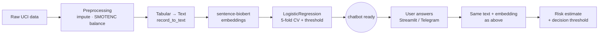

# Forecast — Clinical Risk Chatbot

A conversational front-end (Streamlit + Telegram) that walks a user through a short clinical
questionnaire and returns a risk estimate for two UCI benchmarks: **Heart Disease** and
**Diabetes 130-US Hospitals** (30-day readmission). Before either chatbot starts, `main.py`
rebuilds that dataset's classifier from its raw source data.



## How it works
Across a prior embedding-model comparison on both datasets, the biomedical sentence-transformer
**`sentence-biobert`** (`pritamdeka/BioBERT-mnli-snli-scinli-scitail-mednli-stsb`) came out on top
by ROC-AUC, so it's the only encoder used — hardcoded in [`function.py`](function.py)'s
`EMBEDDING_MODEL`.

Running `main.py` first rebuilds that dataset's classifier from scratch:
1. [`preprocessing.py`](preprocessing.py) loads the raw dataset from `datasets/` (UCI Heart
   Disease `.data` files, or the Diabetes 130-US Hospitals CSV), imputes missing values, and
   balances the target class with SMOTENC.
2. [`embedding.py`](embedding.py) converts every record into a natural-language description
   (`record_to_text_*`) and embeds it with `sentence-biobert`, saving to
   `datas/<dataset>/embeddings/`.
3. [`classification.py`](classification.py) 5-fold cross-validates a `LogisticRegression` on
   those embeddings to get accuracy/F1/ROC-AUC and an F1-optimal decision threshold, saved to
   `datas/<dataset>/results/model_performance.csv`.

Only then does [`chatbot_core.py`](chatbot_core.py) load that fresh embedding set, refit the
final classifier, and start the conversation — for each new record collected via chat, it
applies the same `record_to_text_*` + `sentence-biobert` embedding and the saved decision
threshold.

## Repository Structure
```
Forecast/
├── main.py                    # rebuilds the classifier, then launches --chatbot {telegram,streamlit}
├── run_chatbot.sh/.bat/.ps1    # one-command setup + interactive/CLI launch
├── preprocessing.py            # raw data → imputed, balanced records
├── embedding.py                 # record_to_text_* + sentence-biobert embedding generation
├── classification.py            # 5-fold CV → model_performance.csv (metrics + threshold)
├── chatbot_core.py               # conversation flow, live embedding, prediction
├── app_streamlit.py               # Streamlit chat UI
├── bot_telegram.py                 # Telegram bot
├── function.py                      # EMBEDDING_MODEL, raw loaders, per-dataset output paths
├── datasets/                         # raw UCI source data
└── datas/
    ├── heart_disease/{preprocessing,embeddings,results}
    └── diabetes130/{preprocessing,embeddings,results}
```

## Prerequisites
- Python 3.11+ (tested on 3.14)
- A Telegram bot token (only for the Telegram front-end) — create one via
  [@BotFather](https://t.me/BotFather)

No local model server is required: `sentence-biobert` is downloaded automatically on first use via
`sentence-transformers`.

## Installation
```bash
python3 -m venv env
source env/bin/activate
pip install -r requirements.txt
```

For the Telegram bot, create a `.env` file in the project root:
```
TELEGRAM_BOT_TOKEN=your-token-here
```

## Usage

### One-command setup + run
`run_chatbot.sh` (macOS/Linux), `run_chatbot.bat` (Windows cmd.exe), and `run_chatbot.ps1`
(Windows PowerShell) create/activate `env/`, install `requirements.txt`, then let you pick the
dataset and chatbot technology — either interactively or via flags:
```bash
./run_chatbot.sh                                          # asks interactively
./run_chatbot.sh --dataset heart_disease --chatbot streamlit
./run_chatbot.sh --dataset diabetes130 --chatbot telegram
```
```powershell
.\run_chatbot.ps1
.\run_chatbot.ps1 -Dataset heart_disease -Chatbot streamlit
```
```bat
run_chatbot.bat
run_chatbot.bat --dataset heart_disease --chatbot streamlit
```

### Manual invocation
```bash
python main.py --dataset heart_disease --chatbot streamlit
python main.py --dataset diabetes130 --chatbot telegram
```
Each run re-reads the raw dataset, regenerates its embeddings, and retrains the classifier before
the chatbot opens — for `diabetes130` (~28k records) this takes noticeably longer than
`heart_disease` (~900 records).

Either front-end can also be run directly, skipping the rebuild and reusing whatever is already in
`datas/<dataset>/` (fails with a clear error if nothing has been built yet):
```bash
streamlit run app_streamlit.py     # lets the user pick the dataset in-chat
python bot_telegram.py             # asks the user to pick the dataset on /start
```

## Troubleshooting
- **`FileNotFoundError: Nessun risultato addestrato per '<dataset>'`**: only happens when running a
  front-end directly (see above) before ever building that dataset via `python main.py`.
- **`ModuleNotFoundError` for a package listed in `requirements.txt`**: re-run
  `pip install -r requirements.txt` inside the activated virtual environment.

## Requirements
See [requirements.txt](requirements.txt) for the full dependency list.
