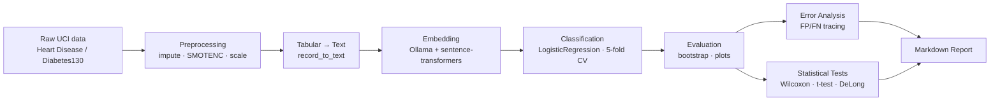

# Forecast — Local Clinical Text-Embedding Pipeline

Automatic disease prediction from clinical datasets using a fully local pipeline based on modern encoders and Ollama.



## Highlights
- **Fully local & private**: no external API calls — embeddings are generated via Ollama (general-purpose encoders) and local `sentence-transformers` (biomedical encoders).
- **Tabular-to-text pipeline**: structured clinical records are converted into natural language before embedding, testing whether language-model representations capture clinical signal from tabular data.
- **Two clinical benchmarks**: UCI Heart Disease (diagnosis) and Diabetes 130-US Hospitals (30-day readmission), selectable via `--dataset`, each with its own isolated output tree.
- **General-purpose vs. biomedical comparison**: models are tagged by `family` (general-purpose, biomedical, biomedical sentence-transformers) enabling a direct comparison of domain-specific vs. general embeddings.
- **Rigorous statistical validation**: 10,000-resample bootstrap plus Wilcoxon, paired t-test, and DeLong tests for every pairwise model comparison.
- **Explainable failures**: every misclassification is traced back to the original clinical record, with per-feature deviation analysis of what characterizes the hardest cases.
- **One-command reproducibility**: `main.py` (or `run_pipeline.sh`) orchestrates the entire pipeline end-to-end and produces a self-contained Markdown report.

## Repository Structure
```
Forecast/
├── main.py                 # orchestrates all phases
├── preprocessing.py        # data loading, imputation, SMOTENC, scaling
├── embedding.py            # model config + tabular-to-text + embedding generation
├── classification.py       # classifier training and cross-validation
├── evaluation.py           # bootstrap metrics and plotting orchestration
├── error_analysis.py       # traces misclassifications to clinical records
├── statisticaltest.py      # Wilcoxon, paired t-test, DeLong tests
├── function.py              # shared config (model list/families), plot style
├── generatereport.py       # assembles the final markdown report
├── run_pipeline.sh/.bat/.ps1  # one-command setup + pipeline execution
├── datasets/
│   ├── heart+disease/                              # raw UCI Heart Disease source files
│   └── diabetes+130-us+hospitals+for+years+1999-2008/  # raw UCI Diabetes130 source files
├── datas/
│   ├── heart_disease/       # per-dataset output tree (see below)
│   │   ├── preprocessing/  # preprocessed features + raw CSV for traceability
│   │   ├── embeddings/     # per-model embedding vectors and labels
│   │   ├── results/        # predictions, bootstrap arrays, comparison CSVs, plots
│   │   ├── graphics/       # UMAP, ROC, confusion matrix, heatmap plots
│   │   └── reports/        # generated report.md
│   └── diabetes130/        # same structure, isolated for the second dataset
└── docs/
    ├── DATASET.md          # full dataset description, ethics, limitations
    └── STATISTICAL_TESTS.md # statistical methodology in depth
```

## Research Questions
**Primary:**
> Does using semantic embeddings generated locally by language models effectively support clinical classification tasks starting from structured data converted into natural language?

**Secondary:**
> Do embedding models specialized for the biomedical domain produce more effective semantic representations than general-purpose models for a clinical classification task based on tabular data transformed into text?

The secondary question is answered directly by the pipeline's model configuration in [function.py](function.py), which tags every encoder with a `family`:

| Family | Models | Source |
|---|---|---|
| General-purpose | `e5-base`, `e5-large`, `gte-base`, `gte-large` | `models_ollama` |
| Biomedical | `bioclinicalbert`, `pubmedbert` | `models_medical` |
| Biomedical sentence-transformers | `sentence-biobert` | `models_medical` |

This grouping drives the Model Family Comparison plot (see [Evaluation and Visualization](#evaluation-and-visualization)) and the color palette used across every figure.

## Datasets
The pipeline supports two clinical datasets, selected with `--dataset` (default `heart_disease`):

| Dataset | `--dataset` value | Records used | Features | Target |
|---|---|---|---|---|
| UCI Heart Disease | `heart_disease` | 297 | 14 clinical attributes | Disease presence (binary) |
| Diabetes 130-US Hospitals | `diabetes130` | 20,000 (stratified sample of ~100k) | 19 encounter attributes | Readmission within 30 days (binary) |

Full details on origin, features, ethics, and limitations for both datasets are in **[docs/DATASET.md](docs/DATASET.md)**.

## Prerequisites
- **Python**: 3.14 (developed and tested against this version; earlier 3.x versions are untested). The `env/` folder is a local virtual environment created by [Installation](#installation) step 2 — it is **not** committed to the repository, so every clone must run `pip install -r requirements.txt` itself.
- **Platform**: developed and verified on Apple Silicon (arm64/macOS); on Intel/Linux the same steps should apply but haven't been verified.
- **Ollama**: required and must be installed and running locally — the general-purpose embedding models (E5, GTE) are served through it. Install from [ollama.com](https://ollama.com).
- **Hugging Face access**: the biomedical models (`bioclinicalbert`, `pubmedbert`, `sentence-biobert`) are downloaded via `sentence-transformers`/`huggingface_hub`, which requires a `.env` file in the project root with `HF_READ_TOKEN` and `OFFLINE_MODE` (see [Installation](#installation), step 5).
- **Hardware**: no GPU required. Expect the full pipeline to take from several minutes to tens of minutes depending on machine specs (embedding generation + 10,000-iteration bootstrap are the slow steps). At least ~8 GB of free RAM is recommended for the HuggingFace models.

## Installation
1. Clone the repository and move into it.
2. Create and activate the virtual environment:
   ```bash
   python3 -m venv env
   source env/bin/activate
   ```
3. Install dependencies:
   ```bash
   pip install -r requirements.txt
   ```
4. Install and start Ollama, then pull the general-purpose models used by the pipeline (`models_ollama` in `function.py`):
   ```bash
   ollama serve &
   ollama pull yxchia/multilingual-e5-base
   ollama pull twwch/m3e-base
   ollama pull zyw0605688/gte-large-zh
   ollama pull jeffh/intfloat-multilingual-e5-large-instruct:q8_0
   ```
5. Create a `.env` file in the project root with the Hugging Face token and offline-mode flag used for the biomedical model calls in `embedding.py`:
   ```
   HF_READ_TOKEN=your_token_here
   OFFLINE_MODE=0
   ```
   `HF_READ_TOKEN` authenticates with Hugging Face (needed the first time each biomedical model is downloaded, or if a model is gated); `OFFLINE_MODE=1` forces `sentence-transformers` to use only the local cache (set it to `1` after the models have already been downloaded once, to skip the network check).
6. Run the pipeline:
   ```bash
   python main.py
   ```

Alternatively, `run_pipeline.sh` (`.bat` / `.ps1` on Windows) automates steps 2–6 end-to-end (creates/activates `env`, installs dependencies, starts Ollama, pulls the required models, and runs `main.py`).

## Pipeline Phases

| Phase | File | What it does |
|---|---|---|
| Preprocessing | [preprocessing.py](preprocessing.py) | Impute missing values, balance classes with SMOTENC on raw features, scale + one-hot encode (for visualization only) |
| Embedding | [embedding.py](embedding.py) | Convert records to text (`record_to_text`), generate vectors via Ollama / `sentence-transformers`, save to `.npy` |
| Classification | [classification.py](classification.py) | `LogisticRegression`, `StratifiedKFold` (5 folds), per-fold F1-optimal threshold, bootstrap uncertainty |
| Evaluation | [evaluation.py](evaluation.py) | UMAP, ROC, confusion matrices, bootstrap boxplots, mean±CI, family comparison plots |
| Error Analysis | [error_analysis.py](error_analysis.py) | Traces misclassifications back to clinical records; error rates, hardest cases, feature deviation |
| Statistical Tests | [statisticaltest.py](statisticaltest.py) | Wilcoxon, paired t-test, DeLong test across all model pairs |
| Report | [generatereport.py](generatereport.py) | Assembles all of the above into a single Markdown report |

### Preprocessing
- Median imputation for numeric features, most-frequent imputation for categorical features
- `SMOTENC` class balancing on the raw/interpretable feature space, so synthetic records remain convertible to text
- `StandardScaler` + one-hot encoding used only for the UMAP projection and correlation heatmap — not for the text descriptions
- Persists `datas/preprocessing/X_train_raw.csv` for traceability during error analysis

### Embedding
- General-purpose models via `ollama` client, biomedical models via `sentence-transformers`
- Model list defined in `function.py` (`models_ollama`, `models_medical`, combined into `models_all`)

### Classification
- Base classifier: `LogisticRegression` (`max_iter=2000`)
- 5-fold `StratifiedKFold`, per-fold threshold optimization (max F1 from precision-recall curve)
- Reported metrics: Accuracy, Macro-F1, ROC-AUC, mean optimized threshold
- Per-fold validation indices saved (`{model}_val_idx.npy`) for error tracing

### Evaluation and Visualization
All plots saved as 300 DPI PNG and vector PDF, white background, colorblind-safe family-consistent palette:

| Plot | Location |
|---|---|
| UMAP 2D projection | `datas/graphics/UMAP_*` |
| Unified ROC comparison | `datas/graphics/ROC_comparison` |
| Confusion matrices per model | `datas/graphics/CM_*` |
| Bootstrap metric boxplots | `datas/results/BOXPLOT_metrics` |
| Mean ± 95% CI per model/metric | `datas/results/MeanCI_metrics` |
| Model family comparison | `datas/results/FamilyComparison_metrics` |

### Error Analysis
Traces every misclassification back to the real clinical record using the saved `val_idx`:
- **Per-model error rates**: `datas/results/error_summary.csv`, plotted in `ErrorAnalysis_rates`
- **Misclassified records**: `datas/results/{model}_false_positives.csv` / `_false_negatives.csv`
- **Hardest cases**: `datas/results/hardest_cases.csv`
- **Feature deviation**: `datas/results/feature_deviation.csv`, plotted in `ErrorAnalysis_feature_deviation`

All of the above feed into the generated report, grounding the discussion of failure modes in the actual run's data.

### Statistical Tests
Wilcoxon signed-rank, paired t-test, and DeLong test are run across all pairwise model comparisons on bootstrap distributions (10,000 resamples). Results saved to `datas/results/{wilcoxon,ttest,delong}_comparison.csv`. Full methodology, hypotheses, and interpretation guidance in **[docs/STATISTICAL_TESTS.md](docs/STATISTICAL_TESTS.md)**.

## `datas/` Folder Structure
Each dataset gets its own tree under `datas/<dataset>/` (`heart_disease` or `diabetes130`), created by `get_output_dirs()` in `function.py`, so switching `--dataset` never overwrites the other dataset's run:

| Folder | Contents |
|---|---|
| `datasets/heart+disease/`, `datasets/diabetes+130-.../` | Raw UCI source files (not touched by the pipeline) |
| `datas/<dataset>/preprocessing/` | `preprocessed_data.npy` / `preprocessed_labels.npy` (encoded features) and `X_train_raw.csv` (raw features, row-aligned with embeddings) |
| `datas/<dataset>/embeddings/` | Per-model embedding vectors (`*_embeddings.npy`) and labels (`*_embeddings_labels.npy`) |
| `datas/<dataset>/results/` | Per-model predictions, bootstrap arrays, comparison tables, error-analysis outputs, and plots |
| `datas/<dataset>/graphics/` | UMAP, ROC comparison, confusion matrix, and heatmap plots (PNG + PDF) |
| `datas/<dataset>/reports/` | The generated `report.md` |

## Execution
The full pipeline (preprocessing → embedding → classification → evaluation → error analysis → statistical tests → report) is orchestrated by `main.py` and takes a single `--dataset` flag to pick which clinical dataset to run:

```bash
source env/bin/activate
python main.py --dataset heart_disease   # UCI Heart Disease benchmark
python main.py --dataset diabetes130     # Diabetes 130-US Hospitals benchmark
```

> ⚠️ **Default dataset**: `--dataset` is optional and **defaults to `heart_disease`** ([main.py](main.py)) — running `python main.py` with no flag will *not* run the Diabetes130 benchmark. Pass `--dataset diabetes130` explicitly to run it.

Each run first wipes and regenerates only *that dataset's* own `datas/<dataset>/` tree (preprocessing, embeddings, results, graphics — see [`datas/` Folder Structure](#datas-folder-structure) above); the other dataset's previous outputs are left untouched, so the two benchmarks can be run independently and compared side by side.

To automate environment setup and Ollama model downloads as well, use `run_pipeline.sh` (`.bat` / `.ps1` on Windows), which forwards any arguments to `main.py`:
```bash
./run_pipeline.sh                        # defaults to heart_disease
./run_pipeline.sh --dataset diabetes130
```
Note: embedding generation for the general-purpose models uses `ollama.Client` in `embedding.py` — ensure the Ollama service is running and the required models have been pulled (see [Installation](#installation)).

## Troubleshooting
- **ARM/x86 mismatch (Apple Silicon)**: make sure `python3` and the virtual environment are built natively for `arm64` (`python3 -c "import platform; print(platform.machine())"` should print `arm64`). A Rosetta-translated Python install can cause slow or failing installs of `torch`/`numba`.
- **`ollama pull` / model not found errors**: the general-purpose models must be pulled before running the pipeline (see [Installation](#installation), step 4). Verify with `ollama list`.
- **Hugging Face authentication / gated model errors**: set `HF_READ_TOKEN` in `.env` (see [Installation](#installation), step 5); for fully offline runs after the first download, set `OFFLINE_MODE=1`.
- **`FileNotFoundError` on `.npy` files in `datas/embeddings` or `datas/results`**: an earlier phase hasn't completed successfully yet — rerun `python main.py`, or check the console output of the specific phase.
- **Virtual environment issues**: if `source env/bin/activate` fails, delete the `env/` folder and recreate it (`python3 -m venv env`), then reinstall with `pip install -r requirements.txt`.
- **`ModuleNotFoundError` for a package listed in `requirements.txt`**: the environment was activated but `pip install -r requirements.txt` was never run (or was interrupted) inside it — re-run it; this is safe to repeat.

## Requirements
See [requirements.txt](requirements.txt) for the full dependency list.

## Further Reading
- **[docs/DATASET.md](docs/DATASET.md)** — full dataset origin, composition, ethics, and limitations
- **[docs/STATISTICAL_TESTS.md](docs/STATISTICAL_TESTS.md)** — statistical testing methodology, hypotheses, and interpretation
