# 📊 Encoder Evaluation Report

**Generated:** 2026-09-06 19:48

---

## 🎯 Objective

Verify the robustness and reliability of the pipeline based on embeddings generated by modern models (E5-base, E5-large, GTE-large).

## 📘 Evaluated Models

- **e5-base**
- **gte-base**
- **gte-large**
- **e5-large**
- **bioclinicalbert**
- **pubmedbert**
- **sentence-biobert**

---

## 📈 Metric results with confidence intervals (Bootstrap 10,000)

| model            |   acc_mean |   acc_ci_low |   acc_ci_high |    acc_std |   f1_mean |   f1_ci_low |   f1_ci_high |     f1_std |   auc_mean |   auc_ci_low |   auc_ci_high |    auc_std |
|:-----------------|-----------:|-------------:|--------------:|-----------:|----------:|------------:|-------------:|-----------:|-----------:|-------------:|--------------:|-----------:|
| e5-base          |   0.640526 |     0.635008 |      0.646088 | 0.00284393 |  0.62433  |    0.618629 |     0.629939 | 0.0029199  |   0.718335 |     0.712511 |      0.724322 | 0.00302594 |
| gte-base         |   0.624733 |     0.619073 |      0.6304   | 0.00286547 |  0.601109 |    0.59521  |     0.606979 | 0.00296153 |   0.710418 |     0.704494 |      0.716417 | 0.00303287 |
| gte-large        |   0.643221 |     0.637715 |      0.648973 | 0.0028478  |  0.626609 |    0.620938 |     0.632517 | 0.00292476 |   0.724886 |     0.719013 |      0.730731 | 0.0029855  |
| e5-large         |   0.634646 |     0.629132 |      0.64025  | 0.00284594 |  0.614665 |    0.608876 |     0.620419 | 0.00292369 |   0.711674 |     0.705797 |      0.717582 | 0.00304151 |
| bioclinicalbert  |   0.674234 |     0.668777 |      0.679752 | 0.00277562 |  0.664344 |    0.658753 |     0.669902 | 0.00282994 |   0.760213 |     0.754706 |      0.765774 | 0.00281404 |
| pubmedbert       |   0.669322 |     0.663712 |      0.674863 | 0.00278755 |  0.655102 |    0.649336 |     0.66079  | 0.00286185 |   0.758967 |     0.753436 |      0.764494 | 0.0028326  |
| sentence-biobert |   0.681098 |     0.675707 |      0.686436 | 0.00276876 |  0.670329 |    0.664808 |     0.675819 | 0.00282578 |   0.764831 |     0.759428 |      0.770207 | 0.00278283 |

---

## 📉 ROC Curve Comparison

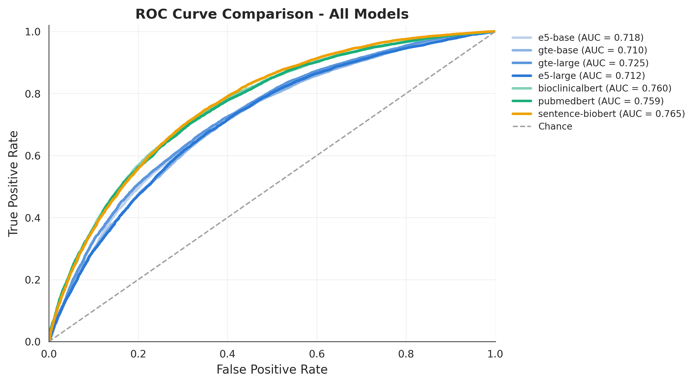

---

## 🧩 Confusion Matrix

### e5-base

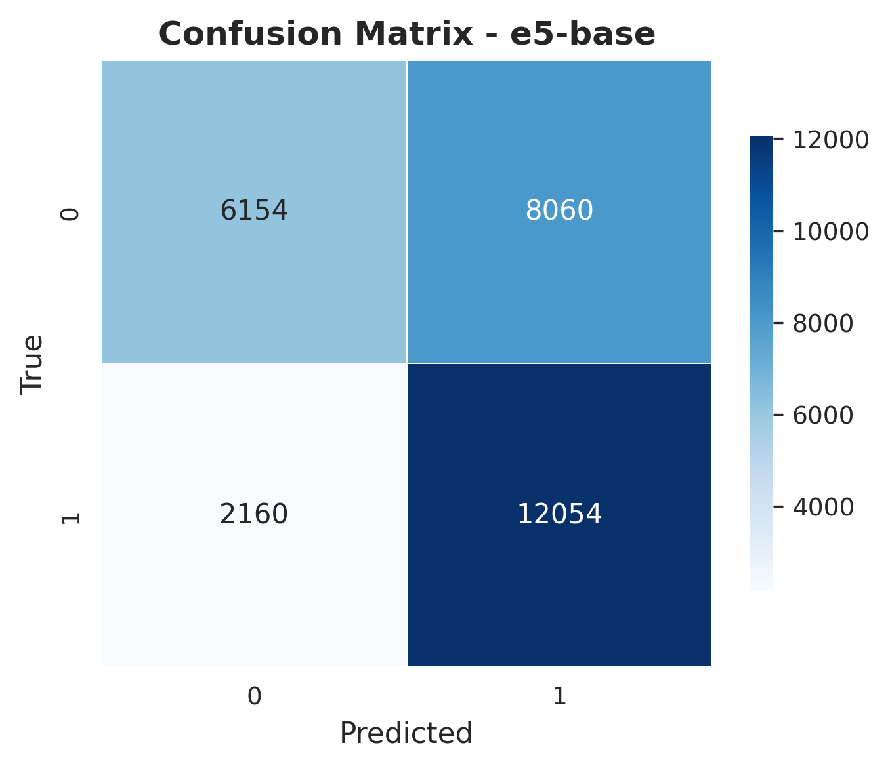

### gte-base

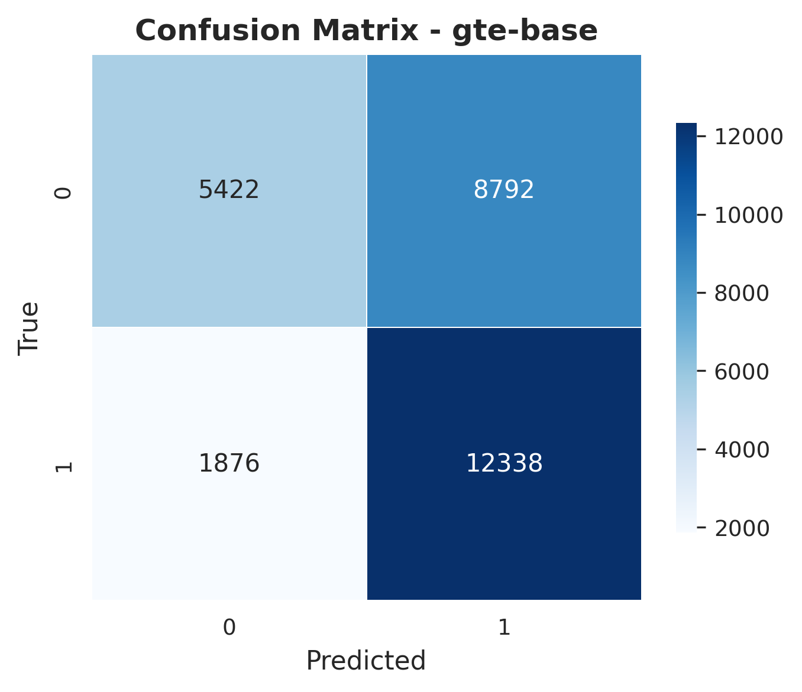

### gte-large

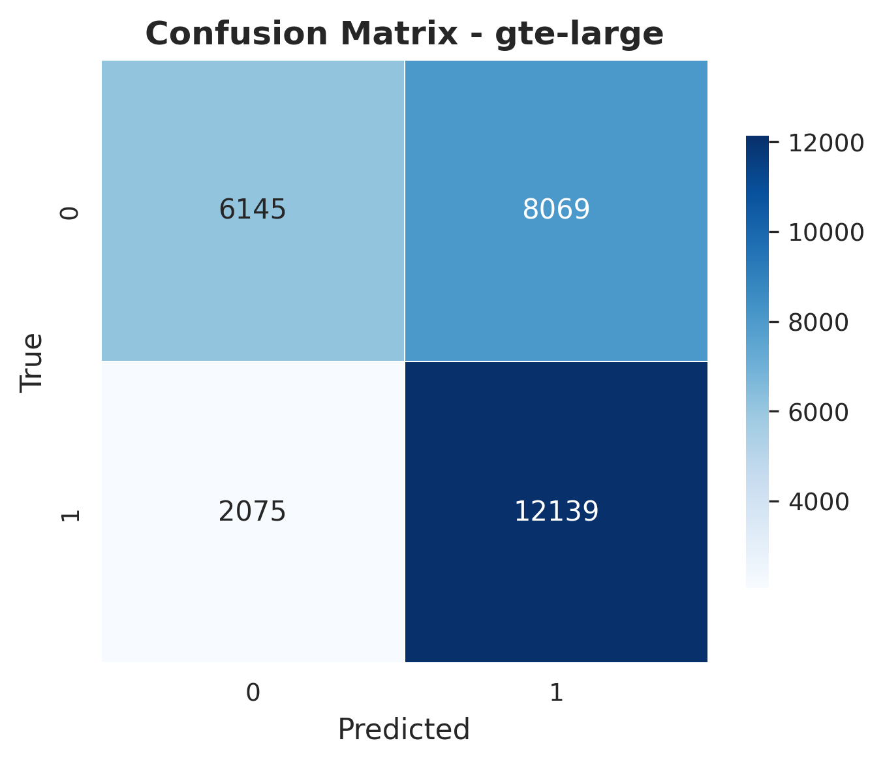

### e5-large

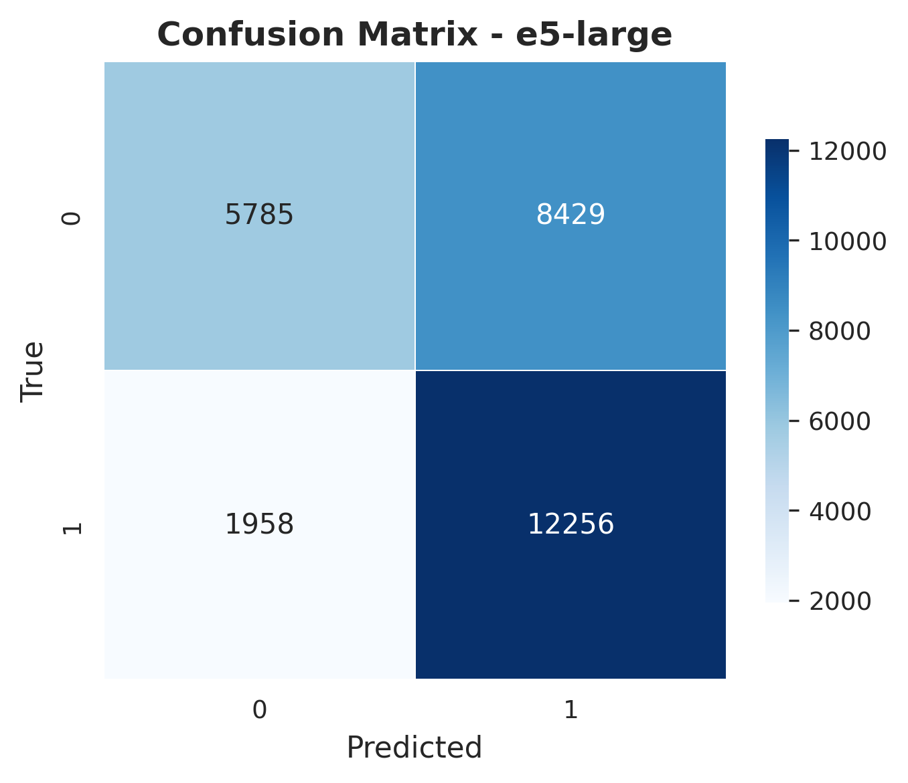

### bioclinicalbert

### pubmedbert

### sentence-biobert

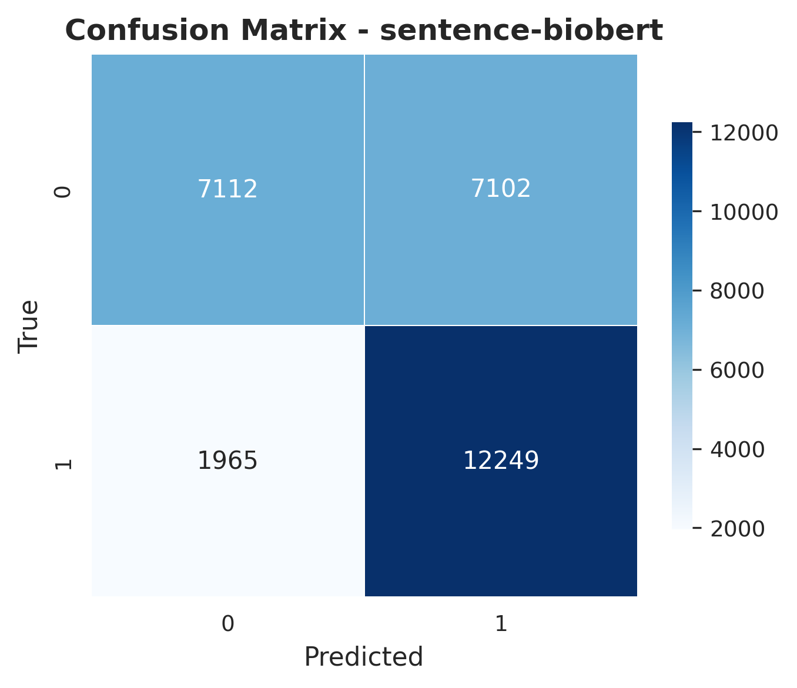

---

## 📦 Bootstrapped Metric Boxplot

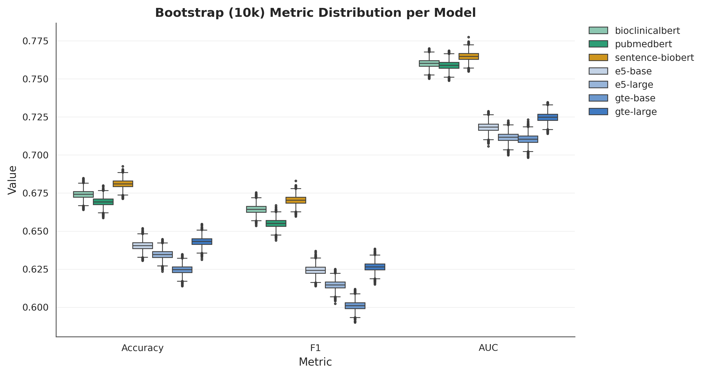

---

## 📐 Mean ± Confidence Interval

Mean metric per model with 95% bootstrap confidence interval (thin whisker) and ±1 standard deviation (thick whisker).

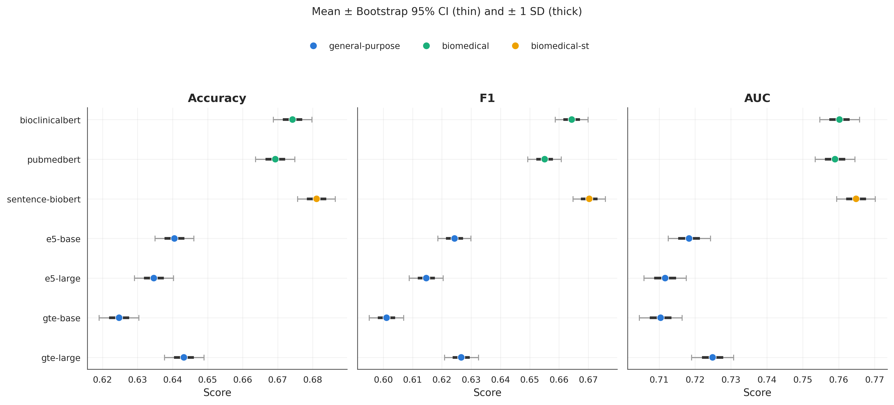

---

## 🧬 Model Family Comparison

Bootstrap metric distributions pooled by model family: general-purpose vs. biomedical vs. biomedical sentence-transformers.

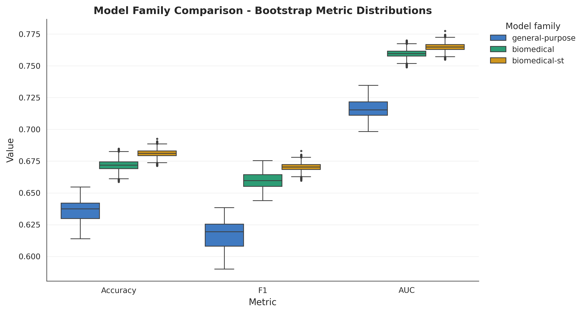

---

## 🩺 Error Analysis

Misclassified cases (false positives / false negatives) are traced back to the original clinical record for every model, using the fold validation indices saved during training.

### Error rates per model

| model            |   n_errors |   n_fp |   n_fn |   fp_rate |   fn_rate |
|:-----------------|-----------:|-------:|-------:|----------:|----------:|
| e5-base          |      10220 |   8060 |   2160 |  0.567047 |  0.151963 |
| gte-base         |      10668 |   8792 |   1876 |  0.618545 |  0.131983 |
| gte-large        |      10144 |   8069 |   2075 |  0.56768  |  0.145983 |
| e5-large         |      10387 |   8429 |   1958 |  0.593007 |  0.137752 |
| bioclinicalbert  |       9261 |   7070 |   2191 |  0.497397 |  0.154144 |
| pubmedbert       |       9401 |   7586 |   1815 |  0.533699 |  0.127691 |
| sentence-biobert |       9067 |   7102 |   1965 |  0.499648 |  0.138244 |

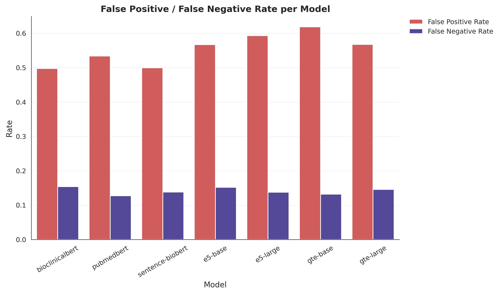

### Clinical feature deviation: misclassified vs. correctly classified

Standardized mean difference per clinical feature, pooled across all models (positive = higher in misclassified cases).

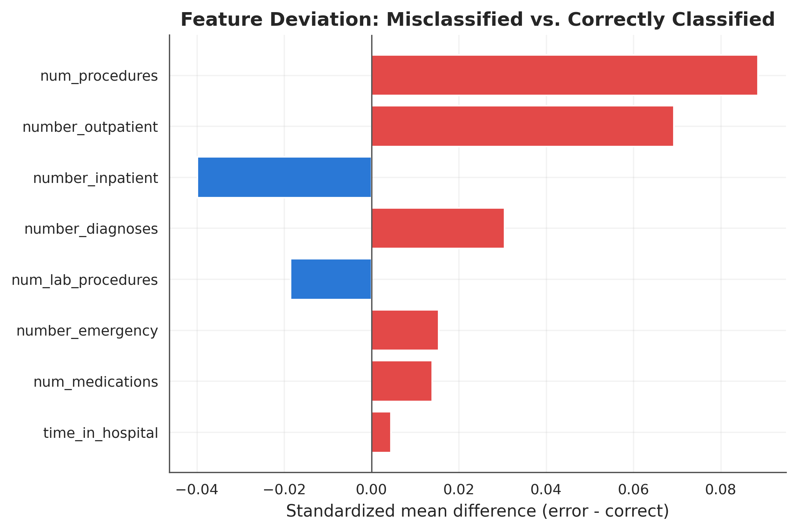

### Hardest cases (most frequently misclassified across models)

| race            | gender   | age      |   admission_type_id |   discharge_disposition_id |   admission_source_id |   time_in_hospital |   num_lab_procedures |   num_procedures |   num_medications |   number_outpatient |   number_emergency |   number_inpatient |   number_diagnoses | max_glu_serum   | A1Cresult   | insulin   | change   | diabetesMed   |   max_glu_serum_missing |   A1Cresult_missing |   n_models_wrong |   n_models_evaluated |
|:----------------|:---------|:---------|--------------------:|---------------------------:|----------------------:|-------------------:|---------------------:|-----------------:|------------------:|--------------------:|-------------------:|-------------------:|-------------------:|:----------------|:------------|:----------|:---------|:--------------|------------------------:|--------------------:|-----------------:|---------------------:|
| Caucasian       | Male     | [40-50)  |                   1 |                          1 |                     7 |                  4 |                    1 |                1 |                13 |                   0 |                  0 |                  0 |                  9 | Norm            | >8          | Steady    | Ch       | Yes           |                       1 |                   1 |                7 |                    7 |
| Caucasian       | Female   | [60-70)  |                   1 |                          6 |                     7 |                  5 |                   82 |                1 |                17 |                   1 |                  0 |                  0 |                  9 | Norm            | >8          | Up        | Ch       | Yes           |                       1 |                   1 |                7 |                    7 |
| Caucasian       | Female   | [40-50)  |                   1 |                          1 |                     7 |                 10 |                   70 |                0 |                24 |                   0 |                  1 |                  0 |                  9 | Norm            | >8          | Up        | Ch       | Yes           |                       1 |                   1 |                7 |                    7 |
| Caucasian       | Male     | [90-100) |                   1 |                          1 |                     7 |                  1 |                   37 |                0 |                 3 |                   0 |                  0 |                  0 |                  5 | Norm            | >8          | No        | No       | Yes           |                       1 |                   1 |                7 |                    7 |
| Caucasian       | Male     | [80-90)  |                   1 |                          3 |                     7 |                  9 |                   61 |                0 |                31 |                   0 |                  0 |                  0 |                  9 | Norm            | >8          | No        | No       | No            |                       1 |                   1 |                7 |                    7 |
| Caucasian       | Female   | [60-70)  |                   1 |                          1 |                     7 |                  1 |                   42 |                0 |                 5 |                   0 |                  0 |                  0 |                  3 | Norm            | >8          | No        | No       | Yes           |                       1 |                   1 |                7 |                    7 |
| Caucasian       | Female   | [50-60)  |                   1 |                          1 |                     7 |                  2 |                   10 |                0 |                12 |                   0 |                  0 |                  0 |                  3 | Norm            | >8          | Steady    | Ch       | Yes           |                       1 |                   1 |                7 |                    7 |
| AfricanAmerican | Male     | [50-60)  |                   2 |                         18 |                     2 |                  9 |                   49 |                1 |                10 |                   0 |                  0 |                  1 |                  8 | Norm            | >8          | No        | No       | No            |                       1 |                   1 |                7 |                    7 |
| Caucasian       | Male     | [80-90)  |                   1 |                          1 |                     7 |                  5 |                   34 |                0 |                23 |                   0 |                  0 |                  0 |                  9 | Norm            | >8          | Steady    | Ch       | Yes           |                       1 |                   1 |                7 |                    7 |
| Caucasian       | Female   | [60-70)  |                   1 |                          1 |                     7 |                  6 |                   65 |                0 |                27 |                   0 |                  0 |                  1 |                  9 | Norm            | >8          | Steady    | Ch       | Yes           |                       1 |                   1 |                7 |                    7 |

---

## 🧪 Statistical Tests

This section reports pairwise comparisons between model bootstrap metrics using Wilcoxon signed-rank tests, paired t-tests, and DeLong AUC comparisons.

### Wilcoxon Signed-Rank Test

The Wilcoxon test compares paired bootstrap distributions for each model pair.

| metric   | model_a         | model_b          |   mean_a |   mean_b |        statistic |   p_value |   significant |   p_value_bh |   significant_bh |
|:---------|:----------------|:-----------------|---------:|---------:|-----------------:|----------:|--------------:|-------------:|-----------------:|
| acc      | e5-base         | gte-base         |   0.6405 |   0.6247 |      0           |         0 |             1 |            0 |                1 |
| acc      | e5-base         | gte-large        |   0.6405 |   0.6432 |      1.30628e+06 |         0 |             1 |            0 |                1 |
| acc      | e5-base         | e5-large         |   0.6405 |   0.6346 |     22.5         |         0 |             1 |            0 |                1 |
| acc      | e5-base         | bioclinicalbert  |   0.6405 |   0.6742 |      0           |         0 |             1 |            0 |                1 |
| acc      | e5-base         | pubmedbert       |   0.6405 |   0.6693 |      0           |         0 |             1 |            0 |                1 |
| acc      | e5-base         | sentence-biobert |   0.6405 |   0.6811 |      0           |         0 |             1 |            0 |                1 |
| acc      | gte-base        | gte-large        |   0.6247 |   0.6432 |      0           |         0 |             1 |            0 |                1 |
| acc      | gte-base        | e5-large         |   0.6247 |   0.6346 |      0           |         0 |             1 |            0 |                1 |
| acc      | gte-base        | bioclinicalbert  |   0.6247 |   0.6742 |      0           |         0 |             1 |            0 |                1 |
| acc      | gte-base        | pubmedbert       |   0.6247 |   0.6693 |      0           |         0 |             1 |            0 |                1 |
| acc      | gte-base        | sentence-biobert |   0.6247 |   0.6811 |      0           |         0 |             1 |            0 |                1 |
| acc      | gte-large       | e5-large         |   0.6432 |   0.6346 |      0           |         0 |             1 |            0 |                1 |
| acc      | gte-large       | bioclinicalbert  |   0.6432 |   0.6742 |      0           |         0 |             1 |            0 |                1 |
| acc      | gte-large       | pubmedbert       |   0.6432 |   0.6693 |      0           |         0 |             1 |            0 |                1 |
| acc      | gte-large       | sentence-biobert |   0.6432 |   0.6811 |      0           |         0 |             1 |            0 |                1 |
| acc      | e5-large        | bioclinicalbert  |   0.6346 |   0.6742 |      0           |         0 |             1 |            0 |                1 |
| acc      | e5-large        | pubmedbert       |   0.6346 |   0.6693 |      0           |         0 |             1 |            0 |                1 |
| acc      | e5-large        | sentence-biobert |   0.6346 |   0.6811 |      0           |         0 |             1 |            0 |                1 |
| acc      | bioclinicalbert | pubmedbert       |   0.6742 |   0.6693 |   1067           |         0 |             1 |            0 |                1 |
| acc      | bioclinicalbert | sentence-biobert |   0.6742 |   0.6811 |   7022.5         |         0 |             1 |            0 |                1 |
| acc      | pubmedbert      | sentence-biobert |   0.6693 |   0.6811 |      0           |         0 |             1 |            0 |                1 |
| f1       | e5-base         | gte-base         |   0.6243 |   0.6011 |      0           |         0 |             1 |            0 |                1 |
| f1       | e5-base         | gte-large        |   0.6243 |   0.6266 |      3.47412e+06 |         0 |             1 |            0 |                1 |
| f1       | e5-base         | e5-large         |   0.6243 |   0.6147 |      0           |         0 |             1 |            0 |                1 |
| f1       | e5-base         | bioclinicalbert  |   0.6243 |   0.6643 |      0           |         0 |             1 |            0 |                1 |
| f1       | e5-base         | pubmedbert       |   0.6243 |   0.6551 |      0           |         0 |             1 |            0 |                1 |
| f1       | e5-base         | sentence-biobert |   0.6243 |   0.6703 |      0           |         0 |             1 |            0 |                1 |
| f1       | gte-base        | gte-large        |   0.6011 |   0.6266 |      0           |         0 |             1 |            0 |                1 |
| f1       | gte-base        | e5-large         |   0.6011 |   0.6147 |      0           |         0 |             1 |            0 |                1 |
| f1       | gte-base        | bioclinicalbert  |   0.6011 |   0.6643 |      0           |         0 |             1 |            0 |                1 |
| f1       | gte-base        | pubmedbert       |   0.6011 |   0.6551 |      0           |         0 |             1 |            0 |                1 |
| f1       | gte-base        | sentence-biobert |   0.6011 |   0.6703 |      0           |         0 |             1 |            0 |                1 |
| f1       | gte-large       | e5-large         |   0.6266 |   0.6147 |      0           |         0 |             1 |            0 |                1 |
| f1       | gte-large       | bioclinicalbert  |   0.6266 |   0.6643 |      0           |         0 |             1 |            0 |                1 |
| f1       | gte-large       | pubmedbert       |   0.6266 |   0.6551 |      0           |         0 |             1 |            0 |                1 |
| f1       | gte-large       | sentence-biobert |   0.6266 |   0.6703 |      0           |         0 |             1 |            0 |                1 |
| f1       | e5-large        | bioclinicalbert  |   0.6147 |   0.6643 |      0           |         0 |             1 |            0 |                1 |
| f1       | e5-large        | pubmedbert       |   0.6147 |   0.6551 |      0           |         0 |             1 |            0 |                1 |
| f1       | e5-large        | sentence-biobert |   0.6147 |   0.6703 |      0           |         0 |             1 |            0 |                1 |
| f1       | bioclinicalbert | pubmedbert       |   0.6643 |   0.6551 |      0           |         0 |             1 |            0 |                1 |
| f1       | bioclinicalbert | sentence-biobert |   0.6643 |   0.6703 |  83192           |         0 |             1 |            0 |                1 |
| f1       | pubmedbert      | sentence-biobert |   0.6551 |   0.6703 |      0           |         0 |             1 |            0 |                1 |
| auc      | e5-base         | gte-base         |   0.7183 |   0.7104 |      0           |         0 |             1 |            0 |                1 |
| auc      | e5-base         | gte-large        |   0.7183 |   0.7249 |      0           |         0 |             1 |            0 |                1 |
| auc      | e5-base         | e5-large         |   0.7183 |   0.7117 |      0           |         0 |             1 |            0 |                1 |
| auc      | e5-base         | bioclinicalbert  |   0.7183 |   0.7602 |      0           |         0 |             1 |            0 |                1 |
| auc      | e5-base         | pubmedbert       |   0.7183 |   0.759  |      0           |         0 |             1 |            0 |                1 |
| auc      | e5-base         | sentence-biobert |   0.7183 |   0.7648 |      0           |         0 |             1 |            0 |                1 |
| auc      | gte-base        | gte-large        |   0.7104 |   0.7249 |      0           |         0 |             1 |            0 |                1 |
| auc      | gte-base        | e5-large         |   0.7104 |   0.7117 |      7.25008e+06 |         0 |             1 |            0 |                1 |
| auc      | gte-base        | bioclinicalbert  |   0.7104 |   0.7602 |      0           |         0 |             1 |            0 |                1 |
| auc      | gte-base        | pubmedbert       |   0.7104 |   0.759  |      0           |         0 |             1 |            0 |                1 |
| auc      | gte-base        | sentence-biobert |   0.7104 |   0.7648 |      0           |         0 |             1 |            0 |                1 |
| auc      | gte-large       | e5-large         |   0.7249 |   0.7117 |      0           |         0 |             1 |            0 |                1 |
| auc      | gte-large       | bioclinicalbert  |   0.7249 |   0.7602 |      0           |         0 |             1 |            0 |                1 |
| auc      | gte-large       | pubmedbert       |   0.7249 |   0.759  |      0           |         0 |             1 |            0 |                1 |
| auc      | gte-large       | sentence-biobert |   0.7249 |   0.7648 |      0           |         0 |             1 |            0 |                1 |
| auc      | e5-large        | bioclinicalbert  |   0.7117 |   0.7602 |      0           |         0 |             1 |            0 |                1 |
| auc      | e5-large        | pubmedbert       |   0.7117 |   0.759  |      0           |         0 |             1 |            0 |                1 |
| auc      | e5-large        | sentence-biobert |   0.7117 |   0.7648 |      0           |         0 |             1 |            0 |                1 |
| auc      | bioclinicalbert | pubmedbert       |   0.7602 |   0.759  | 952941           |         0 |             1 |            0 |                1 |
| auc      | bioclinicalbert | sentence-biobert |   0.7602 |   0.7648 | 112454           |         0 |             1 |            0 |                1 |
| auc      | pubmedbert      | sentence-biobert |   0.759  |   0.7648 |  11593           |         0 |             1 |            0 |                1 |

### Paired t-test

The paired t-test compares paired bootstrap means for each model pair.

| metric   | model_a         | model_b          |   mean_a |   mean_b |   statistic |   p_value |   significant |   p_value_bh |   significant_bh |
|:---------|:----------------|:-----------------|---------:|---------:|------------:|----------:|--------------:|-------------:|-----------------:|
| acc      | e5-base         | gte-base         |   0.6405 |   0.6247 |    776.122  |         0 |             1 |            0 |                1 |
| acc      | e5-base         | gte-large        |   0.6405 |   0.6432 |   -136.339  |         0 |             1 |            0 |                1 |
| acc      | e5-base         | e5-large         |   0.6405 |   0.6346 |    346.55   |         0 |             1 |            0 |                1 |
| acc      | e5-base         | bioclinicalbert  |   0.6405 |   0.6742 |  -1445.68   |         0 |             1 |            0 |                1 |
| acc      | e5-base         | pubmedbert       |   0.6405 |   0.6693 |  -1285.88   |         0 |             1 |            0 |                1 |
| acc      | e5-base         | sentence-biobert |   0.6405 |   0.6811 |  -1523.73   |         0 |             1 |            0 |                1 |
| acc      | gte-base        | gte-large        |   0.6247 |   0.6432 |   -826.301  |         0 |             1 |            0 |                1 |
| acc      | gte-base        | e5-large         |   0.6247 |   0.6346 |   -481.185  |         0 |             1 |            0 |                1 |
| acc      | gte-base        | bioclinicalbert  |   0.6247 |   0.6742 |  -1997.59   |         0 |             1 |            0 |                1 |
| acc      | gte-base        | pubmedbert       |   0.6247 |   0.6693 |  -1922.07   |         0 |             1 |            0 |                1 |
| acc      | gte-base        | sentence-biobert |   0.6247 |   0.6811 |  -1891.29   |         0 |             1 |            0 |                1 |
| acc      | gte-large       | e5-large         |   0.6432 |   0.6346 |    424.54   |         0 |             1 |            0 |                1 |
| acc      | gte-large       | bioclinicalbert  |   0.6432 |   0.6742 |  -1374.64   |         0 |             1 |            0 |                1 |
| acc      | gte-large       | pubmedbert       |   0.6432 |   0.6693 |  -1232.44   |         0 |             1 |            0 |                1 |
| acc      | gte-large       | sentence-biobert |   0.6432 |   0.6811 |  -1416.38   |         0 |             1 |            0 |                1 |
| acc      | e5-large        | bioclinicalbert  |   0.6346 |   0.6742 |  -1705.19   |         0 |             1 |            0 |                1 |
| acc      | e5-large        | pubmedbert       |   0.6346 |   0.6693 |  -1612.35   |         0 |             1 |            0 |                1 |
| acc      | e5-large        | sentence-biobert |   0.6346 |   0.6811 |  -1704.86   |         0 |             1 |            0 |                1 |
| acc      | bioclinicalbert | pubmedbert       |   0.6742 |   0.6693 |    295.065  |         0 |             1 |            0 |                1 |
| acc      | bioclinicalbert | sentence-biobert |   0.6742 |   0.6811 |   -258.028  |         0 |             1 |            0 |                1 |
| acc      | pubmedbert      | sentence-biobert |   0.6693 |   0.6811 |   -439.405  |         0 |             1 |            0 |                1 |
| f1       | e5-base         | gte-base         |   0.6243 |   0.6011 |   1009.17   |         0 |             1 |            0 |                1 |
| f1       | e5-base         | gte-large        |   0.6243 |   0.6266 |   -104.42   |         0 |             1 |            0 |                1 |
| f1       | e5-base         | e5-large         |   0.6243 |   0.6147 |    514.973  |         0 |             1 |            0 |                1 |
| f1       | e5-base         | bioclinicalbert  |   0.6243 |   0.6643 |  -1586.21   |         0 |             1 |            0 |                1 |
| f1       | e5-base         | pubmedbert       |   0.6243 |   0.6551 |  -1252.08   |         0 |             1 |            0 |                1 |
| f1       | e5-base         | sentence-biobert |   0.6243 |   0.6703 |  -1582.47   |         0 |             1 |            0 |                1 |
| f1       | gte-base        | gte-large        |   0.6011 |   0.6266 |  -1006.99   |         0 |             1 |            0 |                1 |
| f1       | gte-base        | e5-large         |   0.6011 |   0.6147 |   -575.823  |         0 |             1 |            0 |                1 |
| f1       | gte-base        | bioclinicalbert  |   0.6011 |   0.6643 |  -2325.75   |         0 |             1 |            0 |                1 |
| f1       | gte-base        | pubmedbert       |   0.6011 |   0.6551 |  -2081.32   |         0 |             1 |            0 |                1 |
| f1       | gte-base        | sentence-biobert |   0.6011 |   0.6703 |  -2086.98   |         0 |             1 |            0 |                1 |
| f1       | gte-large       | e5-large         |   0.6266 |   0.6147 |    529.86   |         0 |             1 |            0 |                1 |
| f1       | gte-large       | bioclinicalbert  |   0.6266 |   0.6643 |  -1542.52   |         0 |             1 |            0 |                1 |
| f1       | gte-large       | pubmedbert       |   0.6266 |   0.6551 |  -1226.19   |         0 |             1 |            0 |                1 |
| f1       | gte-large       | sentence-biobert |   0.6266 |   0.6703 |  -1493.05   |         0 |             1 |            0 |                1 |
| f1       | e5-large        | bioclinicalbert  |   0.6147 |   0.6643 |  -1959.51   |         0 |             1 |            0 |                1 |
| f1       | e5-large        | pubmedbert       |   0.6147 |   0.6551 |  -1693.56   |         0 |             1 |            0 |                1 |
| f1       | e5-large        | sentence-biobert |   0.6147 |   0.6703 |  -1855.17   |         0 |             1 |            0 |                1 |
| f1       | bioclinicalbert | pubmedbert       |   0.6643 |   0.6551 |    514.424  |         0 |             1 |            0 |                1 |
| f1       | bioclinicalbert | sentence-biobert |   0.6643 |   0.6703 |   -208.708  |         0 |             1 |            0 |                1 |
| f1       | pubmedbert      | sentence-biobert |   0.6551 |   0.6703 |   -518.994  |         0 |             1 |            0 |                1 |
| auc      | e5-base         | gte-base         |   0.7183 |   0.7104 |    514.632  |         0 |             1 |            0 |                1 |
| auc      | e5-base         | gte-large        |   0.7183 |   0.7249 |   -427.397  |         0 |             1 |            0 |                1 |
| auc      | e5-base         | e5-large         |   0.7183 |   0.7117 |    553.462  |         0 |             1 |            0 |                1 |
| auc      | e5-base         | bioclinicalbert  |   0.7183 |   0.7602 |  -2249.01   |         0 |             1 |            0 |                1 |
| auc      | e5-base         | pubmedbert       |   0.7183 |   0.759  |  -2274.88   |         0 |             1 |            0 |                1 |
| auc      | e5-base         | sentence-biobert |   0.7183 |   0.7648 |  -1915.61   |         0 |             1 |            0 |                1 |
| auc      | gte-base        | gte-large        |   0.7104 |   0.7249 |   -773.122  |         0 |             1 |            0 |                1 |
| auc      | gte-base        | e5-large         |   0.7104 |   0.7117 |    -74.6556 |         0 |             1 |            0 |                1 |
| auc      | gte-base        | bioclinicalbert  |   0.7104 |   0.7602 |  -2474.89   |         0 |             1 |            0 |                1 |
| auc      | gte-base        | pubmedbert       |   0.7104 |   0.759  |  -2509.57   |         0 |             1 |            0 |                1 |
| auc      | gte-base        | sentence-biobert |   0.7104 |   0.7648 |  -1930.41   |         0 |             1 |            0 |                1 |
| auc      | gte-large       | e5-large         |   0.7249 |   0.7117 |    820.68   |         0 |             1 |            0 |                1 |
| auc      | gte-large       | bioclinicalbert  |   0.7249 |   0.7602 |  -2103.53   |         0 |             1 |            0 |                1 |
| auc      | gte-large       | pubmedbert       |   0.7249 |   0.759  |  -2281.23   |         0 |             1 |            0 |                1 |
| auc      | gte-large       | sentence-biobert |   0.7249 |   0.7648 |  -1643.37   |         0 |             1 |            0 |                1 |
| auc      | e5-large        | bioclinicalbert  |   0.7117 |   0.7602 |  -2510.26   |         0 |             1 |            0 |                1 |
| auc      | e5-large        | pubmedbert       |   0.7117 |   0.759  |  -2674.97   |         0 |             1 |            0 |                1 |
| auc      | e5-large        | sentence-biobert |   0.7117 |   0.7648 |  -2065.06   |         0 |             1 |            0 |                1 |
| auc      | bioclinicalbert | pubmedbert       |   0.7602 |   0.759  |    146.326  |         0 |             1 |            0 |                1 |
| auc      | bioclinicalbert | sentence-biobert |   0.7602 |   0.7648 |   -203.014  |         0 |             1 |            0 |                1 |
| auc      | pubmedbert      | sentence-biobert |   0.759  |   0.7648 |   -251.273  |         0 |             1 |            0 |                1 |

### DeLong AUC Comparison

The DeLong test compares AUC performance between model pairs on the same test labels.

| model_a         | model_b          |   auc_a |   auc_b |   delta_auc |   z_statistic |   p_value |   significant |   p_value_bh |   significant_bh |
|:----------------|:-----------------|--------:|--------:|------------:|--------------:|----------:|--------------:|-------------:|-----------------:|
| e5-base         | gte-base         |  0.7183 |  0.7104 |      0.0079 |       -5.1569 |    0      |             1 |       0      |                1 |
| e5-base         | gte-large        |  0.7183 |  0.7249 |     -0.0065 |        4.2496 |    0      |             1 |       0      |                1 |
| e5-base         | e5-large         |  0.7183 |  0.7117 |      0.0067 |       -5.5443 |    0      |             1 |       0      |                1 |
| e5-base         | bioclinicalbert  |  0.7183 |  0.7602 |     -0.0419 |       22.418  |    0      |             1 |       0      |                1 |
| e5-base         | pubmedbert       |  0.7183 |  0.759  |     -0.0407 |       22.7391 |    0      |             1 |       0      |                1 |
| e5-base         | sentence-biobert |  0.7183 |  0.7648 |     -0.0465 |       19.4078 |    0      |             1 |       0      |                1 |
| gte-base        | gte-large        |  0.7104 |  0.7249 |     -0.0144 |        7.6989 |    0      |             1 |       0      |                1 |
| gte-base        | e5-large         |  0.7104 |  0.7117 |     -0.0012 |        0.7366 |    0.4614 |             0 |       0.4614 |                0 |
| gte-base        | bioclinicalbert  |  0.7104 |  0.7602 |     -0.0498 |       24.649  |    0      |             1 |       0      |                1 |
| gte-base        | pubmedbert       |  0.7104 |  0.759  |     -0.0485 |       25.121  |    0      |             1 |       0      |                1 |
| gte-base        | sentence-biobert |  0.7104 |  0.7648 |     -0.0544 |       19.4861 |    0      |             1 |       0      |                1 |
| gte-large       | e5-large         |  0.7249 |  0.7117 |      0.0132 |       -8.0986 |    0      |             1 |       0      |                1 |
| gte-large       | bioclinicalbert  |  0.7249 |  0.7602 |     -0.0354 |       20.93   |    0      |             1 |       0      |                1 |
| gte-large       | pubmedbert       |  0.7249 |  0.759  |     -0.0341 |       22.7142 |    0      |             1 |       0      |                1 |
| gte-large       | sentence-biobert |  0.7249 |  0.7648 |     -0.04   |       16.7736 |    0      |             1 |       0      |                1 |
| e5-large        | bioclinicalbert  |  0.7117 |  0.7602 |     -0.0486 |       25.0195 |    0      |             1 |       0      |                1 |
| e5-large        | pubmedbert       |  0.7117 |  0.759  |     -0.0473 |       26.7771 |    0      |             1 |       0      |                1 |
| e5-large        | sentence-biobert |  0.7117 |  0.7648 |     -0.0532 |       20.8589 |    0      |             1 |       0      |                1 |
| bioclinicalbert | pubmedbert       |  0.7602 |  0.759  |      0.0013 |       -1.4615 |    0.1439 |             0 |       0.1511 |                0 |
| bioclinicalbert | sentence-biobert |  0.7602 |  0.7648 |     -0.0046 |        2.0337 |    0.042  |             1 |       0.0464 |                1 |
| pubmedbert      | sentence-biobert |  0.759  |  0.7648 |     -0.0058 |        2.5369 |    0.0112 |             1 |       0.0131 |                1 |

---

## 🧾 Held-Out Test Set Evaluation

Metrics on the 20% test split created in `preprocessing.py` and never used for training, threshold calibration, or the model comparisons above — the counterpart to the 5-fold cross-validation results, on data none of those steps ever saw.

| model            |   n_test |   accuracy |   macro_f1 |      auc |   threshold |
|:-----------------|---------:|-----------:|-----------:|---------:|------------:|
| e5-base          |     4000 |    0.454   |   0.384047 | 0.502024 |    0.439374 |
| gte-base         |     4000 |    0.3975  |   0.354891 | 0.50217  |    0.415731 |
| gte-large        |     4000 |    0.45125 |   0.38566  | 0.51327  |    0.411734 |
| e5-large         |     4000 |    0.46275 |   0.390522 | 0.482491 |    0.443243 |
| bioclinicalbert  |     4000 |    0.4525  |   0.39155  | 0.528788 |    0.357758 |
| pubmedbert       |     4000 |    0.48225 |   0.409145 | 0.532661 |    0.377375 |
| sentence-biobert |     4000 |    0.49725 |   0.420828 | 0.551663 |    0.3692   |

---

## 🔍 Discussion and Observations

- **sentence-biobert** has the highest mean accuracy in this run (0.6811).
- **sentence-biobert** has the highest mean macro-F1 (0.6703).
- **sentence-biobert** has the highest mean ROC-AUC (0.7648), 95% bootstrap CI [0.7594, 0.7702].
- **sentence-biobert** has the narrowest AUC confidence interval (0.0108 wide) — the most stable AUC estimate across the bootstrap resamples, independent of whether its mean AUC is also the highest.
- Averaged by family, **biomedical-st** has the highest mean AUC (0.7648) among the families present in this run. This is a descriptive average, not a statistical test: see the DeLong comparison above for which specific pairwise differences are actually significant.

---

## 🏁 Conclusions

- Every model in this run outperforms a trivial majority-class baseline on the SMOTE-balanced validation pool (50.0% accuracy, 0.333 macro-F1 by construction, since that pool is always exactly balanced) — see the accuracy/macro-F1 columns above.
- Bootstrap resampling (10,000 iterations) gives every metric a reported confidence interval: treat a numerically higher mean as a meaningful difference only where the corresponding pairwise test below also reports significance, not from the ranking alone.
- Of the 21 pairwise AUC comparisons (DeLong test), 19 are statistically significant at alpha=0.05 — see `delong_comparison.csv` for which specific pairs, rather than assuming every numeric difference is real.

---

## 🚀 Potential Improvements

- Test additional general-purpose or biomedical encoders beyond the ones already compared.
- Introduce a non-linear classifier (e.g. gradient boosting) as an additional comparison point.
- Apply probability calibration (e.g. Platt scaling) and report calibration curves, not only
  discrimination metrics (accuracy, F1, AUC).
- Run on the full Diabetes130 file instead of the 20,000-row stratified sample, to narrow the
  bootstrap confidence intervals further.
