# 📊 Encoder Evaluation Report

**Generated:** 2026-09-06 11:10

---

## 🎯 Objective

Verify the robustness and reliability of the pipeline based on embeddings generated by modern models (E5-base, E5-large, GTE-large).

## 📘 Evaluated Models

- **e5-base**
- **gte-base**
- **gte-large**
- **e5-large**
- **bioclinicalbert**
- **pubmedbert**
- **sentence-biobert**

---

## 📈 Metric results with confidence intervals (Bootstrap 10,000)

| model            |   acc_mean |   acc_ci_low |   acc_ci_high |   acc_std |   f1_mean |   f1_ci_low |   f1_ci_high |    f1_std |   auc_mean |   auc_ci_low |   auc_ci_high |   auc_std |
|:-----------------|-----------:|-------------:|--------------:|----------:|----------:|------------:|-------------:|----------:|-----------:|-------------:|--------------:|----------:|
| e5-base          |   0.770207 |     0.740786 |      0.798526 | 0.0147226 |  0.767925 |    0.737733 |     0.796659 | 0.0148463 |   0.847644 |     0.820034 |      0.873723 | 0.0134577 |
| gte-base         |   0.772683 |     0.743243 |      0.800983 | 0.0146052 |  0.771836 |    0.74282  |     0.800675 | 0.0146522 |   0.845783 |     0.818569 |      0.871702 | 0.0135526 |
| gte-large        |   0.775188 |     0.7457   |      0.80344  | 0.0147106 |  0.772742 |    0.743282 |     0.801168 | 0.0148528 |   0.854332 |     0.82768  |      0.879659 | 0.0132193 |
| e5-large         |   0.762861 |     0.733415 |      0.792383 | 0.0149346 |  0.759373 |    0.729321 |     0.78858  | 0.015128  |   0.855449 |     0.829463 |      0.880045 | 0.012997  |
| bioclinicalbert  |   0.77031  |     0.740786 |      0.798526 | 0.0147205 |  0.766939 |    0.737442 |     0.795563 | 0.0148873 |   0.882873 |     0.859855 |      0.90496  | 0.0114991 |
| pubmedbert       |   0.793611 |     0.765356 |      0.821867 | 0.0141311 |  0.791607 |    0.762567 |     0.819659 | 0.0142626 |   0.890948 |     0.868637 |      0.912472 | 0.0112797 |
| sentence-biobert |   0.789979 |     0.761671 |      0.816953 | 0.0142353 |  0.787367 |    0.75904  |     0.814719 | 0.0143916 |   0.87481  |     0.850031 |      0.897525 | 0.0119536 |

---

## 📉 ROC Curve Comparison

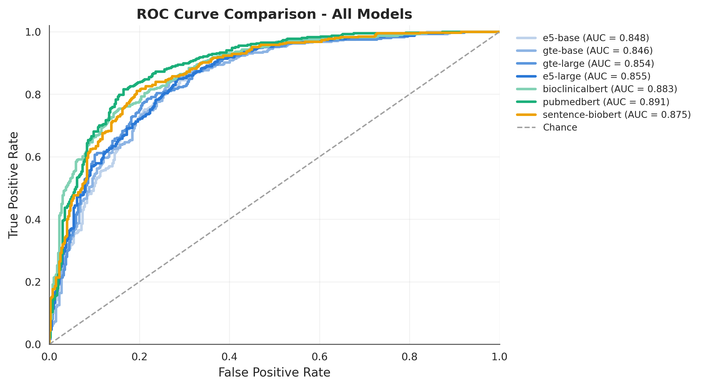

---

## 🧩 Confusion Matrix

### e5-base

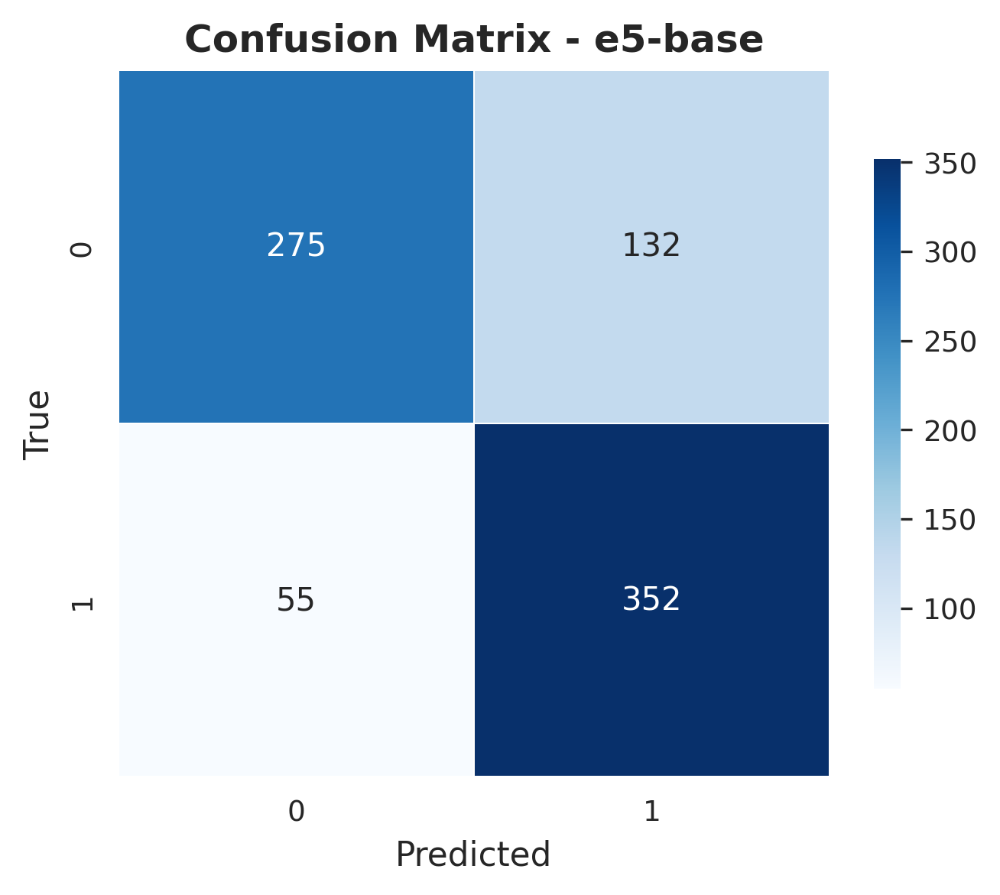

### gte-base

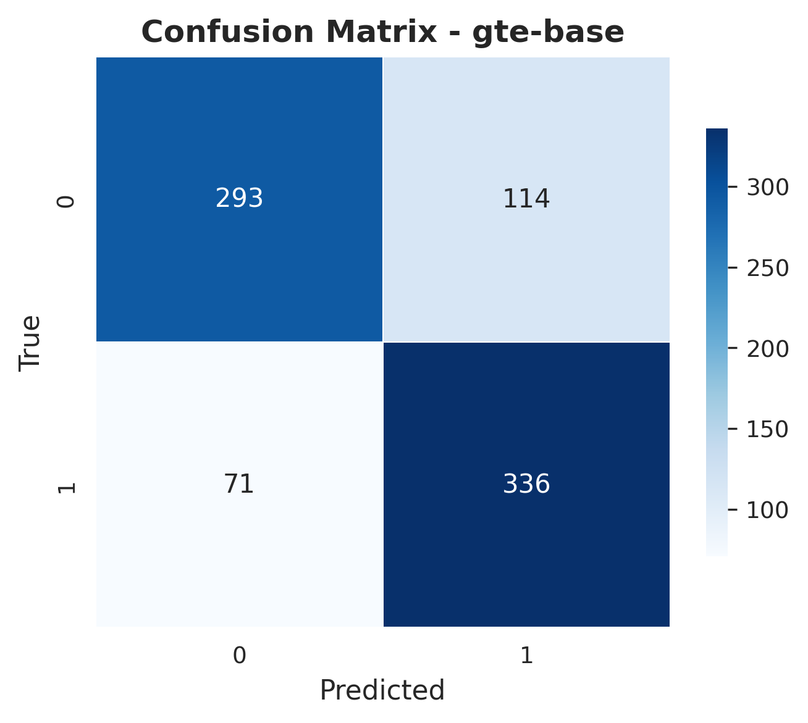

### gte-large

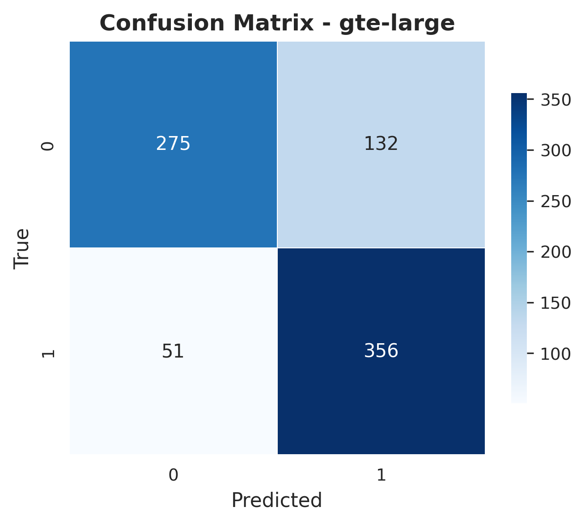

### e5-large

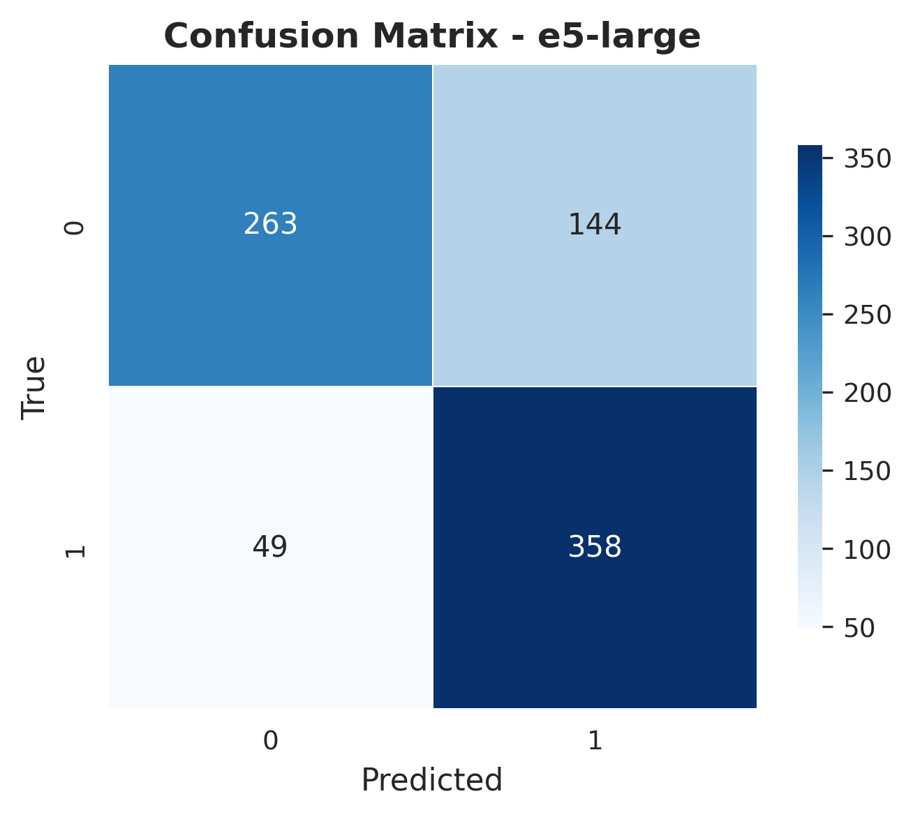

### bioclinicalbert

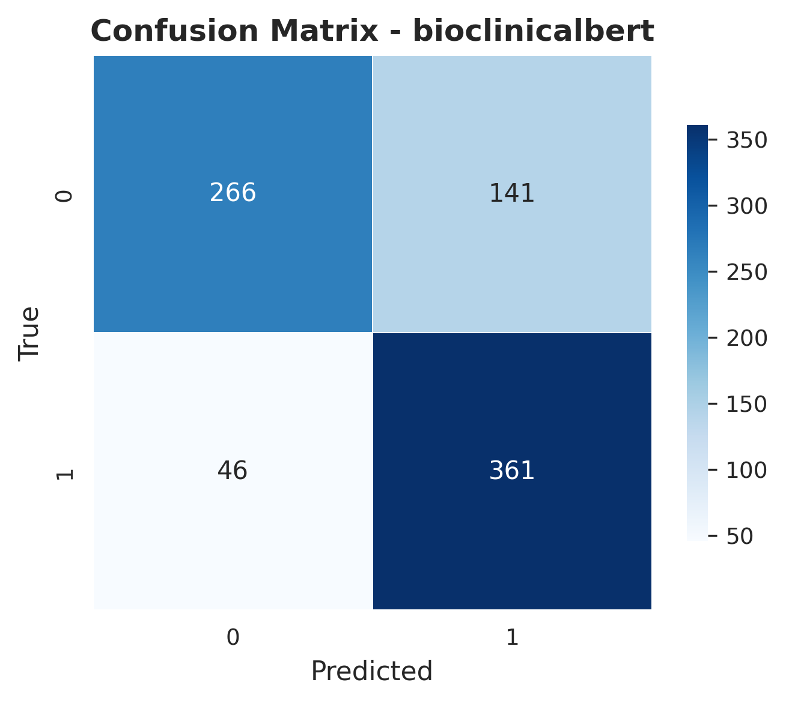

### pubmedbert

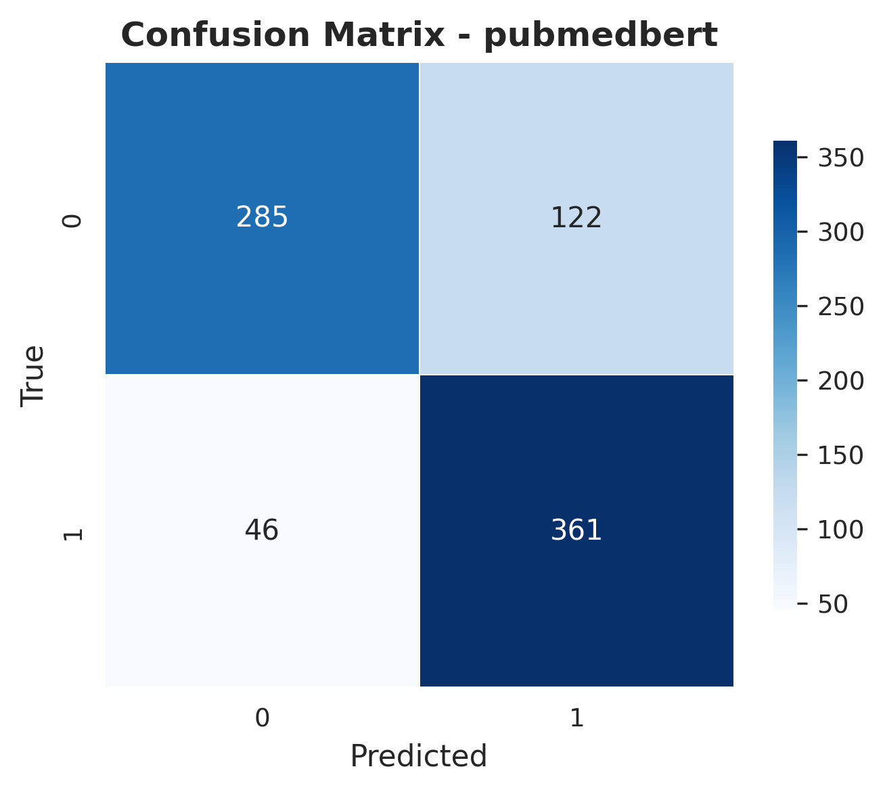

### sentence-biobert

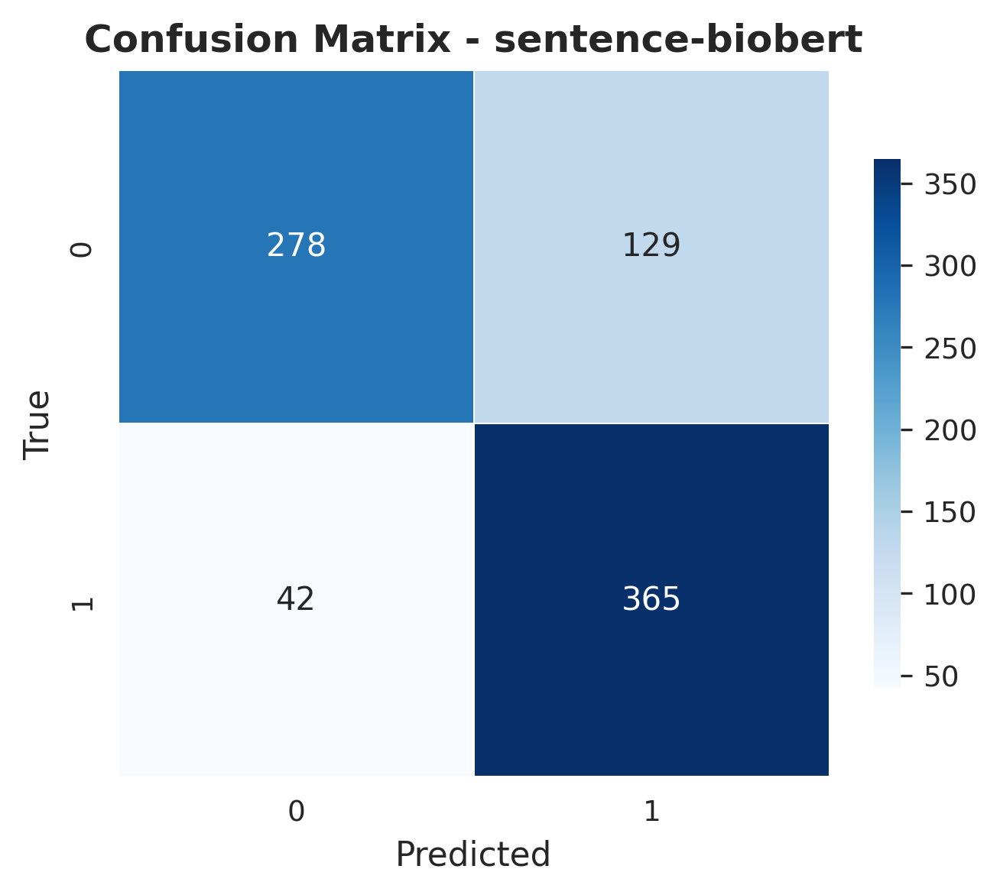

---

## 📦 Bootstrapped Metric Boxplot

---

## 📐 Mean ± Confidence Interval

Mean metric per model with 95% bootstrap confidence interval (thin whisker) and ±1 standard deviation (thick whisker).

---

## 🧬 Model Family Comparison

Bootstrap metric distributions pooled by model family: general-purpose vs. biomedical vs. biomedical sentence-transformers.

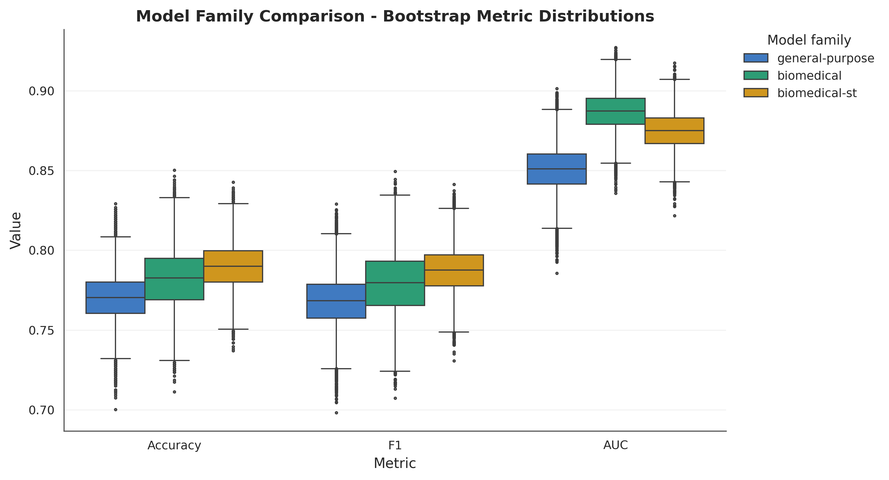

---

## 🩺 Error Analysis

Misclassified cases (false positives / false negatives) are traced back to the original clinical record for every model, using the fold validation indices saved during training.

### Error rates per model

| model            |   n_errors |   n_fp |   n_fn |   fp_rate |   fn_rate |
|:-----------------|-----------:|-------:|-------:|----------:|----------:|
| e5-base          |        187 |    132 |     55 |  0.324324 |  0.135135 |
| gte-base         |        185 |    114 |     71 |  0.280098 |  0.174447 |
| gte-large        |        183 |    132 |     51 |  0.324324 |  0.125307 |
| e5-large         |        193 |    144 |     49 |  0.353808 |  0.120393 |
| bioclinicalbert  |        187 |    141 |     46 |  0.346437 |  0.113022 |
| pubmedbert       |        168 |    122 |     46 |  0.299754 |  0.113022 |
| sentence-biobert |        171 |    129 |     42 |  0.316953 |  0.103194 |

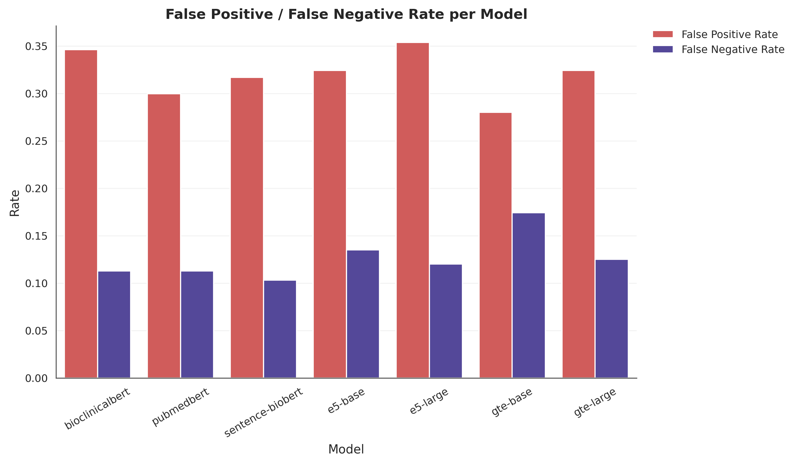

### Clinical feature deviation: misclassified vs. correctly classified

Standardized mean difference per clinical feature, pooled across all models (positive = higher in misclassified cases).

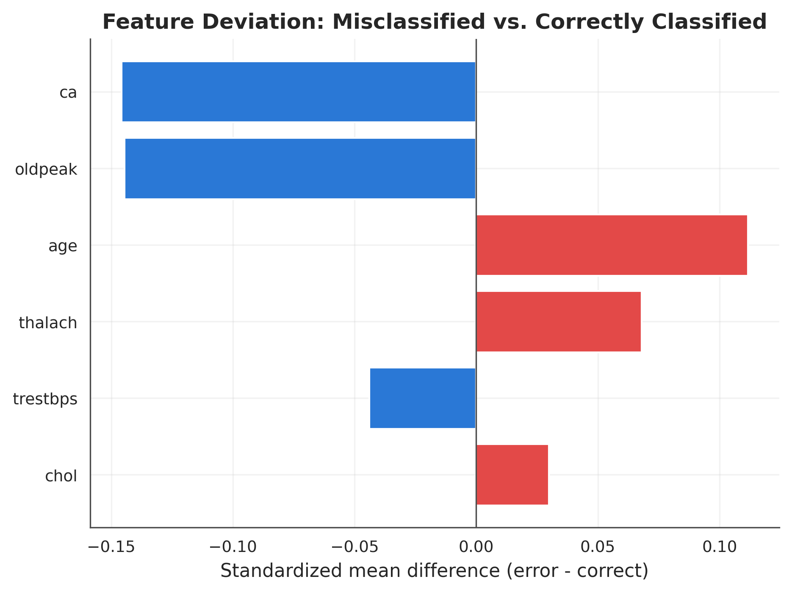

### Hardest cases (most frequently misclassified across models)

|   age |   sex |   cp |   trestbps |   chol |   fbs |   restecg |   thalach |   exang |   oldpeak |   slope |   ca |   thal |   ca_missing |   slope_missing |   thal_missing |   n_models_wrong |   n_models_evaluated |
|------:|------:|-----:|-----------:|-------:|------:|----------:|----------:|--------:|----------:|--------:|-----:|-------:|-------------:|----------------:|---------------:|-----------------:|---------------------:|
|    49 |     1 |    3 |        115 |    265 |     0 |         0 |       175 |       0 |       0   |       2 |    0 |      3 |            1 |               1 |              1 |                7 |                    7 |
|    66 |     1 |    4 |        160 |    228 |     0 |         2 |       138 |       0 |       2.3 |       1 |    0 |      6 |            0 |               0 |              0 |                7 |                    7 |
|    34 |     1 |    1 |        140 |    156 |     0 |         0 |       180 |       0 |       0   |       2 |    0 |      3 |            1 |               1 |              1 |                7 |                    7 |
|    58 |     1 |    3 |        105 |    240 |     0 |         2 |       154 |       1 |       0.6 |       2 |    0 |      7 |            0 |               0 |              0 |                7 |                    7 |
|    44 |     1 |    4 |        130 |    209 |     0 |         1 |       127 |       0 |       0   |       2 |    0 |      3 |            1 |               1 |              1 |                7 |                    7 |
|    55 |     1 |    4 |        150 |    160 |     0 |         1 |       150 |       0 |       0   |       2 |    0 |      3 |            1 |               1 |              1 |                7 |                    7 |
|    57 |     1 |    4 |        130 |    207 |     0 |         1 |        96 |       1 |       1   |       2 |    0 |      3 |            1 |               0 |              1 |                7 |                    7 |
|    58 |     1 |    4 |        135 |    222 |     0 |         0 |       100 |       0 |       0   |       2 |    0 |      3 |            1 |               1 |              1 |                7 |                    7 |
|    47 |     0 |    3 |        135 |    248 |     1 |         0 |       170 |       0 |       0   |       2 |    0 |      3 |            1 |               1 |              1 |                7 |                    7 |
|    75 |     1 |    4 |        160 |    310 |     1 |         0 |       112 |       1 |       2   |       3 |    0 |      7 |            1 |               0 |              0 |                7 |                    7 |

---

## 🧪 Statistical Tests

This section reports pairwise comparisons between model bootstrap metrics using Wilcoxon signed-rank tests, paired t-tests, and DeLong AUC comparisons.

### Wilcoxon Signed-Rank Test

The Wilcoxon test compares paired bootstrap distributions for each model pair.

| metric   | model_a         | model_b          |   mean_a |   mean_b |        statistic |   p_value |   significant |   p_value_bh |   significant_bh |
|:---------|:----------------|:-----------------|---------:|---------:|-----------------:|----------:|--------------:|-------------:|-----------------:|
| acc      | e5-base         | gte-base         |   0.7702 |   0.7727 |      1.7053e+07  |    0      |             1 |       0      |                1 |
| acc      | e5-base         | gte-large        |   0.7702 |   0.7752 |      1.2323e+07  |    0      |             1 |       0      |                1 |
| acc      | e5-base         | e5-large         |   0.7702 |   0.7629 |      6.60713e+06 |    0      |             1 |       0      |                1 |
| acc      | e5-base         | bioclinicalbert  |   0.7702 |   0.7703 |      2.29735e+07 |    0.4143 |             0 |       0.4143 |                0 |
| acc      | e5-base         | pubmedbert       |   0.7702 |   0.7936 | 202340           |    0      |             1 |       0      |                1 |
| acc      | e5-base         | sentence-biobert |   0.7702 |   0.79   |      1.00967e+06 |    0      |             1 |       0      |                1 |
| acc      | gte-base        | gte-large        |   0.7727 |   0.7752 |      1.78762e+07 |    0      |             1 |       0      |                1 |
| acc      | gte-base        | e5-large         |   0.7727 |   0.7629 |      4.22788e+06 |    0      |             1 |       0      |                1 |
| acc      | gte-base        | bioclinicalbert  |   0.7727 |   0.7703 |      1.80852e+07 |    0      |             1 |       0      |                1 |
| acc      | gte-base        | pubmedbert       |   0.7727 |   0.7936 | 323637           |    0      |             1 |       0      |                1 |
| acc      | gte-base        | sentence-biobert |   0.7727 |   0.79   |      1.81321e+06 |    0      |             1 |       0      |                1 |
| acc      | gte-large       | e5-large         |   0.7752 |   0.7629 |      3.1774e+06  |    0      |             1 |       0      |                1 |
| acc      | gte-large       | bioclinicalbert  |   0.7752 |   0.7703 |      1.40137e+07 |    0      |             1 |       0      |                1 |
| acc      | gte-large       | pubmedbert       |   0.7752 |   0.7936 |      1.26809e+06 |    0      |             1 |       0      |                1 |
| acc      | gte-large       | sentence-biobert |   0.7752 |   0.79   |      2.33523e+06 |    0      |             1 |       0      |                1 |
| acc      | e5-large        | bioclinicalbert  |   0.7629 |   0.7703 |      9.29184e+06 |    0      |             1 |       0      |                1 |
| acc      | e5-large        | pubmedbert       |   0.7629 |   0.7936 |  11878           |    0      |             1 |       0      |                1 |
| acc      | e5-large        | sentence-biobert |   0.7629 |   0.79   | 105408           |    0      |             1 |       0      |                1 |
| acc      | bioclinicalbert | pubmedbert       |   0.7703 |   0.7936 |  16823           |    0      |             1 |       0      |                1 |
| acc      | bioclinicalbert | sentence-biobert |   0.7703 |   0.79   | 641445           |    0      |             1 |       0      |                1 |
| acc      | pubmedbert      | sentence-biobert |   0.7936 |   0.79   |      1.54746e+07 |    0      |             1 |       0      |                1 |
| f1       | e5-base         | gte-base         |   0.7679 |   0.7718 |      1.55788e+07 |    0      |             1 |       0      |                1 |
| f1       | e5-base         | gte-large        |   0.7679 |   0.7727 |      1.392e+07   |    0      |             1 |       0      |                1 |
| f1       | e5-base         | e5-large         |   0.7679 |   0.7594 |      5.85129e+06 |    0      |             1 |       0      |                1 |
| f1       | e5-base         | bioclinicalbert  |   0.7679 |   0.7669 |      2.28486e+07 |    0      |             1 |       0      |                1 |
| f1       | e5-base         | pubmedbert       |   0.7679 |   0.7916 | 225371           |    0      |             1 |       0      |                1 |
| f1       | e5-base         | sentence-biobert |   0.7679 |   0.7874 |      1.29104e+06 |    0      |             1 |       0      |                1 |
| f1       | gte-base        | gte-large        |   0.7718 |   0.7727 |      2.30338e+07 |    0      |             1 |       0      |                1 |
| f1       | gte-base        | e5-large         |   0.7718 |   0.7594 |      2.46158e+06 |    0      |             1 |       0      |                1 |
| f1       | gte-base        | bioclinicalbert  |   0.7718 |   0.7669 |      1.46314e+07 |    0      |             1 |       0      |                1 |
| f1       | gte-base        | pubmedbert       |   0.7718 |   0.7916 | 536188           |    0      |             1 |       0      |                1 |
| f1       | gte-base        | sentence-biobert |   0.7718 |   0.7874 |      2.97465e+06 |    0      |             1 |       0      |                1 |
| f1       | gte-large       | e5-large         |   0.7727 |   0.7594 |      2.91176e+06 |    0      |             1 |       0      |                1 |
| f1       | gte-large       | bioclinicalbert  |   0.7727 |   0.7669 |      1.36913e+07 |    0      |             1 |       0      |                1 |
| f1       | gte-large       | pubmedbert       |   0.7727 |   0.7916 |      1.34753e+06 |    0      |             1 |       0      |                1 |
| f1       | gte-large       | sentence-biobert |   0.7727 |   0.7874 |      2.84835e+06 |    0      |             1 |       0      |                1 |
| f1       | e5-large        | bioclinicalbert  |   0.7594 |   0.7669 |      1.01387e+07 |    0      |             1 |       0      |                1 |
| f1       | e5-large        | pubmedbert       |   0.7594 |   0.7916 |   8473           |    0      |             1 |       0      |                1 |
| f1       | e5-large        | sentence-biobert |   0.7594 |   0.7874 | 106554           |    0      |             1 |       0      |                1 |
| f1       | bioclinicalbert | pubmedbert       |   0.7669 |   0.7916 |  11481           |    0      |             1 |       0      |                1 |
| f1       | bioclinicalbert | sentence-biobert |   0.7669 |   0.7874 | 668066           |    0      |             1 |       0      |                1 |
| f1       | pubmedbert      | sentence-biobert |   0.7916 |   0.7874 |      1.57723e+07 |    0      |             1 |       0      |                1 |
| auc      | e5-base         | gte-base         |   0.8476 |   0.8458 |      1.50167e+07 |    0      |             1 |       0      |                1 |
| auc      | e5-base         | gte-large        |   0.8476 |   0.8543 |      3.02601e+06 |    0      |             1 |       0      |                1 |
| auc      | e5-base         | e5-large         |   0.8476 |   0.8554 | 657201           |    0      |             1 |       0      |                1 |
| auc      | e5-base         | bioclinicalbert  |   0.8476 |   0.8829 |      1           |    0      |             1 |       0      |                1 |
| auc      | e5-base         | pubmedbert       |   0.8476 |   0.8909 |      0           |    0      |             1 |       0      |                1 |
| auc      | e5-base         | sentence-biobert |   0.8476 |   0.8748 |    566           |    0      |             1 |       0      |                1 |
| auc      | gte-base        | gte-large        |   0.8458 |   0.8543 |      2.27428e+06 |    0      |             1 |       0      |                1 |
| auc      | gte-base        | e5-large         |   0.8458 |   0.8554 | 254869           |    0      |             1 |       0      |                1 |
| auc      | gte-base        | bioclinicalbert  |   0.8458 |   0.8829 |      0           |    0      |             1 |       0      |                1 |
| auc      | gte-base        | pubmedbert       |   0.8458 |   0.8909 |      0           |    0      |             1 |       0      |                1 |
| auc      | gte-base        | sentence-biobert |   0.8458 |   0.8748 |    189           |    0      |             1 |       0      |                1 |
| auc      | gte-large       | e5-large         |   0.8543 |   0.8554 |      2.05149e+07 |    0      |             1 |       0      |                1 |
| auc      | gte-large       | bioclinicalbert  |   0.8543 |   0.8829 |     42           |    0      |             1 |       0      |                1 |
| auc      | gte-large       | pubmedbert       |   0.8543 |   0.8909 |      0           |    0      |             1 |       0      |                1 |
| auc      | gte-large       | sentence-biobert |   0.8543 |   0.8748 |  22967           |    0      |             1 |       0      |                1 |
| auc      | e5-large        | bioclinicalbert  |   0.8554 |   0.8829 |    131           |    0      |             1 |       0      |                1 |
| auc      | e5-large        | pubmedbert       |   0.8554 |   0.8909 |      0           |    0      |             1 |       0      |                1 |
| auc      | e5-large        | sentence-biobert |   0.8554 |   0.8748 | 103985           |    0      |             1 |       0      |                1 |
| auc      | bioclinicalbert | pubmedbert       |   0.8829 |   0.8909 | 257419           |    0      |             1 |       0      |                1 |
| auc      | bioclinicalbert | sentence-biobert |   0.8829 |   0.8748 |      3.95991e+06 |    0      |             1 |       0      |                1 |
| auc      | pubmedbert      | sentence-biobert |   0.8909 |   0.8748 |  70931.5         |    0      |             1 |       0      |                1 |

### Paired t-test

The paired t-test compares paired bootstrap means for each model pair.

| metric   | model_a         | model_b          |   mean_a |   mean_b |   statistic |   p_value |   significant |   p_value_bh |   significant_bh |
|:---------|:----------------|:-----------------|---------:|---------:|------------:|----------:|--------------:|-------------:|-----------------:|
| acc      | e5-base         | gte-base         |   0.7702 |   0.7727 |    -22.1639 |    0      |             1 |       0      |                1 |
| acc      | e5-base         | gte-large        |   0.7702 |   0.7752 |    -43.2115 |    0      |             1 |       0      |                1 |
| acc      | e5-base         | e5-large         |   0.7702 |   0.7629 |     73.1595 |    0      |             1 |       0      |                1 |
| acc      | e5-base         | bioclinicalbert  |   0.7702 |   0.7703 |     -0.7941 |    0.4272 |             0 |       0.4272 |                0 |
| acc      | e5-base         | pubmedbert       |   0.7702 |   0.7936 |   -181.734  |    0      |             1 |       0      |                1 |
| acc      | e5-base         | sentence-biobert |   0.7702 |   0.79   |   -142.252  |    0      |             1 |       0      |                1 |
| acc      | gte-base        | gte-large        |   0.7727 |   0.7752 |    -19.8574 |    0      |             1 |       0      |                1 |
| acc      | gte-base        | e5-large         |   0.7727 |   0.7629 |     92.7487 |    0      |             1 |       0      |                1 |
| acc      | gte-base        | bioclinicalbert  |   0.7727 |   0.7703 |     18.7821 |    0      |             1 |       0      |                1 |
| acc      | gte-base        | pubmedbert       |   0.7727 |   0.7936 |   -174.3    |    0      |             1 |       0      |                1 |
| acc      | gte-base        | sentence-biobert |   0.7727 |   0.79   |   -124.093  |    0      |             1 |       0      |                1 |
| acc      | gte-large       | e5-large         |   0.7752 |   0.7629 |    104.266  |    0      |             1 |       0      |                1 |
| acc      | gte-large       | bioclinicalbert  |   0.7752 |   0.7703 |     36.3478 |    0      |             1 |       0      |                1 |
| acc      | gte-large       | pubmedbert       |   0.7752 |   0.7936 |   -135.114  |    0      |             1 |       0      |                1 |
| acc      | gte-large       | sentence-biobert |   0.7752 |   0.79   |   -114.764  |    0      |             1 |       0      |                1 |
| acc      | e5-large        | bioclinicalbert  |   0.7629 |   0.7703 |    -58.5118 |    0      |             1 |       0      |                1 |
| acc      | e5-large        | pubmedbert       |   0.7629 |   0.7936 |   -249.463  |    0      |             1 |       0      |                1 |
| acc      | e5-large        | sentence-biobert |   0.7629 |   0.79   |   -200.679  |    0      |             1 |       0      |                1 |
| acc      | bioclinicalbert | pubmedbert       |   0.7703 |   0.7936 |   -237.468  |    0      |             1 |       0      |                1 |
| acc      | bioclinicalbert | sentence-biobert |   0.7703 |   0.79   |   -154.643  |    0      |             1 |       0      |                1 |
| acc      | pubmedbert      | sentence-biobert |   0.7936 |   0.79   |     29.5645 |    0      |             1 |       0      |                1 |
| f1       | e5-base         | gte-base         |   0.7679 |   0.7718 |    -34.757  |    0      |             1 |       0      |                1 |
| f1       | e5-base         | gte-large        |   0.7679 |   0.7727 |    -41.1921 |    0      |             1 |       0      |                1 |
| f1       | e5-base         | e5-large         |   0.7679 |   0.7594 |     83.7006 |    0      |             1 |       0      |                1 |
| f1       | e5-base         | bioclinicalbert  |   0.7679 |   0.7669 |      7.5582 |    0      |             1 |       0      |                1 |
| f1       | e5-base         | pubmedbert       |   0.7679 |   0.7916 |   -181.685  |    0      |             1 |       0      |                1 |
| f1       | e5-base         | sentence-biobert |   0.7679 |   0.7874 |   -137.328  |    0      |             1 |       0      |                1 |
| f1       | gte-base        | gte-large        |   0.7718 |   0.7727 |     -7.1091 |    0      |             1 |       0      |                1 |
| f1       | gte-base        | e5-large         |   0.7718 |   0.7594 |    116.495  |    0      |             1 |       0      |                1 |
| f1       | gte-base        | bioclinicalbert  |   0.7718 |   0.7669 |     38.5932 |    0      |             1 |       0      |                1 |
| f1       | gte-base        | pubmedbert       |   0.7718 |   0.7916 |   -163.445  |    0      |             1 |       0      |                1 |
| f1       | gte-base        | sentence-biobert |   0.7718 |   0.7874 |   -110.018  |    0      |             1 |       0      |                1 |
| f1       | gte-large       | e5-large         |   0.7727 |   0.7594 |    110.771  |    0      |             1 |       0      |                1 |
| f1       | gte-large       | bioclinicalbert  |   0.7727 |   0.7669 |     42.3926 |    0      |             1 |       0      |                1 |
| f1       | gte-large       | pubmedbert       |   0.7727 |   0.7916 |   -136.087  |    0      |             1 |       0      |                1 |
| f1       | gte-large       | sentence-biobert |   0.7727 |   0.7874 |   -111.038  |    0      |             1 |       0      |                1 |
| f1       | e5-large        | bioclinicalbert  |   0.7594 |   0.7669 |    -58.3854 |    0      |             1 |       0      |                1 |
| f1       | e5-large        | pubmedbert       |   0.7594 |   0.7916 |   -257.332  |    0      |             1 |       0      |                1 |
| f1       | e5-large        | sentence-biobert |   0.7594 |   0.7874 |   -202.352  |    0      |             1 |       0      |                1 |
| f1       | bioclinicalbert | pubmedbert       |   0.7669 |   0.7916 |   -247.437  |    0      |             1 |       0      |                1 |
| f1       | bioclinicalbert | sentence-biobert |   0.7669 |   0.7874 |   -156.148  |    0      |             1 |       0      |                1 |
| f1       | pubmedbert      | sentence-biobert |   0.7916 |   0.7874 |     33.7374 |    0      |             1 |       0      |                1 |
| auc      | e5-base         | gte-base         |   0.8476 |   0.8458 |     37.1046 |    0      |             1 |       0      |                1 |
| auc      | e5-base         | gte-large        |   0.8476 |   0.8543 |   -110.153  |    0      |             1 |       0      |                1 |
| auc      | e5-base         | e5-large         |   0.8476 |   0.8554 |   -156.363  |    0      |             1 |       0      |                1 |
| auc      | e5-base         | bioclinicalbert  |   0.8476 |   0.8829 |   -383.466  |    0      |             1 |       0      |                1 |
| auc      | e5-base         | pubmedbert       |   0.8476 |   0.8909 |   -496.142  |    0      |             1 |       0      |                1 |
| auc      | e5-base         | sentence-biobert |   0.8476 |   0.8748 |   -289.68   |    0      |             1 |       0      |                1 |
| auc      | gte-base        | gte-large        |   0.8458 |   0.8543 |   -119.265  |    0      |             1 |       0      |                1 |
| auc      | gte-base        | e5-large         |   0.8458 |   0.8554 |   -180.085  |    0      |             1 |       0      |                1 |
| auc      | gte-base        | bioclinicalbert  |   0.8458 |   0.8829 |   -455.64   |    0      |             1 |       0      |                1 |
| auc      | gte-base        | pubmedbert       |   0.8458 |   0.8909 |   -549.212  |    0      |             1 |       0      |                1 |
| auc      | gte-base        | sentence-biobert |   0.8458 |   0.8748 |   -306.045  |    0      |             1 |       0      |                1 |
| auc      | gte-large       | e5-large         |   0.8543 |   0.8554 |    -16.1491 |    0      |             1 |       0      |                1 |
| auc      | gte-large       | bioclinicalbert  |   0.8543 |   0.8829 |   -326.731  |    0      |             1 |       0      |                1 |
| auc      | gte-large       | pubmedbert       |   0.8543 |   0.8909 |   -462.735  |    0      |             1 |       0      |                1 |
| auc      | gte-large       | sentence-biobert |   0.8543 |   0.8748 |   -240.516  |    0      |             1 |       0      |                1 |
| auc      | e5-large        | bioclinicalbert  |   0.8554 |   0.8829 |   -322.914  |    0      |             1 |       0      |                1 |
| auc      | e5-large        | pubmedbert       |   0.8554 |   0.8909 |   -443.232  |    0      |             1 |       0      |                1 |
| auc      | e5-large        | sentence-biobert |   0.8554 |   0.8748 |   -202.602  |    0      |             1 |       0      |                1 |
| auc      | bioclinicalbert | pubmedbert       |   0.8829 |   0.8909 |   -179.816  |    0      |             1 |       0      |                1 |
| auc      | bioclinicalbert | sentence-biobert |   0.8829 |   0.8748 |     99.1957 |    0      |             1 |       0      |                1 |
| auc      | pubmedbert      | sentence-biobert |   0.8909 |   0.8748 |    209.751  |    0      |             1 |       0      |                1 |

### DeLong AUC Comparison

The DeLong test compares AUC performance between model pairs on the same test labels.

| model_a         | model_b          |   auc_a |   auc_b |   delta_auc |   z_statistic |   p_value |   significant |   p_value_bh |   significant_bh |
|:----------------|:-----------------|--------:|--------:|------------:|--------------:|----------:|--------------:|-------------:|-----------------:|
| e5-base         | gte-base         |  0.8476 |  0.8458 |      0.0018 |       -0.356  |    0.7218 |             0 |       0.7579 |                0 |
| e5-base         | gte-large        |  0.8476 |  0.8543 |     -0.0067 |        1.0996 |    0.2715 |             0 |       0.3168 |                0 |
| e5-base         | e5-large         |  0.8476 |  0.8554 |     -0.0078 |        1.5587 |    0.1191 |             0 |       0.1563 |                0 |
| e5-base         | bioclinicalbert  |  0.8476 |  0.8828 |     -0.0353 |        3.8136 |    0.0001 |             1 |       0.0004 |                1 |
| e5-base         | pubmedbert       |  0.8476 |  0.891  |     -0.0434 |        4.9396 |    0      |             1 |       0      |                1 |
| e5-base         | sentence-biobert |  0.8476 |  0.8747 |     -0.0271 |        2.8675 |    0.0041 |             1 |       0.0086 |                1 |
| gte-base        | gte-large        |  0.8458 |  0.8543 |     -0.0085 |        1.1841 |    0.2364 |             0 |       0.292  |                0 |
| gte-base        | e5-large         |  0.8458 |  0.8554 |     -0.0096 |        1.7835 |    0.0745 |             0 |       0.1043 |                0 |
| gte-base        | bioclinicalbert  |  0.8458 |  0.8828 |     -0.037  |        4.5004 |    0      |             1 |       0      |                1 |
| gte-base        | pubmedbert       |  0.8458 |  0.891  |     -0.0451 |        5.446  |    0      |             1 |       0      |                1 |
| gte-base        | sentence-biobert |  0.8458 |  0.8747 |     -0.0289 |        3.0126 |    0.0026 |             1 |       0.0061 |                1 |
| gte-large       | e5-large         |  0.8543 |  0.8554 |     -0.0011 |        0.1585 |    0.874  |             0 |       0.874  |                0 |
| gte-large       | bioclinicalbert  |  0.8543 |  0.8828 |     -0.0286 |        3.2841 |    0.001  |             1 |       0.003  |                1 |
| gte-large       | pubmedbert       |  0.8543 |  0.891  |     -0.0367 |        4.6641 |    0      |             1 |       0      |                1 |
| gte-large       | sentence-biobert |  0.8543 |  0.8747 |     -0.0204 |        2.3986 |    0.0165 |             1 |       0.0315 |                1 |
| e5-large        | bioclinicalbert  |  0.8554 |  0.8828 |     -0.0275 |        3.2357 |    0.0012 |             1 |       0.0031 |                1 |
| e5-large        | pubmedbert       |  0.8554 |  0.891  |     -0.0356 |        4.4283 |    0      |             1 |       0      |                1 |
| e5-large        | sentence-biobert |  0.8554 |  0.8747 |     -0.0193 |        2.0175 |    0.0436 |             1 |       0.0704 |                0 |
| bioclinicalbert | pubmedbert       |  0.8828 |  0.891  |     -0.0081 |        1.8144 |    0.0696 |             0 |       0.1043 |                0 |
| bioclinicalbert | sentence-biobert |  0.8828 |  0.8747 |      0.0082 |       -1.0019 |    0.3164 |             0 |       0.3497 |                0 |
| pubmedbert      | sentence-biobert |  0.891  |  0.8747 |      0.0163 |       -2.1037 |    0.0354 |             1 |       0.062  |                0 |

---

## 🧾 Held-Out Test Set Evaluation

Metrics on the 20% test split created in `preprocessing.py` and never used for training, threshold calibration, or the model comparisons above — the counterpart to the 5-fold cross-validation results, on data none of those steps ever saw.

| model            |   n_test |   accuracy |   macro_f1 |      auc |   threshold |
|:-----------------|---------:|-----------:|-----------:|---------:|------------:|
| e5-base          |      184 |   0.793478 |   0.784277 | 0.87781  |    0.477199 |
| gte-base         |      184 |   0.798913 |   0.791364 | 0.897298 |    0.451525 |
| gte-large        |      184 |   0.755435 |   0.741307 | 0.865615 |    0.410912 |
| e5-large         |      184 |   0.809783 |   0.802642 | 0.897059 |    0.468248 |
| bioclinicalbert  |      184 |   0.842391 |   0.83989  | 0.919297 |    0.496706 |
| pubmedbert       |      184 |   0.831522 |   0.825922 | 0.908656 |    0.388453 |
| sentence-biobert |      184 |   0.809783 |   0.798794 | 0.895863 |    0.307455 |

---

## 🔍 Discussion and Observations

- **pubmedbert** has the highest mean accuracy in this run (0.7936).
- **pubmedbert** has the highest mean macro-F1 (0.7916).
- **pubmedbert** has the highest mean ROC-AUC (0.8909), 95% bootstrap CI [0.8686, 0.9125].
- **pubmedbert** has the narrowest AUC confidence interval (0.0438 wide) — the most stable AUC estimate across the bootstrap resamples, independent of whether its mean AUC is also the highest.
- Averaged by family, **biomedical** has the highest mean AUC (0.8869) among the families present in this run. This is a descriptive average, not a statistical test: see the DeLong comparison above for which specific pairwise differences are actually significant.

---

## 🏁 Conclusions

- Every model in this run outperforms a trivial majority-class baseline on the SMOTE-balanced validation pool (50.0% accuracy, 0.333 macro-F1 by construction, since that pool is always exactly balanced) — see the accuracy/macro-F1 columns above.
- Bootstrap resampling (10,000 iterations) gives every metric a reported confidence interval: treat a numerically higher mean as a meaningful difference only where the corresponding pairwise test below also reports significance, not from the ranking alone.
- Of the 21 pairwise AUC comparisons (DeLong test), 13 are statistically significant at alpha=0.05 — see `delong_comparison.csv` for which specific pairs, rather than assuming every numeric difference is real.

---

## 🚀 Potential Improvements

- Test additional general-purpose or biomedical encoders beyond the ones already compared.
- Introduce a non-linear classifier (e.g. gradient boosting) as an additional comparison point.
- Apply probability calibration (e.g. Platt scaling) and report calibration curves, not only
  discrimination metrics (accuracy, F1, AUC).
- Run on the full Diabetes130 file instead of the 20,000-row stratified sample, to narrow the
  bootstrap confidence intervals further.
