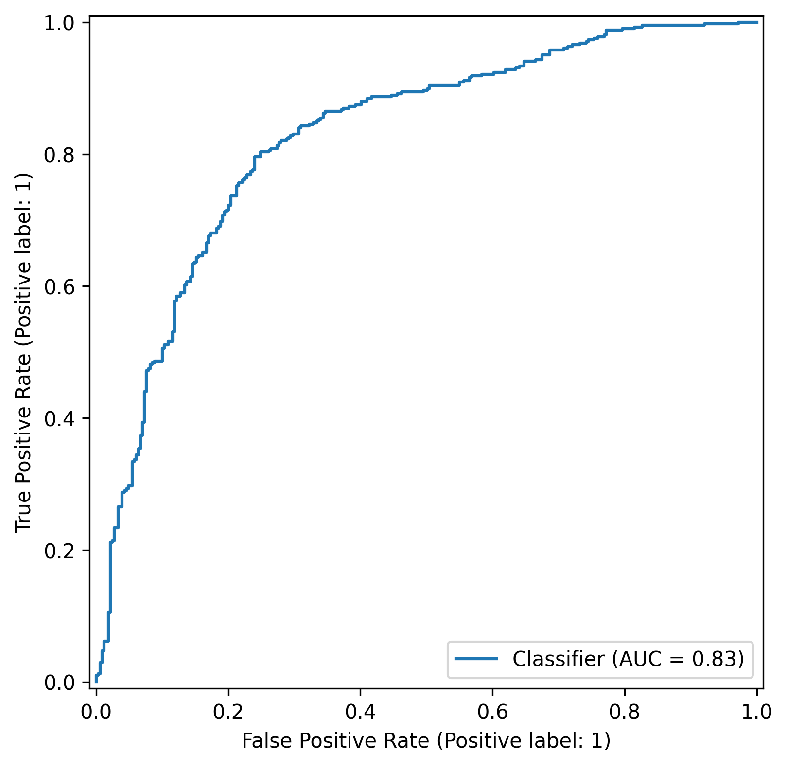
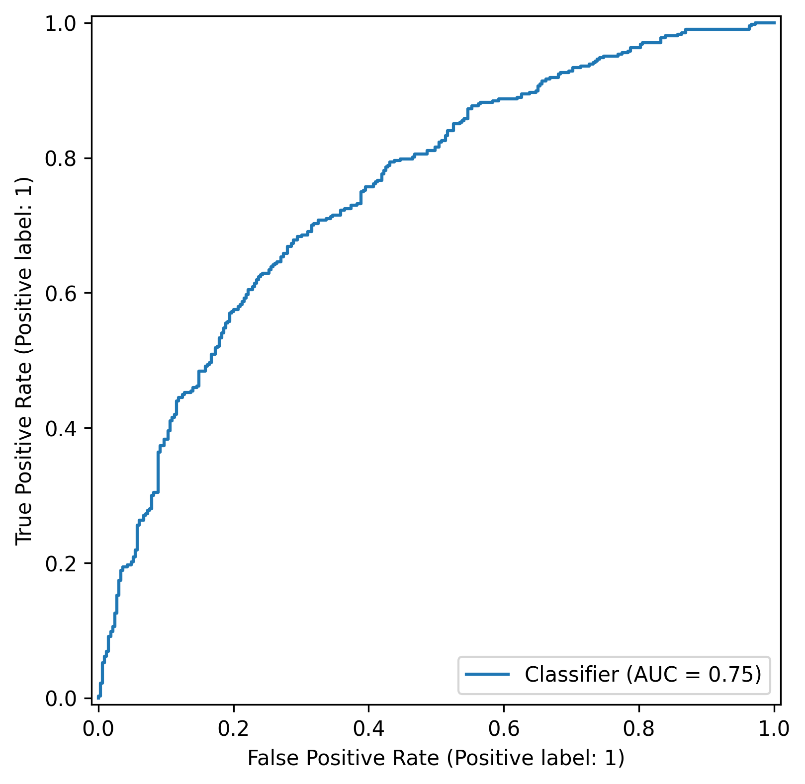
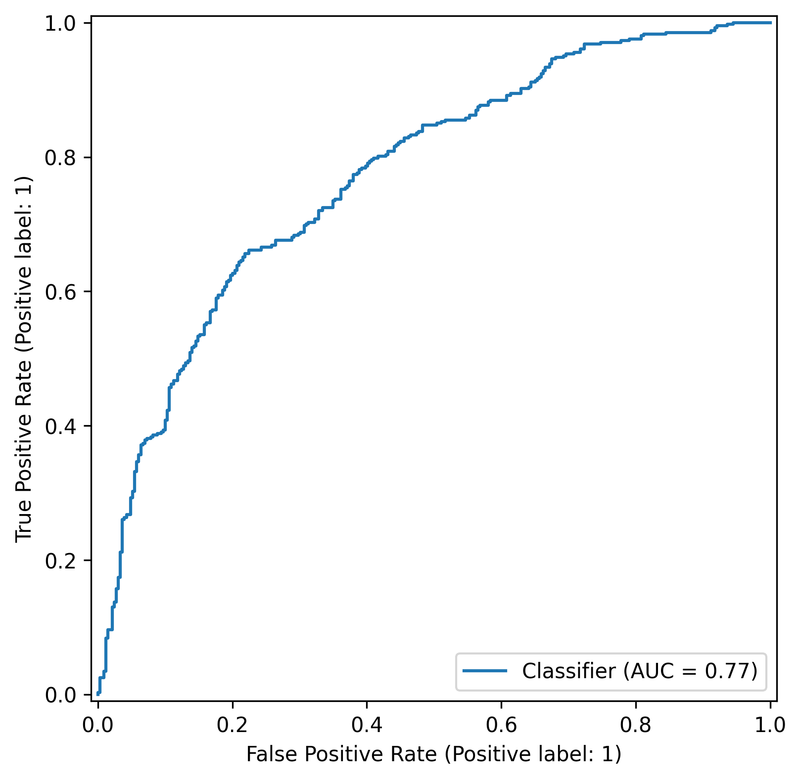
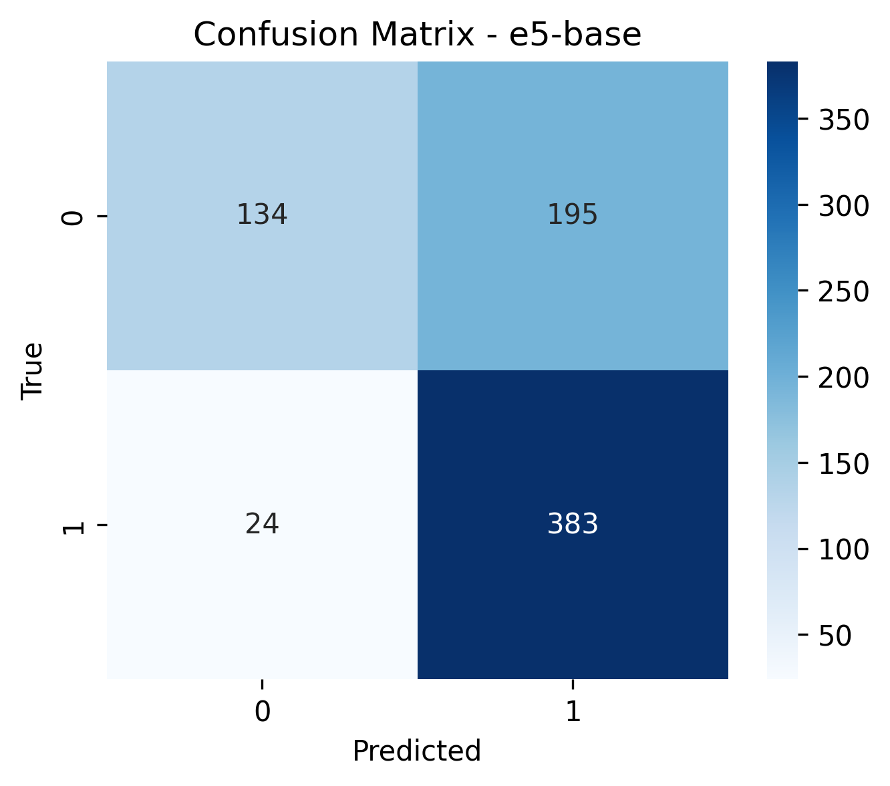
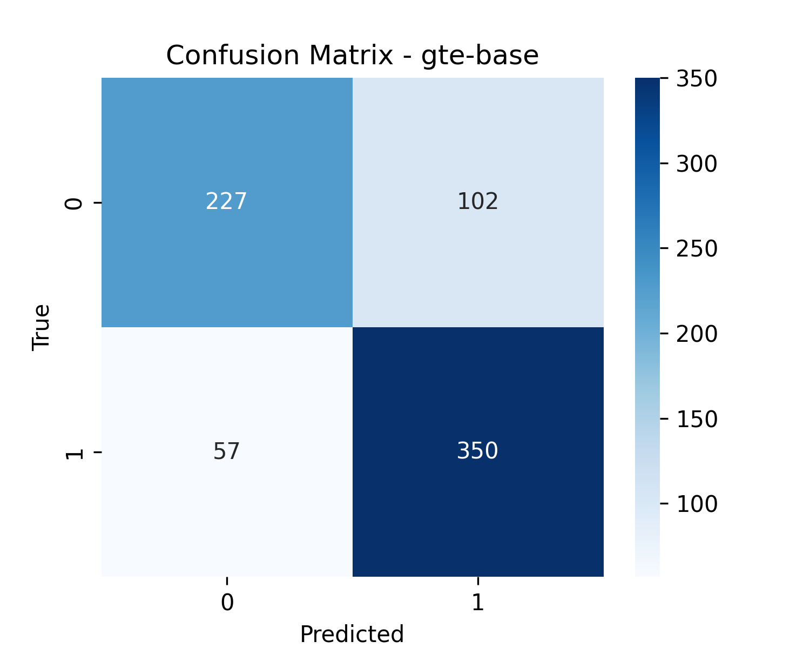
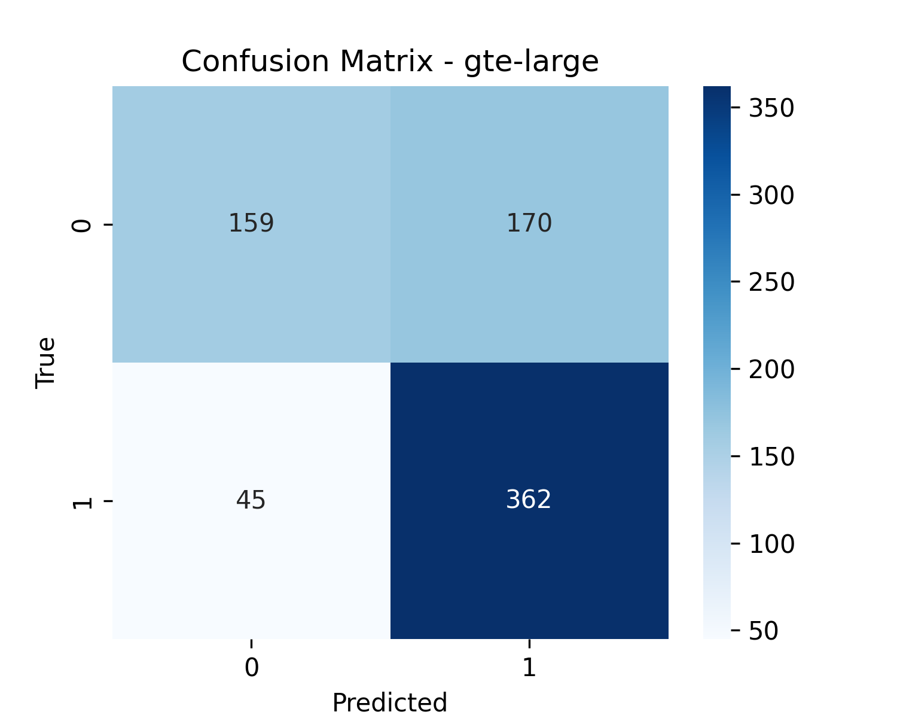
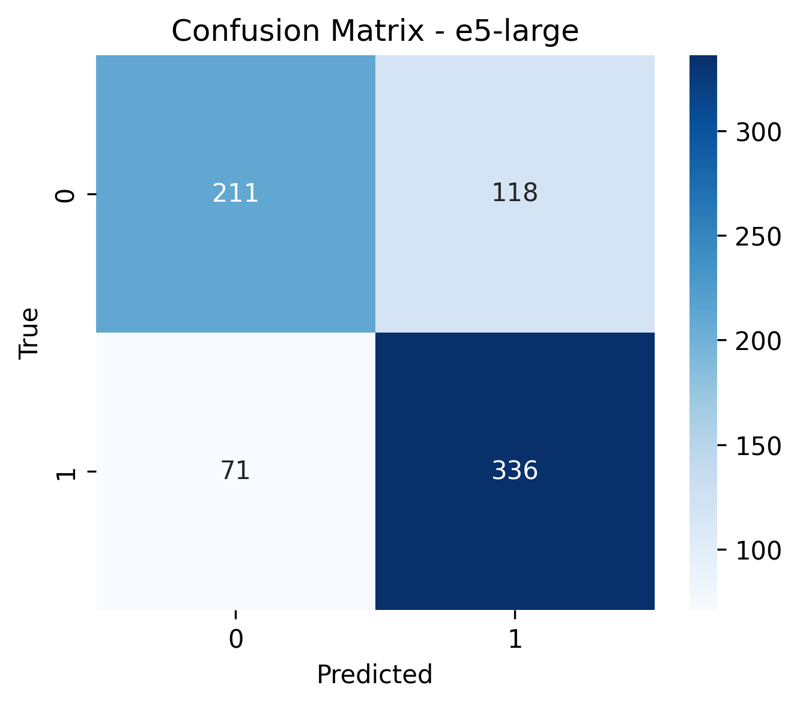
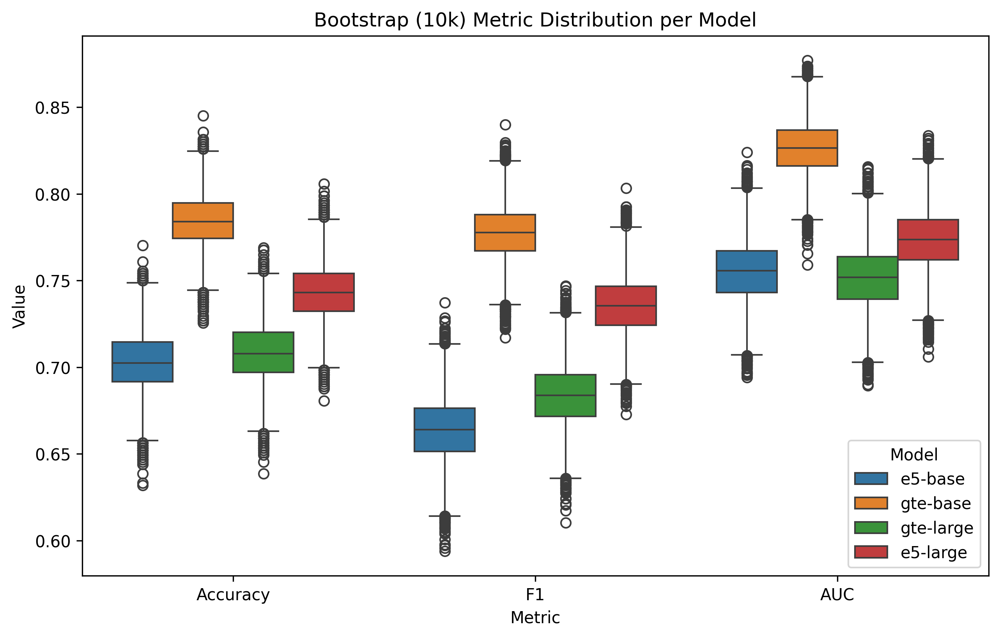

# 📊 Encoder Evaluation Report

**Generated:** 2026-05-17 03:11

---

## 🎯 Objective

Verify the robustness and reliability of the pipeline based on embeddings generated by modern models (E5-base, E5-large, GTE-large).

## 📘 Evaluated Models

- **e5-base**
- **gte-base**
- **gte-large**
- **e5-large**

---

## 📈 Metric results with confidence intervals (Bootstrap 10,000)

| model     |   acc_mean |   acc_ci_low |   acc_ci_high |   f1_mean |   f1_ci_low |   f1_ci_high |   auc_mean |   auc_ci_low |   auc_ci_high |
|:----------|-----------:|-------------:|--------------:|----------:|------------:|-------------:|-----------:|-------------:|--------------:|
| e5-base   |   0.702475 |     0.669837 |      0.735054 |  0.663689 |    0.627163 |     0.699388 |   0.755398 |     0.71977  |      0.79032  |
| gte-base  |   0.783989 |     0.754076 |      0.8125   |  0.777546 |    0.746772 |     0.807024 |   0.826351 |     0.795846 |      0.855741 |
| gte-large |   0.707999 |     0.673913 |      0.740489 |  0.683694 |    0.648373 |     0.718399 |   0.751569 |     0.715765 |      0.785562 |
| e5-large  |   0.74328  |     0.711957 |      0.774457 |  0.735407 |    0.702841 |     0.767215 |   0.773525 |     0.739377 |      0.807318 |

---

## 📉 ROC Curves

### e5-base

### gte-base

### gte-large

### e5-large

---

## 🧩 Confusion Matrix

### e5-base

### gte-base

### gte-large

### e5-large

---

## 📦 Bootstrapped Metric Boxplot

---

## 🔍 Discussion and Observations

- Larger embedding models (E5-large, GTE-large) generally show better performance.
- GTE-large tends to achieve higher ROC-AUC and tighter confidence intervals.
- Confusion matrices enable analysis of false positives and false negatives.
- Bootstrap is useful to verify metric stability and robustness.

---

## 🏁 Conclusions

- The embedding + linear classifier approach is effective.
- Modern encoders such as GTE-large demonstrate strong generalization.
- The pipeline is robust and stable, as confirmed by bootstrap 10,000.

---

## 🚀 Potential Improvements

- Test additional encoders (bge-large, Jina-Embeddings, E5-mistral).
- Introduce a non-linear classifier (XGBoost, LightGBM).
- Apply advanced calibration techniques (Platt scaling).
- Add a larger clinical dataset to reduce variance error.
