# 📊 Encoder Evaluation Report

**Generated:** 2026-07-26 11:30

---

## 🎯 Objective

Verify the robustness and reliability of the pipeline based on embeddings generated by modern models (E5-base, E5-large, GTE-large).

## 📘 Evaluated Models

- **e5-base**
- **gte-base**
- **gte-large**
- **e5-large**
- **bioclinicalbert**
- **pubmedbert**
- **sentence-biobert**

---

## 📈 Metric results with confidence intervals (Bootstrap 10,000)

| model            |   acc_mean |   acc_ci_low |   acc_ci_high |   acc_std |   f1_mean |   f1_ci_low |   f1_ci_high |    f1_std |   auc_mean |   auc_ci_low |   auc_ci_high |   auc_std |
|:-----------------|-----------:|-------------:|--------------:|----------:|----------:|------------:|-------------:|----------:|-----------:|-------------:|--------------:|----------:|
| e5-base          |   0.777663 |     0.748157 |      0.805897 | 0.0145697 |  0.771566 |    0.741669 |     0.800134 | 0.0149022 |   0.848923 |     0.821509 |      0.87462  | 0.0134531 |
| gte-base         |   0.789869 |     0.761671 |      0.816953 | 0.0142793 |  0.788329 |    0.760047 |     0.816032 | 0.0143745 |   0.840111 |     0.812213 |      0.866691 | 0.0138749 |
| gte-large        |   0.786247 |     0.757985 |      0.814496 | 0.014411  |  0.783755 |    0.754944 |     0.812381 | 0.0145694 |   0.853989 |     0.827157 |      0.879692 | 0.0133106 |
| e5-large         |   0.796147 |     0.767813 |      0.824324 | 0.0141214 |  0.792303 |    0.763573 |     0.820425 | 0.01437   |   0.866104 |     0.840607 |      0.890036 | 0.0126045 |
| bioclinicalbert  |   0.796004 |     0.767813 |      0.823096 | 0.0141337 |  0.793183 |    0.764607 |     0.820725 | 0.0143055 |   0.879472 |     0.855968 |      0.901372 | 0.0115646 |
| pubmedbert       |   0.811978 |     0.785012 |      0.837838 | 0.0136571 |  0.80898  |    0.781107 |     0.835427 | 0.0138756 |   0.88545  |     0.862156 |      0.906531 | 0.0114297 |
| sentence-biobert |   0.82074  |     0.793612 |      0.846437 | 0.0133728 |  0.819523 |    0.792187 |     0.844937 | 0.0134552 |   0.87811  |     0.854395 |      0.900546 | 0.0118333 |

---

## 📉 ROC Curve Comparison

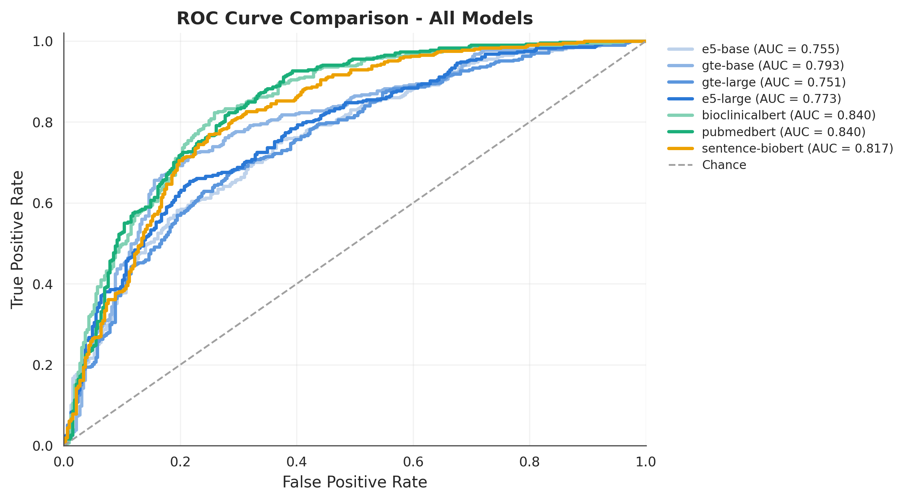

---

## 🧩 Confusion Matrix

### e5-base

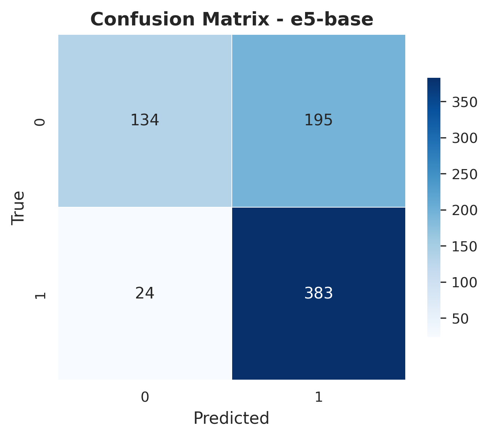

### gte-base

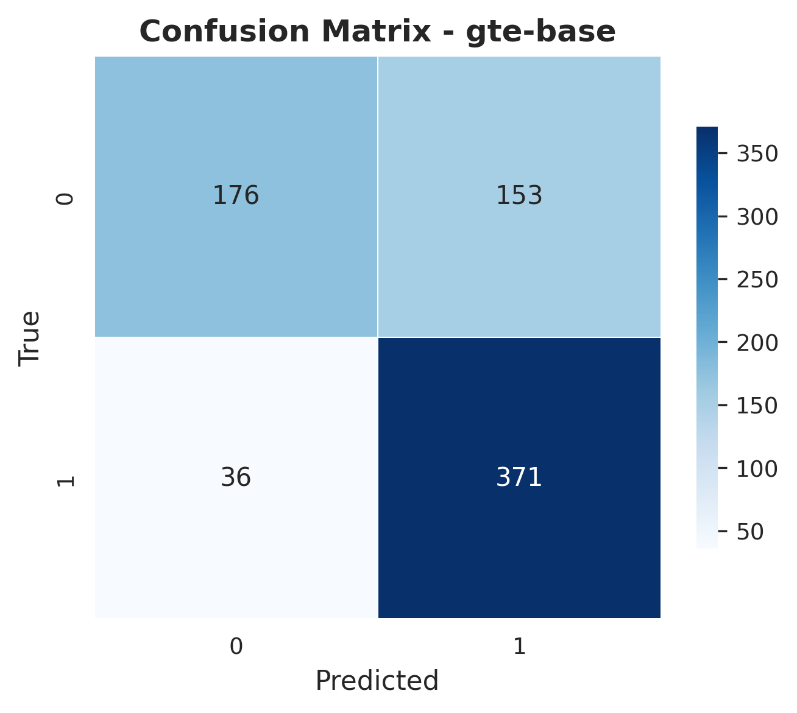

### gte-large

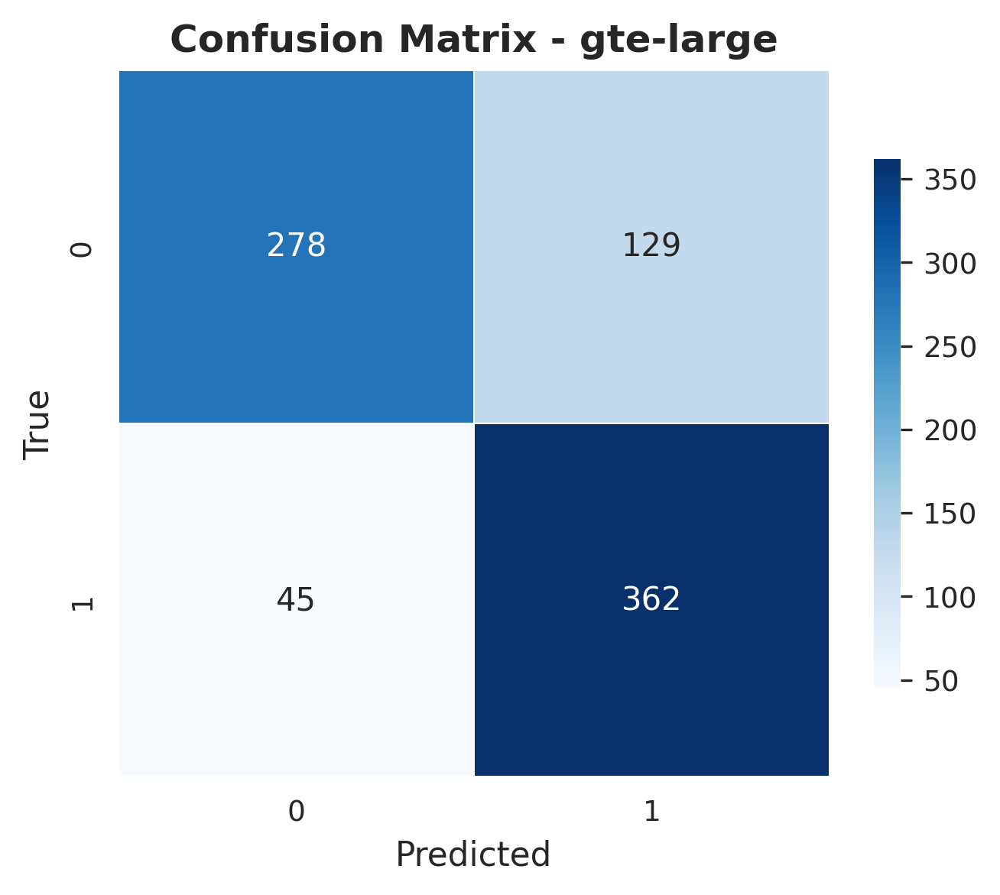

### e5-large

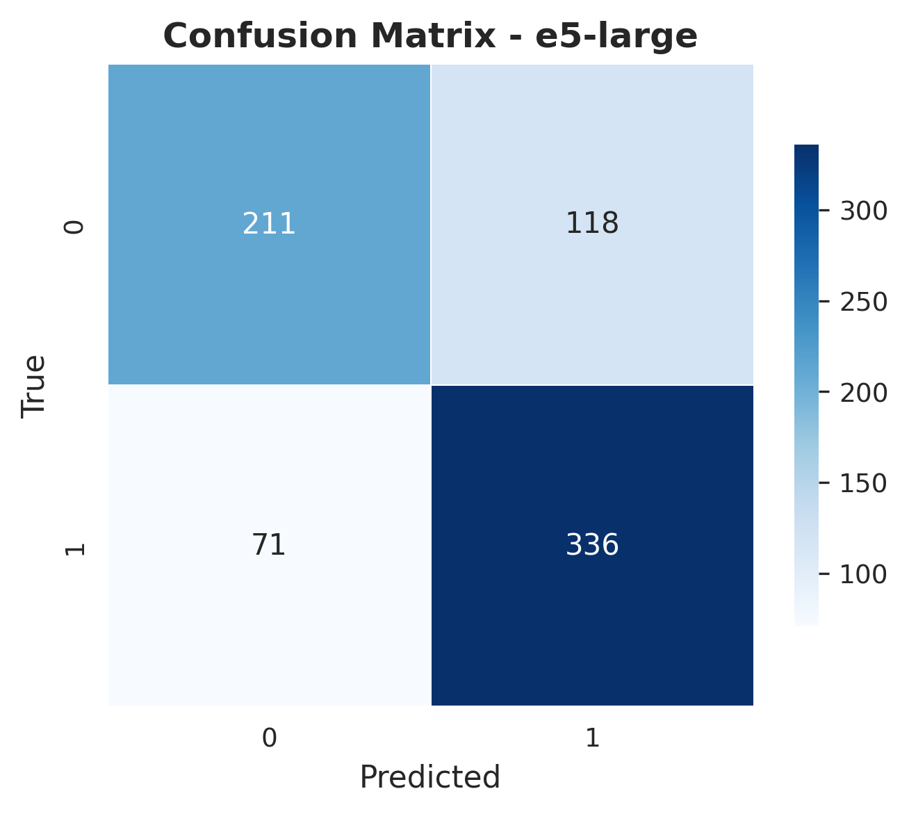

### bioclinicalbert

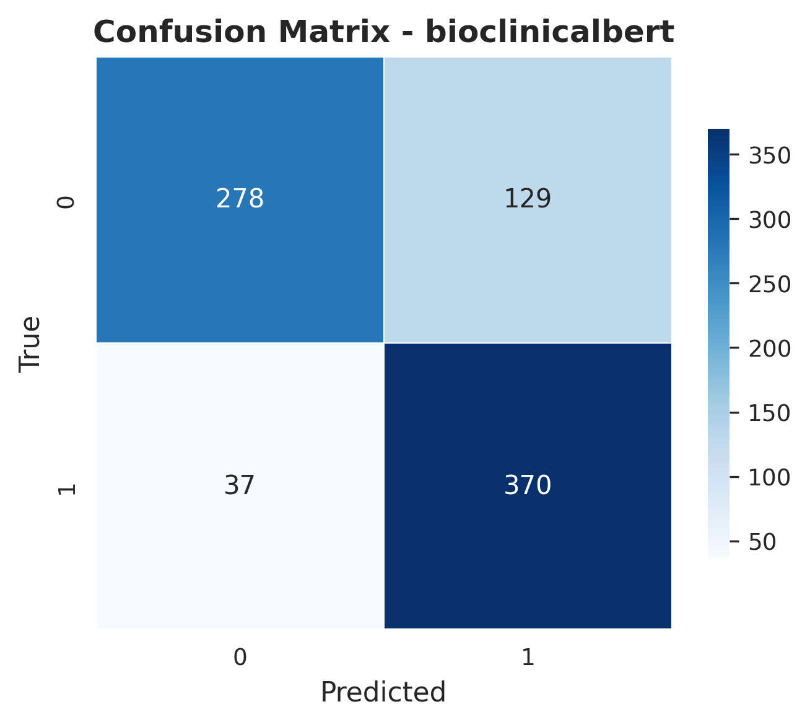

### pubmedbert

### sentence-biobert

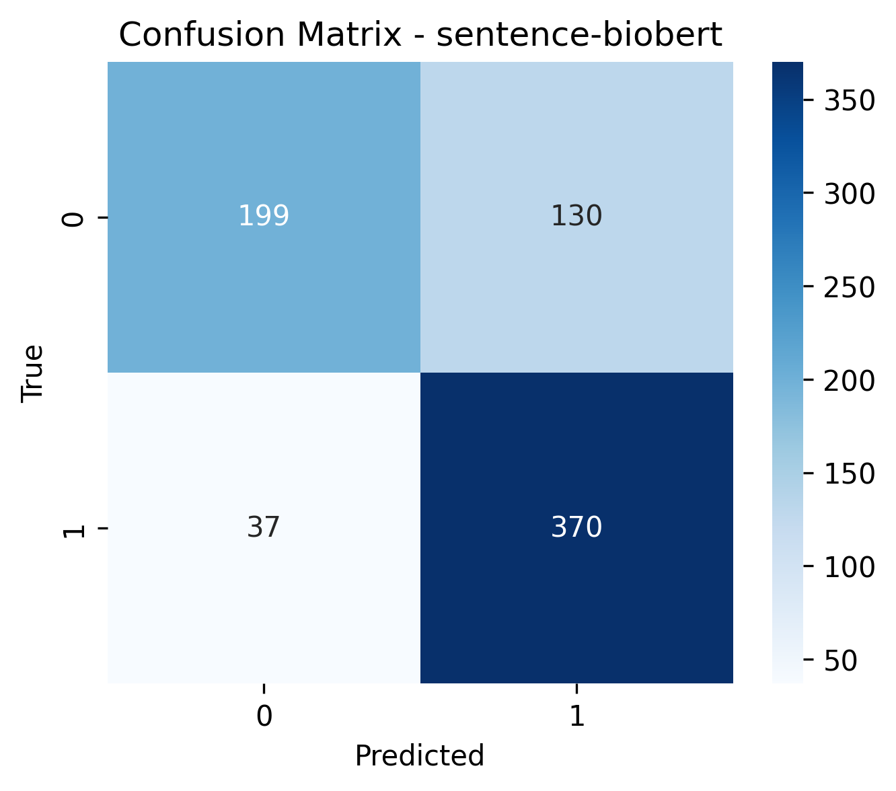

---

## 📦 Bootstrapped Metric Boxplot

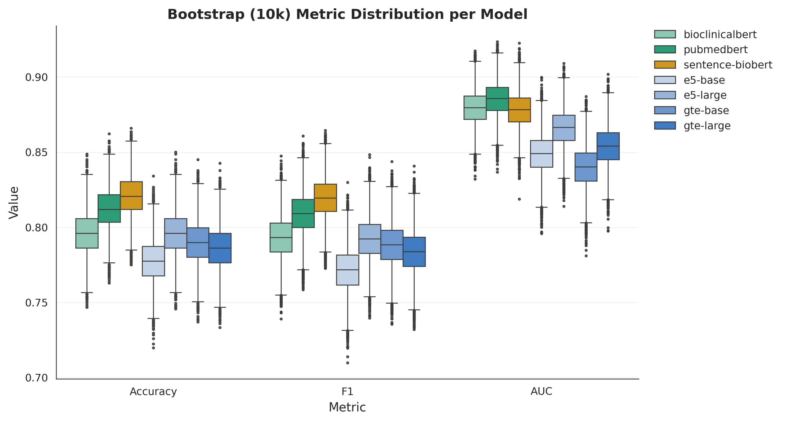

---

## 📐 Mean ± Confidence Interval

Mean metric per model with 95% bootstrap confidence interval (thin whisker) and ±1 standard deviation (thick whisker).

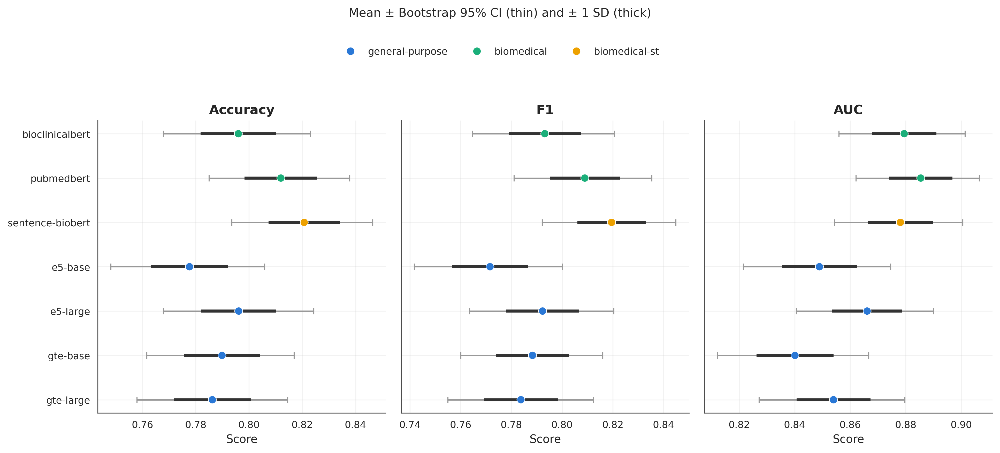

---

## 🧬 Model Family Comparison

Bootstrap metric distributions pooled by model family: general-purpose vs. biomedical vs. biomedical sentence-transformers.

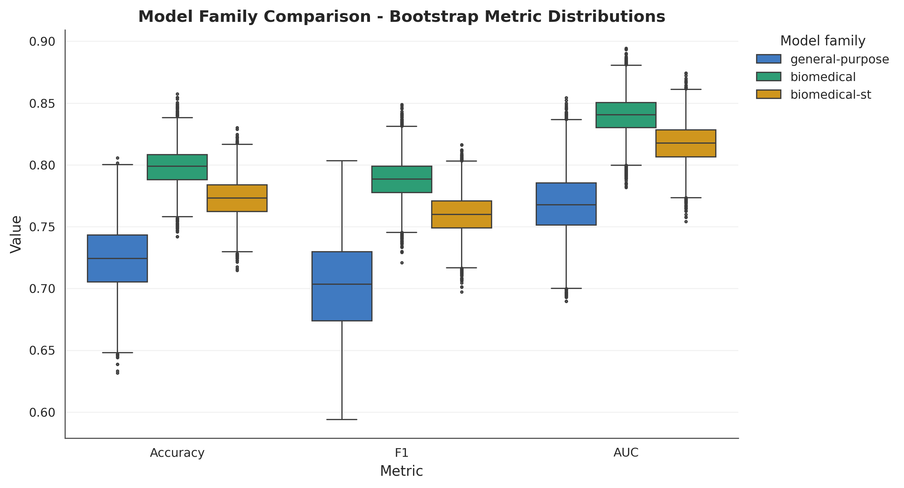

---

## 🩺 Error Analysis

Misclassified cases (false positives / false negatives) are traced back to the original clinical record for every model, using the fold validation indices saved during training.

### Error rates per model

| model            |   n_errors |   n_fp |   n_fn |   fp_rate |   fn_rate |
|:-----------------|-----------:|-------:|-------:|----------:|----------:|
| e5-base          |        181 |    156 |     25 |  0.383292 | 0.0614251 |
| gte-base         |        171 |    118 |     53 |  0.289926 | 0.130221  |
| gte-large        |        174 |    129 |     45 |  0.316953 | 0.110565  |
| e5-large         |        166 |    137 |     29 |  0.336609 | 0.0712531 |
| bioclinicalbert  |        166 |    129 |     37 |  0.316953 | 0.0909091 |
| pubmedbert       |        153 |    126 |     27 |  0.309582 | 0.0663391 |
| sentence-biobert |        146 |    104 |     42 |  0.255528 | 0.103194  |

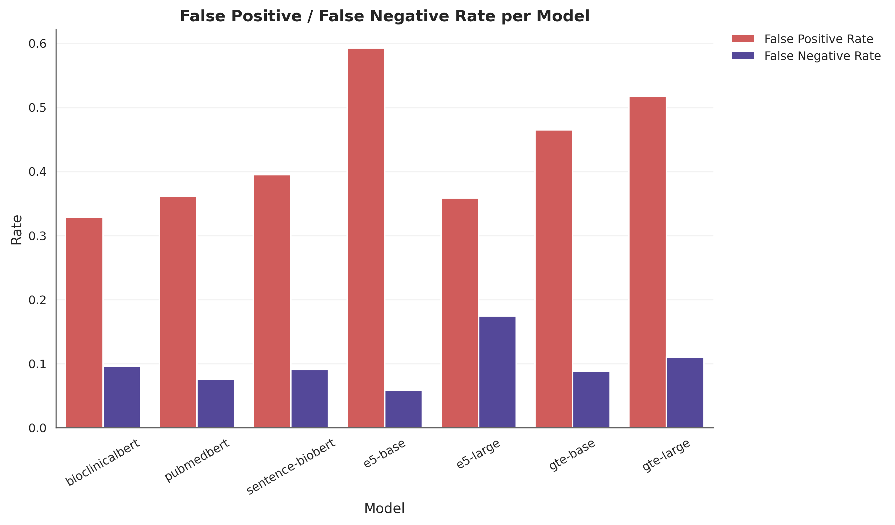

### Clinical feature deviation: misclassified vs. correctly classified

Standardized mean difference per clinical feature, pooled across all models (positive = higher in misclassified cases).

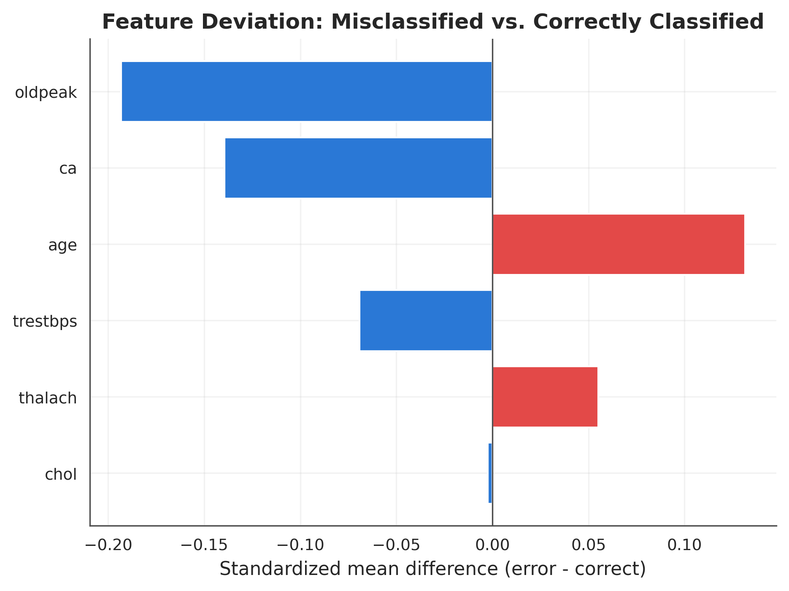

### Hardest cases (most frequently misclassified across models)

|     age |   sex |   cp |   trestbps |    chol |   fbs |   restecg |   thalach |   exang |   oldpeak |   slope |   ca |   thal |   n_models_wrong |   n_models_evaluated |
|--------:|------:|-----:|-----------:|--------:|------:|----------:|----------:|--------:|----------:|--------:|-----:|-------:|-----------------:|---------------------:|
| 55.2321 |     1 |    4 |    149.316 | 232.137 |     0 |         0 |   162.947 |       0 | 1.69583   |       1 |    0 |      3 |                7 |                    7 |
| 54.0393 |     1 |    4 |    110     | 207.908 |     0 |         0 |   141.79  |       0 | 0.0196696 |       2 |    0 |      3 |                7 |                    7 |
| 43      |     1 |    4 |    115     | 303     |     0 |         0 |   181     |       0 | 1.2       |       2 |    0 |      3 |                7 |                    7 |
| 48      |     1 |    4 |    130     | 272     |     0 |         1 |   140     |       0 | 0.5       |       2 |    0 |      3 |                7 |                    7 |
| 41      |     1 |    4 |    150     | 171     |     0 |         0 |   128     |       1 | 1.5       |       2 |    0 |      3 |                7 |                    7 |
| 68      |     1 |    1 |    130     | 181     |     1 |         1 |   140     |       0 | 0.5       |       2 |    0 |      3 |                7 |                    7 |
| 61      |     1 |    3 |    150     | 243     |     1 |         0 |   137     |       1 | 1         |       2 |    0 |      3 |                7 |                    7 |
| 55      |     1 |    4 |    140     | 229     |     0 |         0 |   110     |       1 | 0.5       |       2 |    0 |      3 |                7 |                    7 |
| 59      |     1 |    4 |    140     | 239     |     0 |         0 |   140     |       0 | 0         |       2 |    0 |      3 |                7 |                    7 |
| 51      |     1 |    4 |    140     | 261     |     0 |         2 |   186     |       1 | 0         |       1 |    0 |      3 |                7 |                    7 |

---

## 🧪 Statistical Tests

This section reports pairwise comparisons between model bootstrap metrics using Wilcoxon signed-rank tests, paired t-tests, and DeLong AUC comparisons.

### Wilcoxon Signed-Rank Test

The Wilcoxon test compares paired bootstrap distributions for each model pair.

| metric   | model_a         | model_b          |   mean_a |   mean_b |        statistic |   p_value |   significant |
|:---------|:----------------|:-----------------|---------:|---------:|-----------------:|----------:|--------------:|
| acc      | e5-base         | gte-base         |   0.7777 |   0.7899 |      2.64551e+06 |    0      |             1 |
| acc      | e5-base         | gte-large        |   0.7777 |   0.7862 |      5.54379e+06 |    0      |             1 |
| acc      | e5-base         | e5-large         |   0.7777 |   0.7961 | 139527           |    0      |             1 |
| acc      | e5-base         | bioclinicalbert  |   0.7777 |   0.796  | 535070           |    0      |             1 |
| acc      | e5-base         | pubmedbert       |   0.7777 |   0.812  |    245.5         |    0      |             1 |
| acc      | e5-base         | sentence-biobert |   0.7777 |   0.8207 |     12.5         |    0      |             1 |
| acc      | gte-base        | gte-large        |   0.7899 |   0.7862 |      1.5043e+07  |    0      |             1 |
| acc      | gte-base        | e5-large         |   0.7899 |   0.7961 |      9.73655e+06 |    0      |             1 |
| acc      | gte-base        | bioclinicalbert  |   0.7899 |   0.796  |      9.56855e+06 |    0      |             1 |
| acc      | gte-base        | pubmedbert       |   0.7899 |   0.812  | 103577           |    0      |             1 |
| acc      | gte-base        | sentence-biobert |   0.7899 |   0.8207 |  10621.5         |    0      |             1 |
| acc      | gte-large       | e5-large         |   0.7862 |   0.7961 |      4.72049e+06 |    0      |             1 |
| acc      | gte-large       | bioclinicalbert  |   0.7862 |   0.796  |      6.07183e+06 |    0      |             1 |
| acc      | gte-large       | pubmedbert       |   0.7862 |   0.812  |  34902.5         |    0      |             1 |
| acc      | gte-large       | sentence-biobert |   0.7862 |   0.8207 |    596           |    0      |             1 |
| acc      | e5-large        | bioclinicalbert  |   0.7961 |   0.796  |      2.2567e+07  |    0.3714 |             0 |
| acc      | e5-large        | pubmedbert       |   0.7961 |   0.812  | 502586           |    0      |             1 |
| acc      | e5-large        | sentence-biobert |   0.7961 |   0.8207 |  68682           |    0      |             1 |
| acc      | bioclinicalbert | pubmedbert       |   0.796  |   0.812  | 194745           |    0      |             1 |
| acc      | bioclinicalbert | sentence-biobert |   0.796  |   0.8207 |  78984           |    0      |             1 |
| acc      | pubmedbert      | sentence-biobert |   0.812  |   0.8207 |      5.21835e+06 |    0      |             1 |
| f1       | e5-base         | gte-base         |   0.7716 |   0.7883 | 864240           |    0      |             1 |
| f1       | e5-base         | gte-large        |   0.7716 |   0.7838 |      2.74909e+06 |    0      |             1 |
| f1       | e5-base         | e5-large         |   0.7716 |   0.7923 |  80756           |    0      |             1 |
| f1       | e5-base         | bioclinicalbert  |   0.7716 |   0.7932 | 239357           |    0      |             1 |
| f1       | e5-base         | pubmedbert       |   0.7716 |   0.809  |    107           |    0      |             1 |
| f1       | e5-base         | sentence-biobert |   0.7716 |   0.8195 |      3           |    0      |             1 |
| f1       | gte-base        | gte-large        |   0.7883 |   0.7838 |      1.46642e+07 |    0      |             1 |
| f1       | gte-base        | e5-large         |   0.7883 |   0.7923 |      1.55362e+07 |    0      |             1 |
| f1       | gte-base        | bioclinicalbert  |   0.7883 |   0.7932 |      1.33302e+07 |    0      |             1 |
| f1       | gte-base        | pubmedbert       |   0.7883 |   0.809  | 223314           |    0      |             1 |
| f1       | gte-base        | sentence-biobert |   0.7883 |   0.8195 |  11263           |    0      |             1 |
| f1       | gte-large       | e5-large         |   0.7838 |   0.7923 |      7.22998e+06 |    0      |             1 |
| f1       | gte-large       | bioclinicalbert  |   0.7838 |   0.7932 |      7.33143e+06 |    0      |             1 |
| f1       | gte-large       | pubmedbert       |   0.7838 |   0.809  |  59609           |    0      |             1 |
| f1       | gte-large       | sentence-biobert |   0.7838 |   0.8195 |    446           |    0      |             1 |
| f1       | e5-large        | bioclinicalbert  |   0.7923 |   0.7932 |      2.27652e+07 |    0      |             1 |
| f1       | e5-large        | pubmedbert       |   0.7923 |   0.809  | 471444           |    0      |             1 |
| f1       | e5-large        | sentence-biobert |   0.7923 |   0.8195 |  29264           |    0      |             1 |
| f1       | bioclinicalbert | pubmedbert       |   0.7932 |   0.809  | 311690           |    0      |             1 |
| f1       | bioclinicalbert | sentence-biobert |   0.7932 |   0.8195 |  55653           |    0      |             1 |
| f1       | pubmedbert      | sentence-biobert |   0.809  |   0.8195 |      3.98234e+06 |    0      |             1 |
| auc      | e5-base         | gte-base         |   0.8489 |   0.8401 | 205972           |    0      |             1 |
| auc      | e5-base         | gte-large        |   0.8489 |   0.854  |      5.63212e+06 |    0      |             1 |
| auc      | e5-base         | e5-large         |   0.8489 |   0.8661 |      2           |    0      |             1 |
| auc      | e5-base         | bioclinicalbert  |   0.8489 |   0.8795 |      1           |    0      |             1 |
| auc      | e5-base         | pubmedbert       |   0.8489 |   0.8855 |      0           |    0      |             1 |
| auc      | e5-base         | sentence-biobert |   0.8489 |   0.8781 |     28           |    0      |             1 |
| auc      | gte-base        | gte-large        |   0.8401 |   0.854  | 111284           |    0      |             1 |
| auc      | gte-base        | e5-large         |   0.8401 |   0.8661 |      0           |    0      |             1 |
| auc      | gte-base        | bioclinicalbert  |   0.8401 |   0.8795 |      0           |    0      |             1 |
| auc      | gte-base        | pubmedbert       |   0.8401 |   0.8855 |      0           |    0      |             1 |
| auc      | gte-base        | sentence-biobert |   0.8401 |   0.8781 |      0           |    0      |             1 |
| auc      | gte-large       | e5-large         |   0.854  |   0.8661 | 227610           |    0      |             1 |
| auc      | gte-large       | bioclinicalbert  |   0.854  |   0.8795 |     96           |    0      |             1 |
| auc      | gte-large       | pubmedbert       |   0.854  |   0.8855 |      0           |    0      |             1 |
| auc      | gte-large       | sentence-biobert |   0.854  |   0.8781 |   1540           |    0      |             1 |
| auc      | e5-large        | bioclinicalbert  |   0.8661 |   0.8795 | 236652           |    0      |             1 |
| auc      | e5-large        | pubmedbert       |   0.8661 |   0.8855 |     32           |    0      |             1 |
| auc      | e5-large        | sentence-biobert |   0.8661 |   0.8781 |      1.2929e+06  |    0      |             1 |
| auc      | bioclinicalbert | pubmedbert       |   0.8795 |   0.8855 |      1.7008e+06  |    0      |             1 |
| auc      | bioclinicalbert | sentence-biobert |   0.8795 |   0.8781 |      2.01517e+07 |    0      |             1 |
| auc      | pubmedbert      | sentence-biobert |   0.8855 |   0.8781 |      3.89682e+06 |    0      |             1 |

### Paired t-test

The paired t-test compares paired bootstrap means for each model pair.

| metric   | model_a         | model_b          |   mean_a |   mean_b |   statistic |   p_value |   significant |
|:---------|:----------------|:-----------------|---------:|---------:|------------:|----------:|--------------:|
| acc      | e5-base         | gte-base         |   0.7777 |   0.7899 |   -110.47   |    0      |             1 |
| acc      | e5-base         | gte-large        |   0.7777 |   0.7862 |    -81.9303 |    0      |             1 |
| acc      | e5-base         | e5-large         |   0.7777 |   0.7961 |   -192      |    0      |             1 |
| acc      | e5-base         | bioclinicalbert  |   0.7777 |   0.796  |   -160.693  |    0      |             1 |
| acc      | e5-base         | pubmedbert       |   0.7777 |   0.812  |   -321.019  |    0      |             1 |
| acc      | e5-base         | sentence-biobert |   0.7777 |   0.8207 |   -354.297  |    0      |             1 |
| acc      | gte-base        | gte-large        |   0.7899 |   0.7862 |     30.5199 |    0      |             1 |
| acc      | gte-base        | e5-large         |   0.7899 |   0.7961 |    -55.5744 |    0      |             1 |
| acc      | gte-base        | bioclinicalbert  |   0.7899 |   0.796  |    -56.8185 |    0      |             1 |
| acc      | gte-base        | pubmedbert       |   0.7899 |   0.812  |   -202.038  |    0      |             1 |
| acc      | gte-base        | sentence-biobert |   0.7899 |   0.8207 |   -254.699  |    0      |             1 |
| acc      | gte-large       | e5-large         |   0.7862 |   0.7961 |    -88.4345 |    0      |             1 |
| acc      | gte-large       | bioclinicalbert  |   0.7862 |   0.796  |    -78.2166 |    0      |             1 |
| acc      | gte-large       | pubmedbert       |   0.7862 |   0.812  |   -222.602  |    0      |             1 |
| acc      | gte-large       | sentence-biobert |   0.7862 |   0.8207 |   -294.352  |    0      |             1 |
| acc      | e5-large        | bioclinicalbert  |   0.7961 |   0.796  |      1.2549 |    0.2095 |             0 |
| acc      | e5-large        | pubmedbert       |   0.7961 |   0.812  |   -160.469  |    0      |             1 |
| acc      | e5-large        | sentence-biobert |   0.7961 |   0.8207 |   -207.324  |    0      |             1 |
| acc      | bioclinicalbert | pubmedbert       |   0.796  |   0.812  |   -184.38   |    0      |             1 |
| acc      | bioclinicalbert | sentence-biobert |   0.796  |   0.8207 |   -205.015  |    0      |             1 |
| acc      | pubmedbert      | sentence-biobert |   0.812  |   0.8207 |    -83.8481 |    0      |             1 |
| f1       | e5-base         | gte-base         |   0.7716 |   0.7883 |   -148.891  |    0      |             1 |
| f1       | e5-base         | gte-large        |   0.7716 |   0.7838 |   -113.415  |    0      |             1 |
| f1       | e5-base         | e5-large         |   0.7716 |   0.7923 |   -206.652  |    0      |             1 |
| f1       | e5-base         | bioclinicalbert  |   0.7716 |   0.7932 |   -183.941  |    0      |             1 |
| f1       | e5-base         | pubmedbert       |   0.7716 |   0.809  |   -336.413  |    0      |             1 |
| f1       | e5-base         | sentence-biobert |   0.7716 |   0.8195 |   -384.346  |    0      |             1 |
| f1       | gte-base        | gte-large        |   0.7883 |   0.7838 |     37.9838 |    0      |             1 |
| f1       | gte-base        | e5-large         |   0.7883 |   0.7923 |    -34.6681 |    0      |             1 |
| f1       | gte-base        | bioclinicalbert  |   0.7883 |   0.7932 |    -44.1799 |    0      |             1 |
| f1       | gte-base        | pubmedbert       |   0.7883 |   0.809  |   -185.972  |    0      |             1 |
| f1       | gte-base        | sentence-biobert |   0.7883 |   0.8195 |   -254.202  |    0      |             1 |
| f1       | gte-large       | e5-large         |   0.7838 |   0.7923 |    -74.9682 |    0      |             1 |
| f1       | gte-large       | bioclinicalbert  |   0.7838 |   0.7932 |    -73.9796 |    0      |             1 |
| f1       | gte-large       | pubmedbert       |   0.7838 |   0.809  |   -213.553  |    0      |             1 |
| f1       | gte-large       | sentence-biobert |   0.7838 |   0.8195 |   -300.829  |    0      |             1 |
| f1       | e5-large        | bioclinicalbert  |   0.7923 |   0.7932 |     -7.5429 |    0      |             1 |
| f1       | e5-large        | pubmedbert       |   0.7923 |   0.809  |   -164.92   |    0      |             1 |
| f1       | e5-large        | sentence-biobert |   0.7923 |   0.8195 |   -226.211  |    0      |             1 |
| f1       | bioclinicalbert | pubmedbert       |   0.7932 |   0.809  |   -176.52   |    0      |             1 |
| f1       | bioclinicalbert | sentence-biobert |   0.7932 |   0.8195 |   -214.82   |    0      |             1 |
| f1       | pubmedbert      | sentence-biobert |   0.809  |   0.8195 |    -99.2305 |    0      |             1 |
| auc      | e5-base         | gte-base         |   0.8489 |   0.8401 |    184.931  |    0      |             1 |
| auc      | e5-base         | gte-large        |   0.8489 |   0.854  |    -85.9693 |    0      |             1 |
| auc      | e5-base         | e5-large         |   0.8489 |   0.8661 |   -366.744  |    0      |             1 |
| auc      | e5-base         | bioclinicalbert  |   0.8489 |   0.8795 |   -375.126  |    0      |             1 |
| auc      | e5-base         | pubmedbert       |   0.8489 |   0.8855 |   -510.36   |    0      |             1 |
| auc      | e5-base         | sentence-biobert |   0.8489 |   0.8781 |   -333.729  |    0      |             1 |
| auc      | gte-base        | gte-large        |   0.8401 |   0.854  |   -198.877  |    0      |             1 |
| auc      | gte-base        | e5-large         |   0.8401 |   0.8661 |   -477.471  |    0      |             1 |
| auc      | gte-base        | bioclinicalbert  |   0.8401 |   0.8795 |   -518.756  |    0      |             1 |
| auc      | gte-base        | pubmedbert       |   0.8401 |   0.8855 |   -617.821  |    0      |             1 |
| auc      | gte-base        | sentence-biobert |   0.8401 |   0.8781 |   -395.468  |    0      |             1 |
| auc      | gte-large       | e5-large         |   0.854  |   0.8661 |   -184.751  |    0      |             1 |
| auc      | gte-large       | bioclinicalbert  |   0.854  |   0.8795 |   -321.316  |    0      |             1 |
| auc      | gte-large       | pubmedbert       |   0.854  |   0.8855 |   -459.447  |    0      |             1 |
| auc      | gte-large       | sentence-biobert |   0.854  |   0.8781 |   -289.591  |    0      |             1 |
| auc      | e5-large        | bioclinicalbert  |   0.8661 |   0.8795 |   -184.219  |    0      |             1 |
| auc      | e5-large        | pubmedbert       |   0.8661 |   0.8855 |   -342.419  |    0      |             1 |
| auc      | e5-large        | sentence-biobert |   0.8661 |   0.8781 |   -137.774  |    0      |             1 |
| auc      | bioclinicalbert | pubmedbert       |   0.8795 |   0.8855 |   -128.587  |    0      |             1 |
| auc      | bioclinicalbert | sentence-biobert |   0.8795 |   0.8781 |     17.3784 |    0      |             1 |
| auc      | pubmedbert      | sentence-biobert |   0.8855 |   0.8781 |    100.212  |    0      |             1 |

### DeLong AUC Comparison

The DeLong test compares AUC performance between model pairs on the same test labels.

| model_a         | model_b          |   auc_a |   auc_b |   delta_auc |   z_statistic |   p_value |   significant |
|:----------------|:-----------------|--------:|--------:|------------:|--------------:|----------:|--------------:|
| e5-base         | gte-base         |  0.8488 |  0.8401 |      0.0087 |       -1.8317 |    0.067  |             0 |
| e5-base         | gte-large        |  0.8488 |  0.8539 |     -0.0051 |        0.8627 |    0.3883 |             0 |
| e5-base         | e5-large         |  0.8488 |  0.866  |     -0.0172 |        3.6518 |    0.0003 |             1 |
| e5-base         | bioclinicalbert  |  0.8488 |  0.8794 |     -0.0306 |        3.7577 |    0.0002 |             1 |
| e5-base         | pubmedbert       |  0.8488 |  0.8854 |     -0.0366 |        5.1072 |    0      |             1 |
| e5-base         | sentence-biobert |  0.8488 |  0.878  |     -0.0291 |        3.3331 |    0.0009 |             1 |
| gte-base        | gte-large        |  0.8401 |  0.8539 |     -0.0138 |        1.9805 |    0.0476 |             1 |
| gte-base        | e5-large         |  0.8401 |  0.866  |     -0.0259 |        4.7464 |    0      |             1 |
| gte-base        | bioclinicalbert  |  0.8401 |  0.8794 |     -0.0393 |        5.154  |    0      |             1 |
| gte-base        | pubmedbert       |  0.8401 |  0.8854 |     -0.0453 |        6.1497 |    0      |             1 |
| gte-base        | sentence-biobert |  0.8401 |  0.878  |     -0.0379 |        3.946  |    0.0001 |             1 |
| gte-large       | e5-large         |  0.8539 |  0.866  |     -0.0121 |        1.8605 |    0.0628 |             0 |
| gte-large       | bioclinicalbert  |  0.8539 |  0.8794 |     -0.0255 |        3.2399 |    0.0012 |             1 |
| gte-large       | pubmedbert       |  0.8539 |  0.8854 |     -0.0315 |        4.6447 |    0      |             1 |
| gte-large       | sentence-biobert |  0.8539 |  0.878  |     -0.0241 |        2.9178 |    0.0035 |             1 |
| e5-large        | bioclinicalbert  |  0.866  |  0.8794 |     -0.0134 |        1.8733 |    0.061  |             0 |
| e5-large        | pubmedbert       |  0.866  |  0.8854 |     -0.0194 |        3.4833 |    0.0005 |             1 |
| e5-large        | sentence-biobert |  0.866  |  0.878  |     -0.012  |        1.3858 |    0.1658 |             0 |
| bioclinicalbert | pubmedbert       |  0.8794 |  0.8854 |     -0.006  |        1.2996 |    0.1937 |             0 |
| bioclinicalbert | sentence-biobert |  0.8794 |  0.878  |      0.0015 |       -0.1872 |    0.8515 |             0 |
| pubmedbert      | sentence-biobert |  0.8854 |  0.878  |      0.0074 |       -1.0205 |    0.3075 |             0 |

---

## 🔍 Discussion and Observations

- Larger embedding models (E5-large, GTE-large) generally show better performance.
- GTE-large tends to achieve higher ROC-AUC and tighter confidence intervals.
- Confusion matrices enable analysis of false positives and false negatives.
- Bootstrap is useful to verify metric stability and robustness.

---

## 🏁 Conclusions

- The embedding + linear classifier approach is effective.
- Modern encoders such as GTE-large demonstrate strong generalization.
- The pipeline is robust and stable, as confirmed by bootstrap 10,000.

---

## 🚀 Potential Improvements

- Test additional encoders (bge-large, Jina-Embeddings, E5-mistral).
- Introduce a non-linear classifier (XGBoost, LightGBM).
- Apply advanced calibration techniques (Platt scaling).
- Add a larger clinical dataset to reduce variance error.
