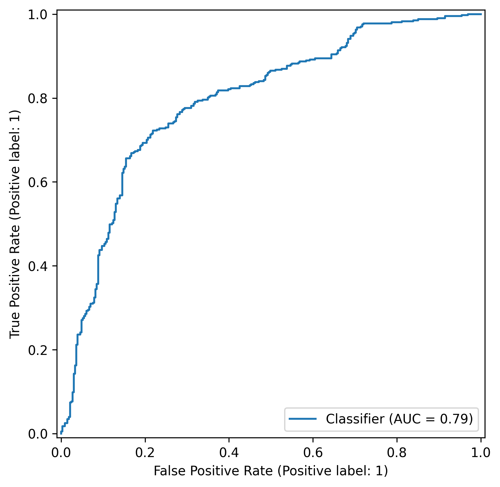
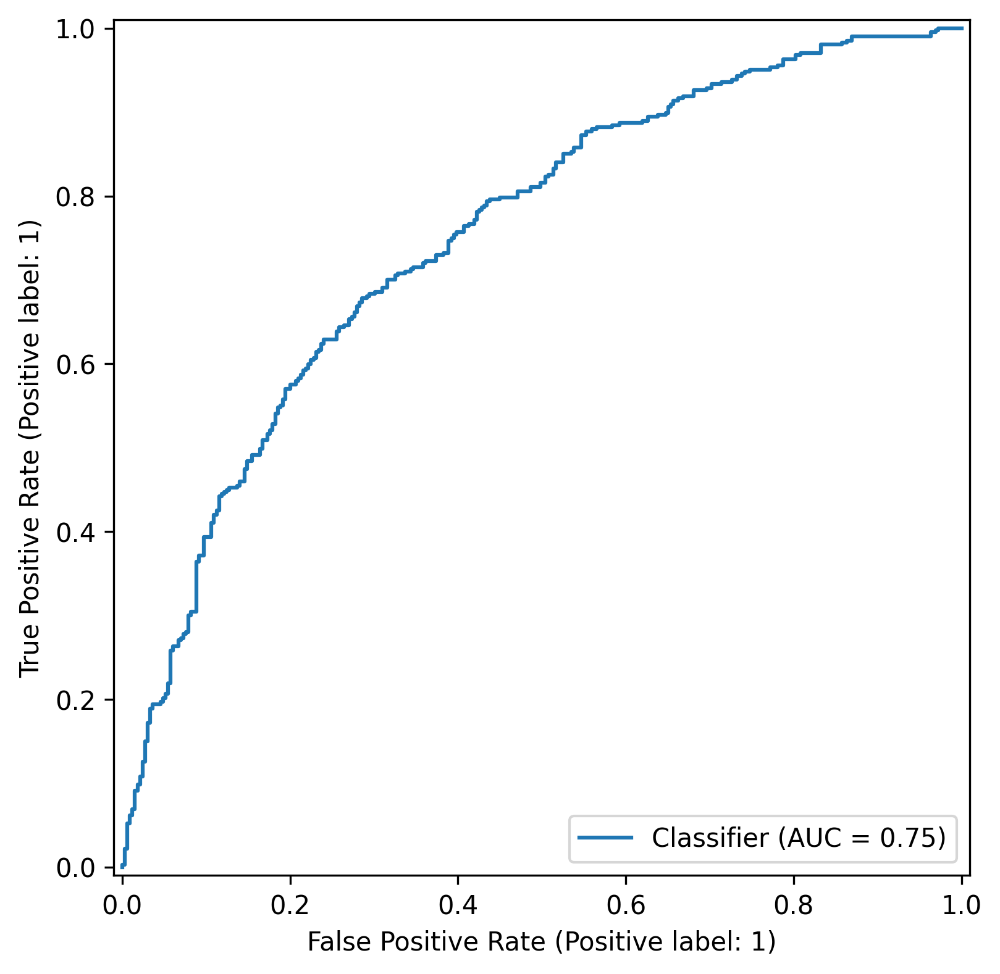
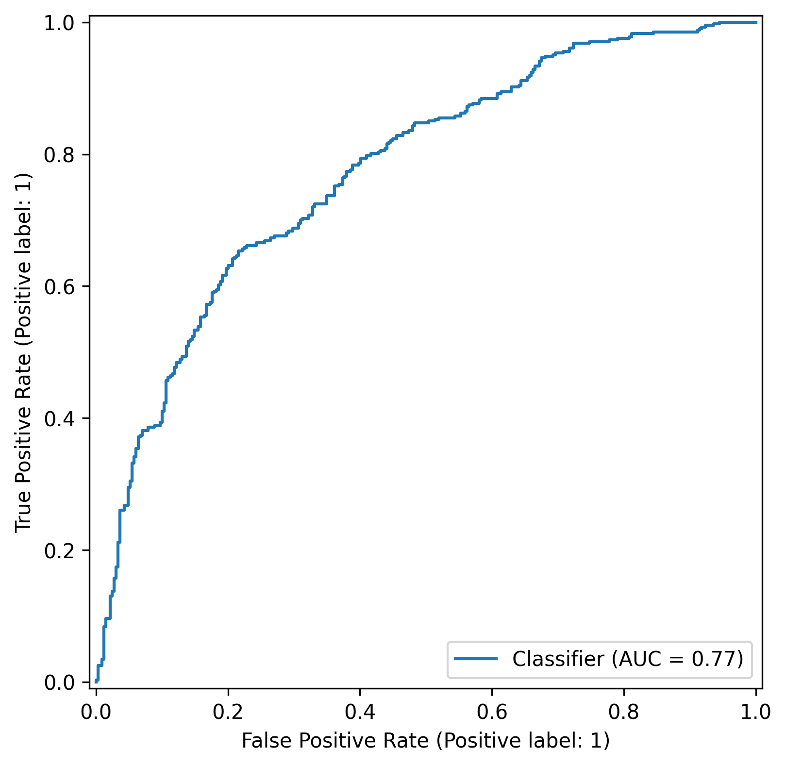
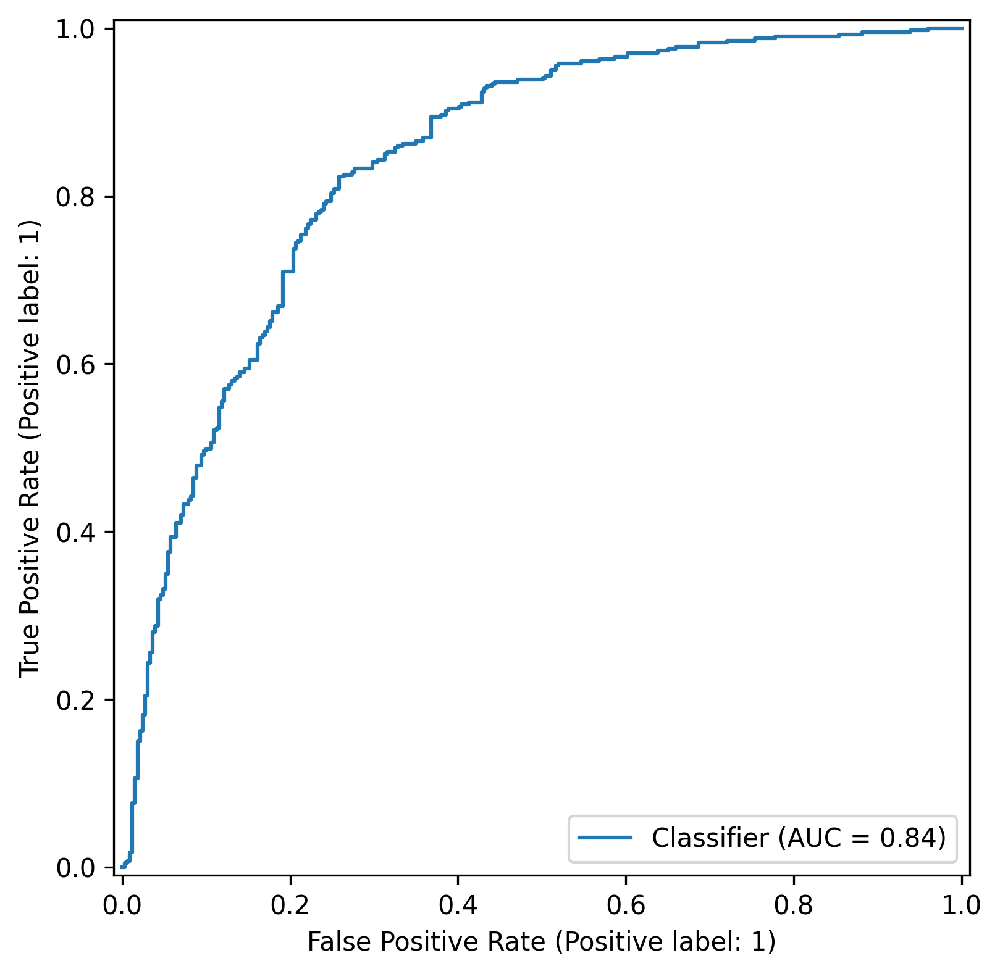
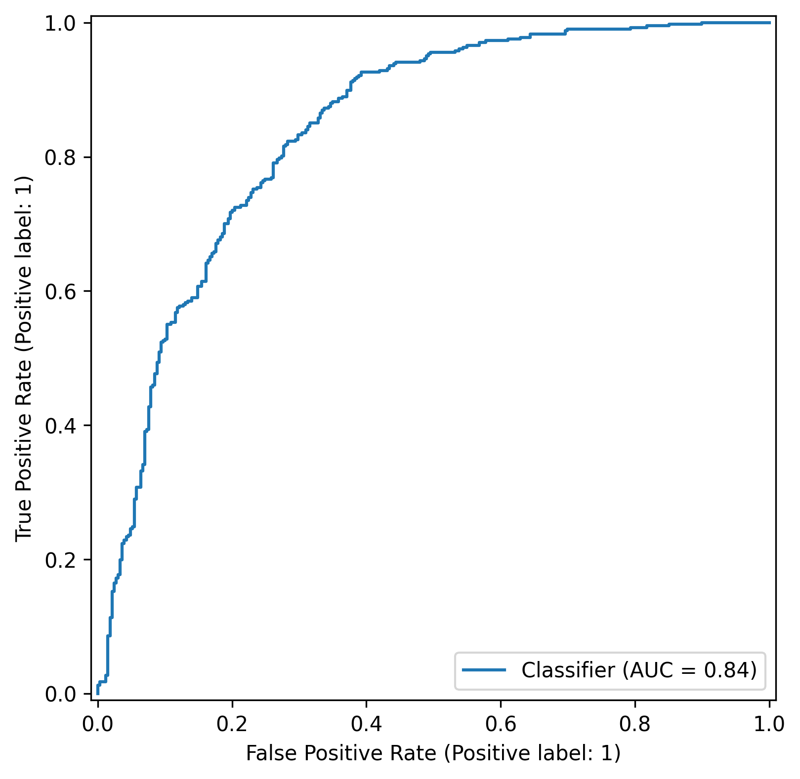
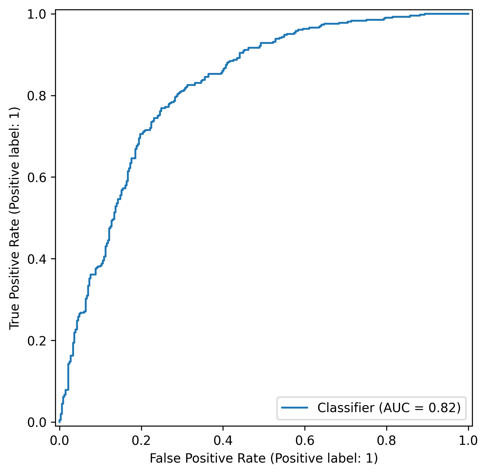

# 📊 Encoder Evaluation Report

**Generated:** 2026-06-10 00:11

---

## 🎯 Objective

Verify the robustness and reliability of the pipeline based on embeddings generated by modern models (E5-base, E5-large, GTE-large).

## 📘 Evaluated Models

- **e5-base**
- **gte-base**
- **gte-large**
- **e5-large**
- **bioclinicalbert**
- **pubmedbert**
- **sentence-biobert**

---

## 📈 Metric results with confidence intervals (Bootstrap 10,000)

| model            |   acc_mean |   acc_ci_low |   acc_ci_high |   f1_mean |   f1_ci_low |   f1_ci_high |   auc_mean |   auc_ci_low |   auc_ci_high |
|:-----------------|-----------:|-------------:|--------------:|----------:|------------:|-------------:|-----------:|-------------:|--------------:|
| e5-base          |   0.702475 |     0.669837 |      0.735054 |  0.663689 |    0.627163 |     0.699388 |   0.755517 |     0.719823 |      0.7904   |
| gte-base         |   0.743249 |     0.711957 |      0.774457 |  0.7236   |    0.689699 |     0.756713 |   0.793294 |     0.75964  |      0.82578  |
| gte-large        |   0.707999 |     0.673913 |      0.740489 |  0.683694 |    0.648373 |     0.718399 |   0.751501 |     0.715792 |      0.7854   |
| e5-large         |   0.74328  |     0.711957 |      0.774457 |  0.735407 |    0.702841 |     0.767215 |   0.773563 |     0.739442 |      0.8074   |
| bioclinicalbert  |   0.800207 |     0.77038  |      0.828804 |  0.791667 |    0.760856 |     0.821404 |   0.840417 |     0.810464 |      0.869265 |
| pubmedbert       |   0.79609  |     0.766304 |      0.824762 |  0.78492  |    0.753913 |     0.815538 |   0.839983 |     0.810133 |      0.868158 |
| sentence-biobert |   0.773138 |     0.741848 |      0.802989 |  0.759944 |    0.728137 |     0.791531 |   0.817376 |     0.785708 |      0.847807 |

---

## 📉 ROC Curves

### e5-base

### gte-base

### gte-large

### e5-large

### bioclinicalbert

### pubmedbert

### sentence-biobert

---

## 🧩 Confusion Matrix

### e5-base

### gte-base

### gte-large

### e5-large

### bioclinicalbert

### pubmedbert

### sentence-biobert

---

## 📦 Bootstrapped Metric Boxplot

---

## 🔍 Discussion and Observations

- Larger embedding models (E5-large, GTE-large) generally show better performance.
- GTE-large tends to achieve higher ROC-AUC and tighter confidence intervals.
- Confusion matrices enable analysis of false positives and false negatives.
- Bootstrap is useful to verify metric stability and robustness.

---

## 🏁 Conclusions

- The embedding + linear classifier approach is effective.
- Modern encoders such as GTE-large demonstrate strong generalization.
- The pipeline is robust and stable, as confirmed by bootstrap 10,000.

---

## 🚀 Potential Improvements

- Test additional encoders (bge-large, Jina-Embeddings, E5-mistral).
- Introduce a non-linear classifier (XGBoost, LightGBM).
- Apply advanced calibration techniques (Platt scaling).
- Add a larger clinical dataset to reduce variance error.
