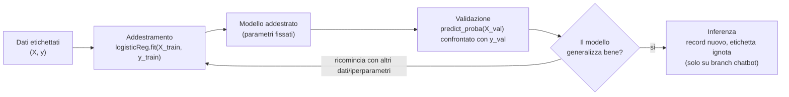

# Capitolo 2 — Il quadro del machine learning supervisionato

**Obiettivi del capitolo**

- Collocare quello che fa il progetto in una mappa più ampia: cosa distingue apprendimento supervisionato, non supervisionato e per rinforzo.
- Avere un modello mentale del ciclo addestramento → validazione → inferenza, prima di vederlo nel codice.
- Sapere cosa significano overfitting, underfitting e generalizzazione, e perché sono il motivo per cui esiste la validazione.

Questo capitolo non parla ancora del progetto in dettaglio. Parla del quadro concettuale dentro cui il progetto si colloca — necessario perché il tuo punto di partenza su questo, per calibrazione esplicita di questo libro, è zero, indipendentemente da quanto tu sappia già di ingegneria del software.

## 2.1 Apprendimento supervisionato, non supervisionato, per rinforzo: una mappa minima

**[Livello: teoria consolidata del settore]** Il machine learning si divide, a grandi linee, in tre famiglie di problemi, distinte da *cosa hai a disposizione durante l'addestramento*.

Nell'**apprendimento supervisionato**, hai esempi già etichettati: coppie (input, output corretto). Il compito è imparare una funzione che, dato un nuovo input mai visto, produca un output plausibile, generalizzando da quegli esempi. Un embedding di un record clinico come input, l'etichetta "malattia presente/assente" come output atteso: questo è supervisionato, ed è tutto ciò che fa questo progetto nella sua parte di classificazione.

Nell'**apprendimento non supervisionato**, hai solo input, senza alcun output di riferimento. Il compito è trovare struttura nei dati stessi: raggruppamenti, direzioni di massima variazione, vicinanze. **[Fatto]** Il progetto usa esattamente una tecnica di questa famiglia — UMAP, in `function.py:223 plot_umap` — ma solo per produrre un grafico bidimensionale a scopo di ispezione visiva (capitolo 38), mai per decidere l'etichetta di un record. È un dettaglio che vale la pena notare subito: la pipeline è supervisionata dall'inizio alla fine tranne che in un punto puramente illustrativo.

Nell'**apprendimento per rinforzo**, un agente interagisce con un ambiente, riceve una ricompensa numerica per le sue azioni, e impara una strategia che la massimizzi nel tempo. **[Fatto]** Questa famiglia non compare da nessuna parte nel codice del progetto: la citiamo solo perché la mappa sia completa, non perché sia rilevante qui.

> **SE VIENI DA JAVA —** non c'è un'analogia diretta e onesta con qualcosa che conosci già dal mondo enterprise. La cosa più vicina, concettualmente, è la differenza fra scrivere una regola esplicita (`if pressione > 140: rischio_alto = true`) e *dedurre* quella soglia da migliaia di casi passati invece di scriverla tu. Il "programma" nell'apprendimento supervisionato non è il codice che hai scritto: sono i parametri numerici che l'addestramento ha trovato, e che il codice si limita ad applicare.

## 2.2 Il ciclo addestramento → validazione → inferenza

**[Livello: teoria consolidata del settore]** Ogni pipeline supervisionata attraversa tre momenti concettualmente distinti, anche quando il codice li esegue uno via l'altro senza soluzione di continuità.

**Addestramento (training):** al modello vengono mostrati input ed etichette corrette insieme, e un algoritmo di ottimizzazione regola i parametri interni del modello per minimizzare l'errore su quegli esempi. **[Fatto]** Nel progetto, questo è esattamente `logisticReg.fit(X_train, y_train)` (`classification.py:26`): `X_train` sono gli embedding, `y_train` le etichette vere, e `fit` è il verbo che in scikit-learn significa sempre "esegui l'addestramento".

**Validazione:** il modello addestrato viene applicato a dati che *non ha usato per allenarsi*, di cui però conosci comunque l'etichetta vera — così puoi confrontare previsione e realtà e stimare quanto bene il modello si comporterà su dati futuri, genuinamente sconosciuti. **[Fatto]** Nel progetto, questo è `logisticReg.predict_proba(X_val)` (`classification.py:28`), dove `X_val` è la parte di dati tenuta fuori dall'addestramento in quel fold — il meccanismo esatto è il tema del capitolo 33.

**Inferenza:** il modello, già addestrato e già validato, viene applicato a un input completamente nuovo, di cui *non conosci* l'etichetta vera — è il momento in cui il sistema produce effettivamente valore, perché prima di allora stavi solo misurando quanto ti puoi fidare di lui. **[Fatto, ma non in `master`]** Il progetto, sul branch `master`, si ferma alla validazione: non esiste, nel codice che orchestra `main.py`, un percorso che prenda un record clinico nuovo e restituisca una previsione. Quel percorso esiste solo sul branch `chatbot`, non unito (`chatbot_core.py`, capitolo 54): è lì che il ciclo si chiude davvero, e non a caso è anche il punto in cui le implicazioni etiche di un errore diventano più concrete.

*Figura 2.1 — Il ciclo addestramento/validazione/inferenza, con i riferimenti esatti a dove ciascun momento avviene nel codice del progetto.*

## 2.3 Overfitting, underfitting, generalizzazione

**[Livello: teoria consolidata del settore]** Un modello che si comporta perfettamente sui dati di addestramento non è necessariamente un buon modello. Può darsi che abbia imparato a memoria le particolarità di *quei* dati — incluso il rumore, le coincidenze, gli errori di misura — invece di catturare il pattern reale che si ripete anche su dati nuovi. Questo fenomeno si chiama **overfitting** (sovradattamento): l'errore sui dati di addestramento è basso, l'errore su dati nuovi è alto. Il fenomeno opposto, l'**underfitting** (sottoadattamento), succede quando il modello è troppo semplice per catturare anche il pattern reale, e sbaglia sia sui dati di addestramento sia su quelli nuovi.

La **generalizzazione** è la capacità di un modello di comportarsi bene su dati che non ha mai visto durante l'addestramento. È l'unica cosa che conta davvero in un sistema che dovrà essere usato su pazienti futuri, non sui pazienti già registrati nel dataset. Ed è precisamente per stimare la generalizzazione, senza aspettare che il sistema sia già in uso per scoprire che sbaglia, che esiste la validazione del paragrafo precedente: tieni da parte una porzione di dati con etichetta nota, fingi di non conoscerne l'etichetta, e misura quanto il modello ci va vicino.

> **ATTENZIONE —** la stima di generalizzazione vale solo quanto è onesta la separazione fra dati di addestramento e dati di validazione. Se anche un solo bit di informazione sui dati di validazione trapela nel processo di addestramento o di scelta del modello — un fenomeno chiamato **data leakage**, che il capitolo 33 tratta per esteso — la stima diventa artificialmente ottimistica, e lo scopri solo quando il sistema è già in produzione e i numeri reali sono peggiori di quelli misurati. Anticipiamo qui perché è rilevante da subito: questo progetto, come vedremo nel dettaglio ai capitoli 33, 35 e 51, ha almeno due punti in cui questa separazione è meno netta di quanto sembri a prima lettura.

**[Approfondimento facoltativo]** Il compromesso fra overfitting e underfitting è spesso descritto in letteratura come *bias-variance tradeoff*: un modello troppo semplice ha alto bias (sbaglia sistematicamente, in modo simile su ogni campione di dati), un modello troppo complesso ha alta varianza (il suo comportamento cambia molto a seconda del campione specifico di dati di addestramento che riceve). Una trattazione rigorosa di questo compromesso è materia da manuale di machine learning generale — per esempio Hastie, Tibshirani e Friedman, *The Elements of Statistical Learning* `[DA VERIFICARE — non citare prima del controllo: edizione, anno ed editore esatti da confermare]` — e non è necessaria per seguire il resto di questo libro: la citiamo per chi volesse approfondirla nella tesi.

## Riepilogo

Il progetto si colloca interamente nell'apprendimento supervisionato, con una singola incursione non supervisionata (UMAP) usata solo a scopo illustrativo. Il ciclo addestramento→validazione→inferenza è il telaio concettuale su cui si legge ogni riga di `classification.py`; il progetto, sul branch `master`, copre addestramento e validazione ma non l'inferenza su casi nuovi. Overfitting, underfitting e generalizzazione sono il motivo per cui la validazione esiste, e la loro affidabilità dipende interamente dal non lasciare trapelare informazione dai dati di validazione verso l'addestramento — un punto su cui questo progetto merita attenzione, come i capitoli successivi mostreranno.

## Domande di autoverifica

**1. Perché UMAP, che è una tecnica non supervisionata, non "rompe" la natura supervisionata della pipeline?**
Perché non partecipa mai alla decisione di classificazione: `plot_umap` (`function.py:223`) produce solo una proiezione 2D usata per un grafico ispezionabile a occhio. Il classificatore vero e proprio non riceve mai l'output di UMAP come input — riceve gli embedding originali a piena dimensione.

**2. Qual è la differenza pratica, non solo definitoria, fra "validazione" e "inferenza"?**
In validazione conosci già l'etichetta vera e la usi per misurare l'errore del modello; in inferenza non la conosci affatto, ed è per quello che ti serve il modello. Una pipeline che confonde le due cose — per esempio scegliendo un parametro guardando l'etichetta vera del dato su cui poi riporta il punteggio — produce una stima di generalizzazione fin troppo ottimistica.

**3. Cosa significa, in una frase, che un modello "generalizza bene"?**
Che l'errore misurato su dati mai visti durante l'addestramento è vicino all'errore misurato sui dati di addestramento stesso — cioè che il modello ha imparato un pattern reale, non le particolarità del campione specifico che gli è stato mostrato.

> **MATERIALE PER LA TESI**
> 1. La mappa supervisionato/non supervisionato/per rinforzo, con la collocazione esplicita di ogni tecnica del progetto in una delle tre categorie — riusabile come paragrafo di inquadramento metodologico in "Materiali e metodi".
> 2. Il diagramma Mermaid del ciclo addestramento/validazione/inferenza con i riferimenti di codice (Figura 2.1) — riusabile direttamente come figura nella tesi, con didascalia originale.
> 3. La definizione operativa di data leakage e l'anticipazione dei due punti del progetto in cui la separazione training/validazione è meno netta del previsto — riusabile come apertura della sezione "Discussione e limiti", da sviluppare con il dettaglio dei capitoli 33, 35 e 51.
