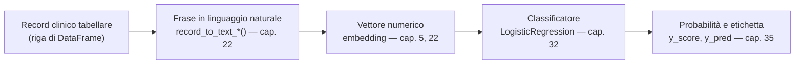

# Capitolo 3 — Dalla tabella al testo

**Obiettivi del capitolo**

- Capire perché una tabella di numeri e categorie non è, di per sé, qualcosa che un modello linguistico può usare direttamente.
- Vedere l'idea centrale del progetto — tabellare→testo→embedding→classificazione — prima di incontrarne il codice.
- Sapere quali strade alternative esistono per lo stesso problema, e in cosa questa se ne distingue.

## 3.1 Limiti di una rappresentazione tabellare per i modelli linguistici

Immagina di dover descrivere un paziente a un collega al telefono, senza poter mostrargli una tabella. Non gli detteresti "sesso: 1, età: 63, cp: 4, trestbps: 145" — gli diresti "un paziente di 63 anni, uomo, con dolore toracico di tipo asintomatico, pressione a riposo di 145". La differenza non è cosmetica: la seconda forma porta con sé un contesto — "dolore toracico asintomatico" è un'espressione che compare in migliaia di testi medici, con relazioni semantiche note (è associata a un certo tipo di rischio, ricorre vicino ad altre espressioni cliniche specifiche) — mentre il numero "4" da solo non porta nessuna di queste relazioni. Un modello linguistico pre-addestrato su enormi quantità di testo ha imparato quelle relazioni semantiche osservandole nel testo. Non le ha mai osservate nei codici numerici di una tabella, perché in una tabella quelle relazioni semplicemente non compaiono nella stessa forma.

**[Livello: teoria consolidata del settore]** Questo è il motivo tecnico per cui un modello di embedding testuale — costruito e addestrato per rappresentare frasi, non righe di tabella — non può essere applicato direttamente ai dati tabellari originali. Il dato tabellare deve prima diventare testo, se vuoi che un modello di questo tipo lo elabori.

## 3.2 L'idea del progetto: tabellare → testo → embedding → classificazione

**[Fatto]** Il diagramma che apre `README.md:5-16` descrive esattamente questa catena di trasformazioni, e corrisponde punto per punto a ciò che il codice fa (lo verifichiamo modulo per modulo nella Parte V):

*Figura 3.1 — La catena di trasformazioni centrale del progetto: ogni passaggio ha un capitolo dedicato più avanti nel libro.*

Il primo passaggio — da riga di tabella a frase — è realizzato da funzioni come `record_to_text_heart_disease()` (`embedding.py:43-59`), che il capitolo 22 legge riga per riga. Il secondo — da frase a vettore — usa modelli di embedding pre-addestrati, sia generalisti sia specializzati in ambito biomedico (capitolo 5 per l'intuizione, capitolo 22 per il codice). Il terzo — dal vettore a una previsione — è una regressione logistica ordinaria (capitolo 32), lo stesso tipo di modello che avresti potuto addestrare direttamente sulla tabella originale, se avessi scelto quella strada.

Questa è l'osservazione più importante del capitolo, ed è bene renderla esplicita: **il progetto non inventa un nuovo tipo di classificatore.** Usa un classificatore lineare ordinario. Quello che cambia è *da cosa* quel classificatore impara — non dalle 14 o 19 colonne originali, ma da centinaia di numeri prodotti da un modello linguistico che ha "letto" la versione testuale di quelle colonne. La domanda di ricerca del progetto (capitolo 6.3 la riprende nel dettaglio) è se questa trasformazione aiuti o no.

## 3.3 Approcci alternativi esistenti

**[Livello: teoria consolidata del settore]** Per lo stesso tipo di problema — classificazione binaria su dati clinici tabellari — la letteratura offre principalmente tre famiglie di approccio, oltre a quella scelta da questo progetto:

- **Classificazione tabellare diretta con modelli lineari o ad albero.** Regressione logistica, random forest, gradient boosting (per esempio XGBoost o LightGBM) addestrati direttamente sulle colonne originali, senza alcuna conversione. È l'approccio più comune e spesso il più difficile da battere su dataset di poche migliaia di righe con feature già pulite e clinicamente significative — esattamente la situazione di entrambi i dataset di questo progetto. **[Fatto]** È anche l'approccio che lo stesso `generatereport.py:221` cita come miglioramento suggerito ("Introduce a non-linear classifier (XGBoost, LightGBM)"), pur non implementandolo mai nella pipeline.
- **Reti neurali specializzate per dati tabellari.** Architetture che imparano rappresentazioni delle colonne categoriali (embedding di categoria, non di testo) insieme a una rete che le combina con le colonne numeriche. Sono un'area di ricerca attiva proprio perché, a differenza di immagini o testo, i dati tabellari non hanno una struttura spaziale o sequenziale ovvia da cui le reti neurali tradizionalmente traggono vantaggio.
- **Classificazione diretta su testo clinico non strutturato**, quando la fonte non è una tabella ma una nota clinica scritta in linguaggio naturale da un medico. Questo è, in un certo senso, lo scenario "naturale" per cui i modelli di embedding testuale usati in questo progetto sono stati pensati — e qui emerge la particolarità metodologica di questo lavoro: i dati di partenza *sono* tabellari, e vengono trasformati in testo apposta per poter usare quei modelli, invertendo il percorso più comune.

**[Interpretazione]** Il progetto si colloca quindi in una zona intermedia: non usa testo clinico autentico (note mediche scritte da un professionista), ma testo *sintetico*, generato meccanicamente da una tabella con un template fisso (lo vedi al capitolo 22.1: sempre la stessa struttura di frase, cambiano solo i valori). Vale la pena tenerlo a mente quando, al capitolo 53, mettiamo il progetto in prospettiva rispetto allo stato dell'arte: il vantaggio "linguistico" di un modello pre-addestrato su testo reale è testato qui su un testo che non assomiglia granché a quello su cui quel modello si aspetterebbe di essere usato.

> **PROVA TU —** prendi una riga qualunque di `datas/heart_disease/preprocessing/X_train_raw.csv` (la incontri per la prima volta al capitolo 21) e prova a scriverne tu una descrizione in linguaggio naturale, senza guardare il codice di `embedding.py`. Poi confronta la tua frase con quella che produce `record_to_text_heart_disease()` (capitolo 22.1). Le differenze che trovi — cosa hai scelto di enfatizzare, cosa hai omesso — sono esattamente il tipo di scelta progettuale che un template fisso, come quello del codice, non può fare caso per caso.

## Riepilogo

Un modello di embedding testuale non può essere applicato a dati puramente numerici perché non ha mai osservato, durante il proprio addestramento, le relazioni che quei numeri codificano — le ha osservate nel testo. Il progetto risolve il problema convertendo ogni record in una frase con un template fisso, poi calcolando un embedding di quella frase, poi allenando un classificatore lineare ordinario su quell'embedding. È un approccio distinto sia dalla classificazione tabellare diretta sia dall'uso "naturale" di questi modelli su testo clinico autentico.

## Domande di autoverifica

**1. Perché non si può semplicemente dare in pasto a un modello di embedding testuale la tabella originale, colonna per colonna?**
Perché il modello è stato addestrato a rappresentare il significato del testo, non i codici numerici di una tabella: le relazioni semantiche che sa cogliere esistono nella forma in cui il testo le presenta, non nella forma in cui una tabella codifica gli stessi fatti.

**2. Cosa resta invariato, e cosa cambia, rispetto a un classificatore tabellare diretto?**
Resta invariato il classificatore finale: è una regressione logistica in entrambi i casi. Cambia l'input che riceve — colonne originali nella classificazione diretta, un vettore di embedding calcolato da una frase generata automaticamente in questo progetto.

**3. In che senso il testo generato da `record_to_text_*()` non è testo clinico "naturale"?**
Perché non è scritto da un medico che descrive un paziente con le proprie parole: è generato meccanicamente da un template fisso, applicato riga per riga a una tabella. È testo sintetico con una struttura grammaticale identica per ogni record, non prosa clinica autentica.

> **MATERIALE PER LA TESI**
> 1. Il diagramma Mermaid della catena tabellare→testo→embedding→classificazione (Figura 3.1), con i rimandi di capitolo — riusabile come figura di apertura della sezione "Materiali e metodi".
> 2. La tassonomia delle famiglie di approccio alternative (tabellare diretto, reti neurali per dati tabellari, testo clinico autentico) — riusabile per la sezione "Stato dell'arte", con la collocazione esplicita di questo progetto rispetto a ciascuna.
> 3. L'osservazione che il testo generato è sintetico e non clinico-autentico — riusabile come premessa esplicita a una qualunque affermazione, nella tesi, sul "vantaggio" dei modelli biomedici: è un vantaggio misurato su un tipo di testo diverso da quello per cui quei modelli sono stati pensati.
