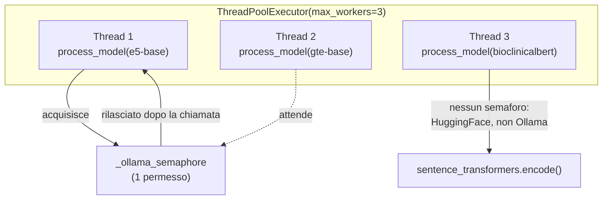

# Capitolo 12 — Concorrenza e memoria: GIL, thread, processi

**Obiettivi del capitolo**

- Sapere cos'è il Global Interpreter Lock e perché non rende inutile il threading in questo progetto.
- Leggere `ThreadPoolExecutor` e `Semaphore` con la stessa disinvoltura con cui leggeresti `ExecutorService` e un lock in Java.
- Capire perché la gestione della memoria non è un punto di attenzione critico in questo codice, a differenza di quasi tutto il resto di questo capitolo.

## 12.1 Il Global Interpreter Lock: cosa cambia rispetto ai thread Java

**[Livello: teoria consolidata del settore]** L'implementazione standard di Python (CPython, quella che stai usando se hai seguito l'installazione del capitolo 15) ha un **Global Interpreter Lock** (GIL): un unico lock globale che garantisce che, in ogni istante, un solo thread alla volta stia eseguendo bytecode Python, indipendentemente da quanti thread hai creato e da quanti core ha la CPU. In Java, più thread possono eseguire codice Java realmente in parallelo su core diversi; in Python (CPython), no — a livello di bytecode Python puro, il parallelismo reale fra thread non esiste.

Questo non significa che il threading in Python sia inutile — significa che è utile solo per un tipo specifico di lavoro. Il GIL viene **rilasciato temporaneamente** ogni volta che un thread è in attesa di qualcosa di esterno all'interprete: una risposta di rete, una lettura da disco, o l'esecuzione di codice nativo (scritto in C, come buona parte del motore di calcolo di NumPy o PyTorch) che dichiara esplicitamente di non aver bisogno del GIL per la durata di quell'operazione. Un thread in attesa di una risposta HTTP da Ollama non sta "usando la CPU": sta aspettando, e mentre aspetta un altro thread può eseguire.

**[Interpretazione]** È esattamente questo il motivo per cui `ThreadPoolExecutor` ha senso nel prossimo paragrafo, nonostante il GIL: la generazione di embedding è dominata da tempo di attesa di rete (verso Ollama) o da calcolo dentro librerie native che rilasciano il GIL (PyTorch, per i modelli Hugging Face), non da bytecode Python puro che il GIL costringerebbe comunque a un solo thread alla volta.

## 12.2 `ThreadPoolExecutor` e `Semaphore` nel progetto, confrontati con `ExecutorService`

**[Fatto]** `embedding.py:201-209` orchestra la generazione di embedding per tutti i 7 modelli con un pool di thread:
```python
def generate_all_embeddings(texts, labels, embeddings_dir, max_workers=3):
    with ThreadPoolExecutor(max_workers=max_workers) as executor:
        futures = []
        for m in models_all:
            futures.append(executor.submit(process_model, m, texts, labels, embeddings_dir))
        for f in futures:
            f.result()
```
`ThreadPoolExecutor(max_workers=3)` è concettualmente lo stesso oggetto di un `ExecutorService` Java creato con un pool fisso di 3 thread: `executor.submit(...)` accoda un lavoro (qui, la funzione `process_model` con i suoi argomenti) e restituisce immediatamente un oggetto `Future` (qui chiamato `f`), senza aspettare che il lavoro sia completato. Il ciclo finale, `f.result()` per ogni future, blocca finché ciascun lavoro non è terminato, propagando qualunque eccezione sollevata dentro il thread — il modo in cui un errore avvenuto in un thread secondario emerge nel thread principale, esattamente il ruolo di `Future.get()` in Java.

**[Fatto]** Con `max_workers=3` e 7 modelli in `models_all`, al più tre modelli vengono processati "in parallelo" in un dato momento — ma solo nel senso spiegato al paragrafo precedente: attesa di rete o calcolo nativo, non bytecode Python puro. Il codice restringe ulteriormente questo parallelismo per i modelli serviti da Ollama, con un semaforo dichiarato a livello di modulo:
```python
_ollama_semaphore = threading.Semaphore(1)     # embedding.py:101
```
usato in `generate_embeddings_batch()` (`embedding.py:117`) per avvolgere ogni singola chiamata `client.embed(...)`. Un `Semaphore(1)` con un solo permesso disponibile equivale, in pratica, a un lock esclusivo: **una sola chiamata a Ollama alla volta**, anche se più thread del pool ci arrivano nello stesso momento — gli altri aspettano in coda finché il permesso non si libera. **[Fatto]** Il motivo è documentato direttamente nel codice, in un commento (`embedding.py:95-100`): il server locale di Ollama può esaurire le porte effimere del sistema operativo, o sovraccaricarsi, se riceve troppe richieste contemporanee da thread diversi — serializzare le chiamate mantiene sempre una sola richiesta HTTP realmente in transito verso quel server specifico.



*Figura 12.1 — Tre thread attivi, ma una sola chiamata a Ollama alla volta: il parallelismo reale è fra un modello Ollama (serializzato dal semaforo) e i modelli Hugging Face, che non lo condividono.*

> **SE VIENI DA JAVA —** `threading.Semaphore` in Python ha la stessa interfaccia concettuale di `java.util.concurrent.Semaphore`: `acquire()`/`release()` (qui invocati implicitamente da `with`, capitolo 11.2), un numero di permessi fisso, thread bloccati in coda quando i permessi sono esauriti. Non c'è nulla di specificamente "pythonico" in questa parte: è la stessa primitiva, con la stessa semantica, avvolta in un context manager invece che in un blocco `try`/`finally` esplicito con `acquire()` e `release()` scritti a mano.

## 12.3 Gestione della memoria: reference counting + garbage collector, niente `finalize`

**[Livello: teoria consolidata del settore]** CPython gestisce la memoria con un contatore di riferimenti per ogni oggetto: quando il contatore arriva a zero (nessuna variabile punta più a quell'oggetto), la memoria viene liberata immediatamente, non a un ciclo di garbage collection successivo. Un garbage collector separato interviene solo per i riferimenti ciclici (due oggetti che si riferiscono a vicenda, che il solo conteggio non riuscirebbe mai a portare a zero da soli). È un modello diverso da quello della JVM (che non usa il conteggio di riferimenti come meccanismo primario), ma il risultato pratico per chi scrive codice applicativo è simile: la memoria è gestita automaticamente, non la liberi mai esplicitamente tu.

**[Fatto]** Non troverai, in nessuno dei nove file del progetto, una singola riga dedicata alla gestione della memoria — nessun equivalente di `close()` chiamato manualmente su una struttura dati, nessun tentativo di "liberare" un DataFrame o un array NumPy quando non serve più. È l'atteso stato di cose: su questo punto specifico, Python non richiede a chi scrive il codice applicativo un'attenzione diversa da quella che richiederebbe Java. La sola gestione esplicita di risorse nel progetto riguarda risorse *esterne* alla memoria del processo — file, thread, un semaforo — ed è quella vista al capitolo 11.2 con `with`.

## Riepilogo

Il Global Interpreter Lock impedisce il parallelismo reale del bytecode Python fra thread, ma non rende inutile il threading per lavoro dominato da attesa di rete o da calcolo in librerie native che rilasciano il GIL — esattamente il caso della generazione di embedding in questo progetto. `ThreadPoolExecutor` gestisce fino a 3 modelli "in parallelo", ma un `Semaphore(1)` serializza comunque ogni chiamata verso Ollama, per non sovraccaricare il suo server locale. La gestione della memoria non richiede alcuna attenzione esplicita nel codice del progetto: reference counting e garbage collector se ne occupano in modo trasparente, come farebbe la JVM.

## Domande di autoverifica

**1. Perché usare tre thread per generare embedding ha senso, nonostante il Global Interpreter Lock?**
Perché il lavoro di ciascun thread è dominato da attesa (chiamate di rete verso Ollama o Hugging Face) o da calcolo in codice nativo che rilascia il GIL (PyTorch), non da bytecode Python puro. Il GIL impedirebbe il parallelismo solo se il lavoro fosse CPU-bound in puro Python.

**2. Perché `_ollama_semaphore` ha un solo permesso, e cosa impedisce concretamente?**
Perché il server locale di Ollama può sovraccaricarsi o esaurire le porte effimere del sistema operativo se riceve troppe richieste contemporanee. Un permesso solo impedisce che più di una chiamata a `client.embed(...)` sia in corso nello stesso momento, indipendentemente da quanti thread del pool sono attivi.

**3. Perché questo progetto non contiene alcuna gestione esplicita della memoria, a differenza della gestione esplicita di file, thread e semaforo?**
Perché la memoria del processo (oggetti Python come DataFrame e array NumPy) è gestita automaticamente da reference counting e garbage collector, senza bisogno di rilascio esplicito. File, thread e semaforo sono invece risorse esterne alla sola memoria del processo, e richiedono un rilascio esplicito — motivo per cui compaiono dietro un `with` al capitolo 11.2.

> **MATERIALE PER LA TESI**
> 1. Il diagramma Mermaid del pool di thread e del semaforo (Figura 12.1), con la spiegazione del perché la concorrenza reale è più limitata di quanto sembri da `max_workers=3` — riusabile come figura tecnica in "Materiali e metodi".
> 2. La spiegazione del Global Interpreter Lock applicata al caso concreto di questo progetto (I/O-bound, non CPU-bound) — riusabile per giustificare la scelta di `ThreadPoolExecutor` invece che, per esempio, il multiprocessing.
> 3. Il commento originale del codice sul motivo del semaforo (`embedding.py:95-100`), citato per esteso — riusabile come esempio di documentazione delle scelte progettuali trovata direttamente nel codice, utile per una discussione sulla qualità della documentazione interna del progetto.
