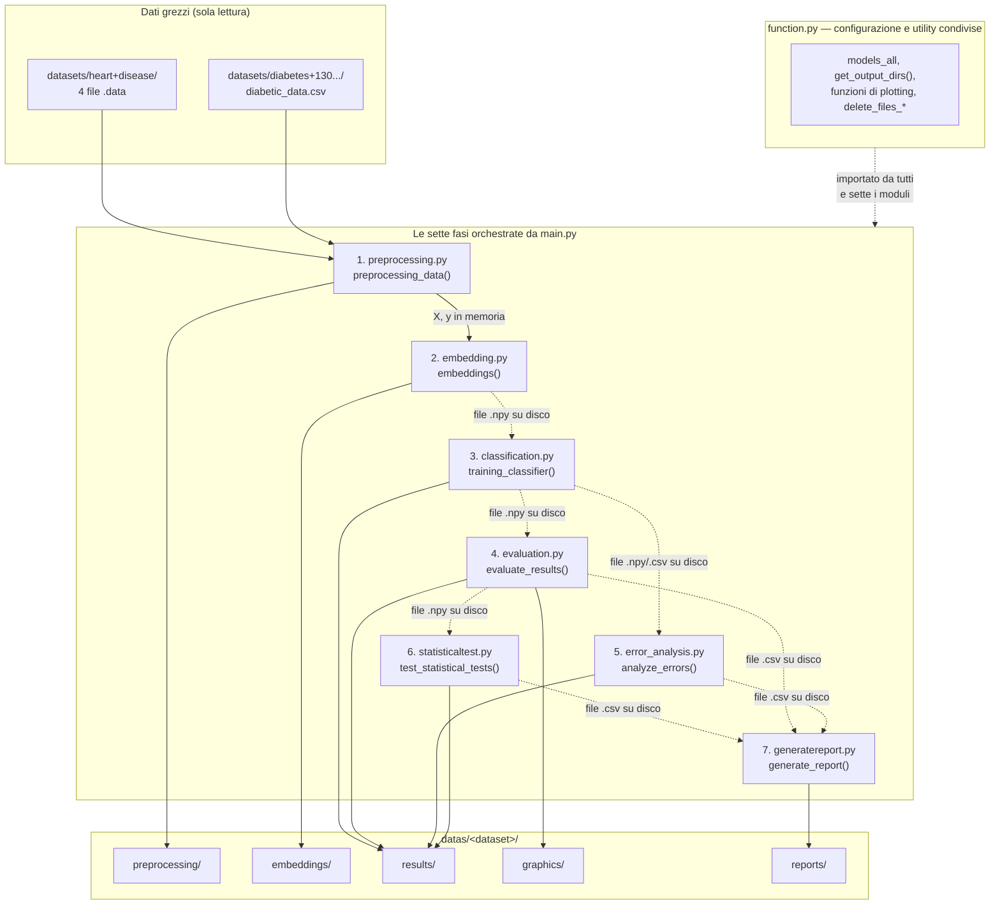

# Capitolo 17 — Vista d'insieme: componenti e confini

**Obiettivi del capitolo**

- Avere una mappa visiva dell'intera pipeline prima di leggere una sola riga di implementazione.
- Sapere esattamente quali moduli dipendono da quali altri, e quali non dipendono da nessuno.
- Confrontare questa architettura con quella di un batch job Java enterprise che probabilmente già conosci.

## 17.1 Diagramma architetturale commentato

**[Fatto]** Il diagramma seguente ricostruisce l'architettura completa a partire dagli `import` reali di ciascun file (verificati sistematicamente, capitolo 10.2) e dalle chiamate di `main.py:20-53`.

*Figura 17.1 — Architettura completa della pipeline. Le frecce continue fra fasi sono passaggio diretto di dati in memoria (Python); le frecce tratteggiate sono un salvataggio su disco seguito da una rilettura nella fase successiva, non una chiamata di funzione diretta.*

Nota, guardando le frecce fra le fasi, un'asimmetria reale: **[Fatto]** solo il passaggio da `preprocessing.py` a `embedding.py` avviene per valore, dentro lo stesso processo Python (`main.py:34-37`, `X, y = preprocessing_data(...)` seguito da `embeddings(X, y, ...)`). **[Fatto]** Da `classification.py` in poi, ogni fase **rilegge da disco** l'output della fase precedente — `classification.py:13-14` chiama `np.load(...)` sui file `.npy` salvati da `embedding.py`, `evaluation.py:15-17` rilegge a sua volta i file salvati da `classification.py`, e così via fino a `generatereport.py`, che rilegge un CSV riassuntivo. Nessuna di queste funzioni riceve i dati della fase precedente come argomento diretto, pur essendo chiamate in sequenza nello stesso processo.

## 17.2 Cosa entra, cosa esce, da ogni fase

| Fase | File | Cosa riceve | Cosa produce |
|---|---|---|---|
| 1. Preprocessing | `preprocessing.py` | Nome del dataset (stringa) | `X, y` in memoria (DataFrame/Series) + `preprocessed_data.npy`, `preprocessed_labels.npy`, `X_train_raw.csv` su disco |
| 2. Embedding | `embedding.py` | `X, y` in memoria | 7 coppie di file `{modello}_embeddings.npy` / `{modello}_embeddings_labels.npy` su disco |
| 3. Classificazione | `classification.py` | Nome del dataset (rilegge gli embedding da disco) | 4 file `.npy` per modello (`y_true`, `y_score`, `y_pred`, `val_idx`) + `model_performance.csv` |
| 4. Valutazione | `evaluation.py` | Nome del dataset (rilegge i risultati da disco) | 3 array bootstrap per modello + grafici + `encoder_comparison_summary.csv` |
| 5. Analisi errori | `error_analysis.py` | Nome del dataset (rilegge risultati + `X_train_raw.csv`) | CSV di falsi positivi/negativi, casi più difficili, deviazione di feature |
| 6. Test statistici | `statisticaltest.py` | Nome del dataset (rilegge gli array bootstrap) | 3 CSV di confronto a coppie (Wilcoxon, t-test, DeLong) |
| 7. Report | `generatereport.py` | Nome del dataset (rilegge il CSV riassuntivo) | `report.md` finale |

## 17.3 Confronto con un'architettura Java a livelli

**[Interpretazione]** Se dovessi tradurre questa architettura in termini familiari a chi lavora con Java enterprise, la corrispondenza più calzante non è un'applicazione web a livelli (controller/service/repository), ma un **batch job sequenziale** — il genere di cosa che in Spring Batch si modellerebbe come un `Job` composto da una sequenza fissa di `Step`, ciascuno con un proprio `ItemReader` (leggi da una fonte), una fase di elaborazione, e un `ItemWriter` (scrivi su una destinazione). `main.py` gioca il ruolo del `Job`; ciascuna delle sette fasi gioca il ruolo di uno `Step`; il passaggio di dati fra step tramite file su disco invece che tramite oggetti Java in memoria è, in questo confronto, non una stranezza ma una scelta architetturale comune anche nel mondo Java quando gli step di un batch devono essere ispezionabili, riavviabili singolarmente, o eseguiti in processi separati — cosa che, come nota il capitolo 18.3, questo progetto rende possibile solo in parte.

`function.py` gioca invece un ruolo diverso da quello di un singolo `Step`: è importato da tutti gli altri moduli (Figura 17.1), e mescola quattro responsabilità distinte — la configurazione dei modelli, la gestione delle cartelle di output, la pulizia dei file di run precedenti, e *tutte* le funzioni di plotting del progetto (nove, capitolo 20.3). In un'architettura Java organizzata per responsabilità, queste sarebbero probabilmente quattro classi separate (una `ModelConfig`, un `OutputDirectoryService`, un `CleanupService`, un `ChartingService`); qui vivono in un solo file di 386 righe. Non è necessariamente un errore — per un progetto di questa scala, la separazione avrebbe un costo di indirection che potrebbe non ripagarsi — ma è un'osservazione precisa da portare in Parte XI quando si discute la manutenibilità del codice.

> **ATTENZIONE —** l'osservazione sul passaggio di dati via disco non è solo descrittiva: è collegata a una scelta progettuale reale già vista al capitolo 8.3 e ripresa al capitolo 18.3. Ogni esecuzione di `main.py` cancella *tutti* i file dell'output precedente per quel dataset prima di rigenerarli (`main.py:28-31`) — una necessità diretta del fatto che le fasi comunicano tramite file: se non venissero cancellati, una fase potrebbe silenziosamente rileggere un file lasciato da un'esecuzione precedente invece che da quella corrente.

## Riepilogo

L'architettura del progetto è un batch job sequenziale a sette fasi, orchestrato da `main.py`, con `function.py` come hub condiviso da cui tutte le altre sette fasi dipendono e che non dipende da nessuna di esse. Solo il passaggio dalla fase 1 alla fase 2 avviene per valore in memoria; da lì in poi, ogni fase rilegge da disco l'output della fase precedente, un pattern concettualmente vicino a uno Step-based batch job Java (Spring Batch, per chi lo conosce), con i vantaggi e i costi che quel pattern comporta.

## Domande di autoverifica

**1. Perché il passaggio di dati fra `classification.py` e `evaluation.py` non è una chiamata di funzione diretta, pur essendo entrambi chiamati in sequenza nello stesso processo Python da `main.py`?**
Perché `evaluation.py` rilegge da disco i file `.npy` che `classification.py` ha salvato, invece di ricevere quei dati come argomento di funzione — un pattern di comunicazione via file, non via memoria condivisa nello stesso processo.

**2. Quali quattro responsabilità distinte convivono in `function.py`, e come le separeresti in un'architettura Java tipica?**
Configurazione dei modelli, gestione delle cartelle di output, pulizia dei file di run precedenti, e tutte le funzioni di plotting. In un'architettura Java tipica sarebbero probabilmente quattro classi separate, ciascuna con una singola responsabilità.

**3. Perché `main.py` cancella l'intero output precedente di un dataset prima di rigenerarlo, invece di limitarsi a sovrascrivere i file nuovi?**
Perché le fasi comunicano tramite file su disco (capitolo 17.1): se un file di un'esecuzione precedente non venisse cancellato e la fase corrente non lo rigenerasse per qualche motivo, una fase successiva potrebbe rileggerlo silenziosamente, mescolando dati di esecuzioni diverse senza che nulla lo segnali.

> **MATERIALE PER LA TESI**
> 1. Il diagramma Mermaid completo dell'architettura (Figura 17.1), con la distinzione esplicita fra passaggio in memoria e passaggio su disco — riusabile come figura centrale della sezione "Materiali e metodi".
> 2. La tabella input/output per ciascuna delle sette fasi (§17.2) — riusabile come tabella descrittiva della pipeline, o come base per una tabella più sintetica nella tesi.
> 3. Il confronto con il pattern Job/Step di un batch sequenziale Java, e l'analisi delle quattro responsabilità mescolate in `function.py` — riusabile nella discussione critica sulla manutenibilità dell'architettura (Parte XI).
