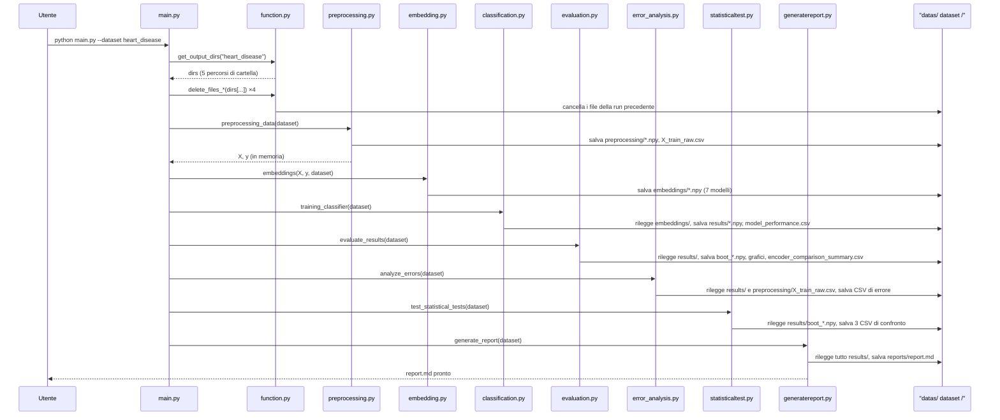

# Capitolo 18 — Il ciclo di vita di un'esecuzione

**Obiettivi del capitolo**

- Seguire, passo per passo, cosa succede fra il momento in cui lanci `python main.py` e il momento in cui il report è pronto.
- Capire perché due dataset diversi non si calpestano mai a vicenda.
- Sapere cosa succede — e cosa resta sul disco — se una fase fallisce a metà.

## 18.1 Diagramma di sequenza da `main.py` al report

**[Fatto]** Il diagramma seguente segue esattamente l'ordine di chiamata di `main.py:20-53`.

*Figura 18.1 — Sequenza completa di un'esecuzione, dalla riga di comando al report finale. Ogni freccia verso `datas/<dataset>/` è un salvataggio; ogni freccia dalla stessa cartella verso una fase, quando presente nel testo, è una rilettura.*

Ogni fase è invocata da `main.py` con la stessa forma: passa `dataset=args.dataset` (o il nome posizionale equivalente) e nient'altro — nessuna fase, da `training_classifier` in poi, riceve dati concreti come argomento, solo il nome del dataset su cui operare. È `get_output_dirs()` (`function.py:79-93`), chiamata dentro ciascuna fase, a tradurre quel nome nei percorsi concreti da cui leggere e su cui scrivere.

## 18.2 Isolamento per dataset

**[Fatto]** `get_output_dirs(dataset)` (`function.py:79-93`) costruisce sempre i percorsi come `datas/<dataset>/<sottocartella>`, con `<dataset>` uguale a `"heart_disease"` o `"diabetes130"`. Ogni chiamata a una delle sette fasi con un dataset diverso opera quindi su un albero di cartelle completamente separato: eseguire `python main.py --dataset diabetes130` non tocca in alcun modo `datas/heart_disease/`, e viceversa. **[Fatto]** `main.py:23-31` chiama `delete_files_*` solo sulle cartelle del dataset scelto in quella specifica esecuzione — non esiste un solo punto del codice in cui un'esecuzione per un dataset possa cancellare o sovrascrivere l'output dell'altro.

> **SE VIENI DA JAVA —** questo isolamento non è imposto da un meccanismo esplicito (un lock, una transazione, un namespace a livello di sistema operativo): è semplicemente il risultato di come sono costruiti i percorsi delle stringhe, `os.path.join("datas", dataset, sottocartella)` (`function.py:83-89`). Non c'è nulla che impedirebbe, per errore di battitura futuro, a qualcuno di scrivere un percorso che esce da questo schema — l'isolamento regge finché il codice continua a costruire i percorsi in questo modo esatto, non perché sia garantito da una barriera strutturale.

## 18.3 Fallimento a metà pipeline

**[Fatto]** Nessuna delle sette fasi verifica, prima di cominciare, che l'output della fase precedente esista e sia completo — ognuna assume che sia lì, e se non lo è, l'errore emerge come `FileNotFoundError` nel momento esatto in cui una fase prova a leggere un file mancante (`np.load(...)` o `pd.read_csv(...)` che non trova il file). **[Fatto]** Non esiste, in `main.py`, alcun blocco `try`/`except` attorno alle chiamate alle sette fasi (`main.py:33-52`): se una fase solleva un'eccezione qualunque, l'intero processo si interrompe immediatamente con un traceback (capitolo 13.3), senza che le fasi successive vengano nemmeno tentate.

Questo significa che un'esecuzione interrotta a metà lascia la cartella del dataset **parzialmente popolata**: per esempio, se `embedding.py` fallisse (una richiesta a Ollama che esaurisce i tentativi di retry, capitolo 22.2), `datas/<dataset>/preprocessing/` conterrebbe già i file completi della fase 1, `datas/<dataset>/embeddings/` conterrebbe solo gli embedding dei modelli completati prima del fallimento, e nessuna delle cartelle successive (`results/`, `graphics/`, `reports/`) conterrebbe nulla di nuovo — restando eventualmente con i file, ormai obsoleti, dell'esecuzione precedente non ancora sovrascritti, perché la fase di pulizia (`main.py:28-31`) ha già cancellato solo quelli, non ha ricreato quelli mancanti.

> **ATTENZIONE —** l'unica strategia di recupero prevista dal progetto, in questo scenario, è rilanciare `python main.py` da capo per lo stesso dataset (`README.md:210`) — che cancella di nuovo tutto e ricomincia dalla fase 1, incluse le fasi già completate con successo. Non esiste un modo, nel codice attuale, di riprendere da dove l'esecuzione si è interrotta: è un limite reale di questa architettura a fasi file-based, non solo un'osservazione teorica. Il capitolo 55 lo riprende come possibile direzione di miglioramento.

## Riepilogo

Un'esecuzione completa attraversa sette fasi in sequenza rigida, ciascuna identificata solo dal nome del dataset, senza alcun controllo di integrità fra una fase e la successiva. L'isolamento fra i due dataset è garantito dalla costruzione sistematica dei percorsi in `get_output_dirs()`, non da una barriera strutturale esplicita. Un fallimento a metà pipeline lascia una cartella di output parzialmente popolata, e l'unico modo di recuperare è rilanciare l'intera pipeline da capo, rifacendo anche le fasi già completate con successo.

## Domande di autoverifica

**1. Come "sa" ciascuna delle sette fasi dove leggere e dove scrivere, dato che nessuna riceve un percorso esplicito come argomento?**
Ogni fase riceve solo il nome del dataset, e chiama internamente `get_output_dirs(dataset)` per ottenere i percorsi concreti delle cinque sottocartelle — la stessa funzione, chiamata allo stesso modo, in ogni fase.

**2. Cosa impedisce, strutturalmente, che un'esecuzione su Diabetes130 cancelli i risultati già salvati per Heart Disease?**
Nulla di strutturale in senso stretto: è una conseguenza di come `get_output_dirs()` costruisce i percorsi (sempre `datas/<dataset>/...`, con `<dataset>` preso dall'argomento passato), non una barriera imposta a livello di sistema operativo o di codice difensivo.

**3. Se `embedding.py` fallisse a metà, cosa troveresti sul disco subito dopo, e cosa dovresti fare per ripartire?**
Troveresti `preprocessing/` completo, `embeddings/` con solo alcuni dei sette modelli generati, e nulla di nuovo nelle cartelle successive. Non esiste un modo di riprendere da lì: l'unica strategia prevista è rilanciare l'intera pipeline da capo per quel dataset, rifacendo anche il preprocessing già completato con successo.

> **MATERIALE PER LA TESI**
> 1. Il diagramma di sequenza completo (Figura 18.1), con l'indicazione esplicita di dove ogni fase legge e scrive — riusabile come figura centrale in "Materiali e metodi" per descrivere il protocollo sperimentale.
> 2. L'analisi dell'isolamento fra dataset come conseguenza di una convenzione di percorso, non di una garanzia strutturale — riusabile come nota tecnica nella sezione che descrive la gestione dei dati.
> 3. L'osservazione sull'assenza di ripartenza da un punto intermedio, con il rimando alla proposta di miglioramento del capitolo 55 — riusabile come punto di discussione sulla robustezza operativa del sistema.
