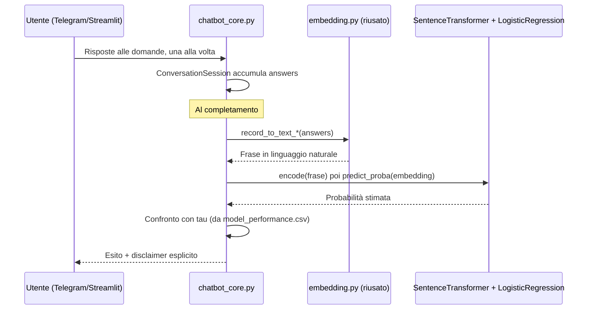

# Capitolo 54 — Il chatbot clinico: cosa esiste già, non integrato

**Obiettivi del capitolo**
- Sapere con precisione cosa fa il chatbot già scritto su un branch separato, avendone letto il codice per intero.
- Capire come chiude il ciclo addestramento→validazione→inferenza rimasto aperto sul branch `master` (capitolo 2.2).
- Riconoscere i rischi specifici di un sistema conversazionale che stima un rischio clinico senza una validazione dedicata a questo scenario d'uso.

**[Fatto, branch `chatbot`]** Il branch `chatbot` (mai unito a `master`, verificato con `git merge-base --is-ancestor`, capitolo 0) aggiunge tre file: `app_streamlit.py` (62 righe), `bot_telegram.py` (92 righe), `chatbot_core.py` (307 righe, letto per intero in questa sessione). Sono l'unico punto dell'intero progetto in cui il ciclo addestramento→validazione→inferenza (capitolo 2.2) si chiude con un'inferenza reale su un caso nuovo.

## 54.1 Architettura di `chatbot_core.py`, `app_streamlit.py`, `bot_telegram.py`

**[Fatto, branch `chatbot`]** `chatbot_core.py` definisce, per ciascuno dei due dataset, un elenco fisso di domande (`QUESTIONS_HEART_DISEASE`, `QUESTIONS_DIABETES130`) — una per feature, ciascuna con un prompt in italiano, un parser che valida l'input (per esempio `_parse_float_range(t, 60, 260)` per la pressione arteriosa, capitolo 3), e un messaggio di errore se il parser fallisce. Una `ConversationSession` accumula le risposte in un dizionario, un campo alla volta, fino a completare l'elenco.

**[Fatto, branch `chatbot`]** Il punto più significativo, dal punto di vista architetturale: una volta raccolte tutte le risposte, `_predict()` le passa **direttamente** a `record_to_text_heart_disease()` o `record_to_text_diabetes130()` — le stesse identiche funzioni di `embedding.py` già lette per intero al capitolo 22.1, riusate senza modifiche. Il testo generato viene poi codificato con `SentenceTransformer(EMBEDDING_MODEL["name"]).encode(...)`, e la probabilità stimata con un `LogisticRegression` confrontato con una soglia — la stessa architettura concettuale della pipeline offline (Formula 32.1, capitolo 35), applicata qui a un singolo caso nuovo invece che a un batch di validazione.

**[Fatto, branch `chatbot`]** Un dettaglio rilevante e non ovvio: `_load_deployed_bundle()` **non riusa** nessuno dei classificatori già addestrati durante la 5-fold cross-validation di `classification.py` (capitolo 23) — ne addestra uno **nuovo**, sull'intero insieme di embedding disponibile (`classifier.fit(X, y)` su tutte le righe, non solo su 4 fold su 5), e riusa solo la soglia $\tau$ già calcolata (la media dei 5 fold, letta da `model_performance.csv`). **[Interpretazione]** È una scelta ragionevole in sé (allenare il modello finale su tutti i dati disponibili è una pratica comune, capitolo 33.1), ma introduce un disallineamento sottile: la soglia $\tau$ usata qui è stata calibrata sui classificatori della validazione incrociata, non su questo classificatore specifico allenato sull'intero dataset — i due modelli non sono identici, anche se addestrati con lo stesso algoritmo sugli stessi dati sovrapposti in gran parte.

**[Fatto, branch `chatbot`]** `EMBEDDING_MODEL` (un singolo dizionario, non una lista di sette) è importato da `function` — ma **[Da verificare]** la sua definizione esatta non è nella versione di `function.py` su `master` (verificato, capitolo 0): deve esistere solo nella copia divergente di `function.py` sul branch `chatbot`, non letta in questa sessione. **[Interpretazione]** Dato che `_ensure_embedder()` istanzia `SentenceTransformer(EMBEDDING_MODEL["name"])` — la classe usata solo per i modelli biomedici in `embedding.py` (capitolo 22.3), mai per quelli via Ollama — è ragionevole dedurre che `EMBEDDING_MODEL` designi uno dei tre modelli biomedici, non uno dei quattro generalisti; quale dei tre, resta un'ipotesi non verificata.

*Figura 54.1 — Flusso di inferenza del chatbot, con il punto esatto di riuso del codice della pipeline offline.*

## 54.2 Cosa manca per l'integrazione pulita

**[Interpretazione]** Portare questo lavoro su `master` in modo pulito richiederebbe, come minimo: riconciliare la copia divergente di `function.py` (capire cosa contiene `EMBEDDING_MODEL` e se la sua scelta va resa esplicita o parametrizzabile, invece di fissata); decidere se il classificatore per l'inferenza debba davvero essere riaddestrato sull'intero dataset ogni volta che il processo del chatbot si avvia (`_classifier_cache` lo mette in cache solo dentro un singolo processo, non lo persiste su disco — ogni riavvio del bot riaddestra da zero); e, soprattutto, validare esplicitamente il comportamento del sistema in questo scenario d'uso specifico, non solo ereditare la validazione della pipeline offline (capitolo 54.3).

## 54.3 Rischi di un chatbot di rischio clinico non validato

**[Fatto, branch `chatbot`]** Il codice include già due disclaimer distinti: nel messaggio di benvenuto ("Non sono uno strumento diagnostico: per qualsiasi dubbio consulta un medico") e dopo ogni previsione ("Questo è solo un supporto informativo basato su un modello statistico, non una diagnosi medica. Consulta sempre un professionista sanitario") — una buona pratica di ingegneria responsabile, presente fin dalla prima versione del codice, non aggiunta come ripensamento.

**[Interpretazione]** Restano comunque rischi specifici di questo scenario d'uso, distinti da quelli già discussi per la pipeline offline (Parte XI): primo, l'input dell'utente in un chatbot conversazionale non è mai mancante per costruzione (ogni domanda richiede una risposta valida, capitolo 54.1) — un contrasto netto con il training set, dove il 66%/53% dei valori di `ca`/`thal` sono imputati (capitolo 29.3, capitolo 46.2); il classificatore ha quindi imparato in gran parte da un profilo "generico imputato" per queste due feature, e potrebbe comportarsi in modo diverso di fronte a un valore realmente osservato e specifico, fornito da un utente che lo conosce davvero. Secondo, un utente non esperto potrebbe rispondere in modo inaccurato a domande cliniche tecniche (per esempio, "depressione del tratto ST indotta dall'esercizio" — capitolo 54.1, un valore che tipicamente richiede un elettrocardiogramma da sforzo, non qualcosa che un paziente conosce a memoria) — un rischio di qualità dell'input specifico dell'interazione diretta con una persona non clinica, che il disegno della pipeline offline (dati già raccolti da professionisti) non doveva affrontare.

> **ATTENZIONE —** nessuno di questi due rischi invalida l'utilità potenziale di un prototipo come questo per scopi educativi o di ricerca — ma renderlo uno strumento realmente usato da pazienti richiederebbe una validazione specifica per questo scenario, distinta dalla validazione (già limitata, Parte XI) della pipeline offline da cui eredita il modello.

## Riepilogo

Il chatbot, esistente solo su un branch non unito, chiude il ciclo di inferenza rimasto aperto sul resto del progetto, riusando elegantemente le funzioni di conversione testo già lette al capitolo 22. Addestra però un classificatore nuovo sull'intero dataset, riusando una soglia calibrata su classificatori diversi (quelli della cross-validation), e affronta un'asimmetria non banale fra un training set con valori spesso imputati e un'inferenza con input sempre genuini. I disclaimer già presenti nel codice sono una buona pratica, ma non sostituiscono una validazione specifica per lo scenario conversazionale.

## Domande di autoverifica

**1. Il chatbot riusa uno dei sette classificatori già addestrati durante la cross-validation di `classification.py`?**
No: `_load_deployed_bundle()` addestra un `LogisticRegression` nuovo sull'intero insieme di embedding disponibile, riusando solo la soglia $\tau$ già calcolata dalla cross-validation offline — non uno dei classificatori specifici di un singolo fold.

**2. Perché l'assenza di valori mancanti nell'input del chatbot è un'asimmetria rispetto al training set, non solo un dettaglio positivo?**
Perché il classificatore è stato addestrato su un training set dove `ca` e `thal` sono imputati nel 66% e 53% dei casi (capitolo 29.3): ha quindi imparato in gran parte da un profilo "generico imputato" per queste due feature, mentre nell'uso conversazionale riceverà sempre un valore realmente fornito dall'utente — un contesto diverso da quello dominante nei dati di addestramento.

**3. Quali due disclaimer sono già presenti nel codice del chatbot, prima ancora di qualunque discussione su validazione aggiuntiva?**
Il messaggio di benvenuto ("Non sono uno strumento diagnostico...") e il messaggio dopo ogni previsione ("...non una diagnosi medica. Consulta sempre un professionista sanitario") — entrambi scritti direttamente nel codice sorgente del chatbot, non aggiunti come ripensamento esterno.

> **MATERIALE PER LA TESI**
> 1. Il diagramma di sequenza del flusso di inferenza (Figura 54.1), con il punto esatto di riuso del codice della pipeline offline — riusabile in "Lavori futuri" per descrivere un'estensione già prototipata.
> 2. L'analisi del disallineamento fra il classificatore riaddestrato e la soglia ereditata dalla cross-validation — riusabile come punto di discussione tecnica specifico, distinto dai limiti già discussi per la pipeline offline.
> 3. L'asimmetria fra dati di addestramento imputati e input conversazionali sempre genuini — riusabile come argomento originale sui rischi specifici del passaggio da un sistema di validazione offline a uno di inferenza interattiva.
